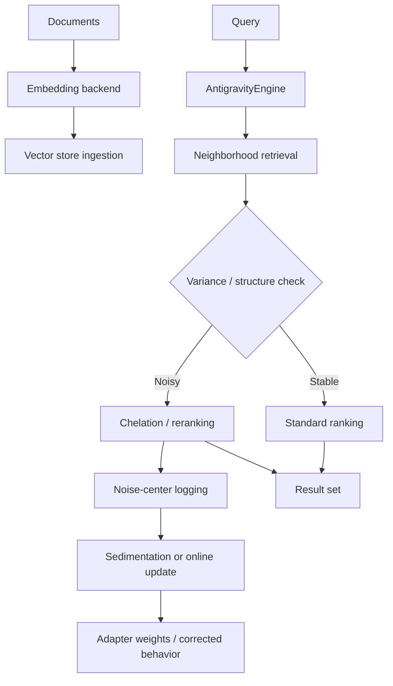
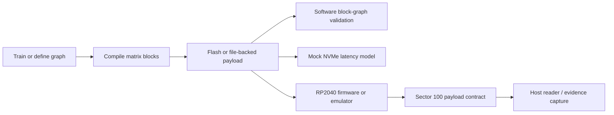

# ChelatedAI

ChelatedAI is a Python research repository for adaptive retrieval, post-hoc embedding correction, multi-dataset evaluation, and computational-storage experiments.

The codebase now spans two connected themes:

- improving vector retrieval quality through chelation, sedimentation, distillation, topology analysis, and online correction
- exploring whether parts of model execution can be pushed toward storage-resident node graphs, deterministic transport paths, and multi-drive speculative execution

> Note
> The computational-storage track includes drive-resident graph execution experiments and RP2040 transport tooling. It does not yet prove full on-device LLM inference on physical hard drives or SSDs. The current merged hardware claim is scope-locked to a deterministic transport proof. See [docs/computational-storage-transport-scope-decision.md](docs/computational-storage-transport-scope-decision.md).

## Why This Repo Exists

Most embedding systems assume the base embedding model is fixed and that retrieval quality is mainly a search-index problem. ChelatedAI treats retrieval failures as a dynamic systems problem:

- detect when a query enters a noisy neighborhood
- rerank or adapt before collapse propagates
- track structural drift over time
- benchmark whether improvements generalize across datasets
- test whether some inference primitives can move closer to storage media

## Repository Tracks

| Track | What it covers | Main entrypoints |
|---|---|---|
| Adaptive retrieval | Chelation, sedimentation, adapter-based correction, vector-store integration | `antigravity_engine.py`, `chelation_adapter.py`, `vector_store.py`, `config.py` |
| Distillation and correction | Teacher guidance, cross-lingual routing, online updates, schedule tuning | `teacher_distillation.py`, `cross_lingual_distillation.py`, `teacher_weight_scheduler.py`, `online_updater.py` |
| Evaluation and reporting | BEIR runs, comparative benchmarks, sweeps, and dashboards | `benchmark_beir.py`, `benchmark_comparative.py`, `benchmark_multitask.py`, `run_sweep.py`, `run_large_sweep.py`, `dashboard_server.py` |
| Structural analysis | Topology cohesion, isomer drift, embedding quality, stability diagnostics | `topology_analyzer.py`, `isomer_detector.py`, `embedding_quality.py`, `stability_tracker.py` |
| Computational storage and drive nodes | Block-graph execution, mock NVMe path, multi-drive array simulation, RP2040 firmware, emulator, host reader, evidence capture | `computational_storage_poc/`, `test_computational_storage_poc.py`, `test_computational_storage_payload.py`, `test_computational_storage_emulation.py` |
| Process and remediation | Agentic review workflow, tracker docs, session logs, verification evidence | `aep_orchestrator.py`, `docs/ARCH AGENTIC ENGINEERING AND PLANNING/` |

## Quick Start

### 1. Install Python dependencies

Windows PowerShell:

```powershell
python -m venv .venv
.\.venv\Scripts\Activate.ps1
pip install -r requirements.txt
pip install -e .
```

macOS / Linux:

```bash
python -m venv .venv
source .venv/bin/activate
pip install -r requirements.txt
pip install -e .
```

`requirements.txt` installs the full research stack, including `requests`, `mteb`, and `scikit-learn`. `pyproject.toml` exposes the installable package metadata and optional dependency groups.

### 2. Optional local embedding backend

If you want to use the Ollama-backed embedding path:

```bash
docker run -d -p 11434:11434 ollama/ollama
docker exec ollama ollama pull nomic-embed-text
```

Use model names like `ollama:nomic-embed-text` to route through the HTTP embedding backend.

### 3. Run the main validation surfaces

```bash
python -m unittest discover -s . -p "test_*.py" -v
python run_live_fire_diagnostics.py --output live_fire_results.json
python run_safety_testbed.py
python run_road_course_campaign.py --task SciFact --max-queries 20 --sample-docs 1200 --output experiment_runs\roadcourse-small\roadcourse_profile_grid.json
python run_road_course_tuning_loop.py --task SciFact --max-queries 100 --sample-docs 1200 --rounds 2 --output experiment_runs\roadcourse-small\scifact_hundred_tuning_loop.json
python run_road_course_tuning_loop.py --task SciFact --max-queries 100 --sample-docs 1200 --rounds 2 --initial-grid modules --output experiment_runs\roadcourse-small\scifact_hundred_module_tuning_loop.json
python run_road_course_tuning_loop.py --task SciFact --max-queries 100 --sample-docs 1200 --rounds 2 --initial-grid calibrated --output experiment_runs\roadcourse-small\scifact_hundred_calibrated_tuning_loop.json
python run_thousand_query_tuning.py --loop-queries 200 --window-queries 50 --sample-docs 400 --output experiment_runs\roadcourse-small\adaptive_thousand_query_tuning.json
python run_thousand_query_tuning.py --phase-queries 5000 --loop-queries 200 --window-queries 50 --sample-docs 250 --output experiment_runs\roadcourse-small\adaptive_fivek_query_tuning.json
python -m unittest test_computational_storage_poc.py -v
python -m unittest test_computational_storage_emulation.py -v
python computational_storage_poc/run_all_tests.py
python computational_storage_poc/emulation/validate_emulation_path.py
```

### 4. Run representative research entrypoints

```bash
python benchmark_beir.py --tier small --output benchmark_beir_small.json
python benchmark_multitask.py --tasks small --epochs 5 --max-queries 100
python dashboard_server.py --port 8080
```

## Information Flows

### Retrieval and adaptation loop



### Computational-storage research flow



## Current Research Status

As of 2026-04-27:

- the adaptive retrieval, benchmarking, and distillation surfaces are implemented on `main`
- the EGGROLL-inspired optimizer, retrieval-fitness gates, adaptive workflow orchestration, and AI-engineering runtime diagnostics are implemented on `main`
- deterministic live-fire diagnostics validate that engine controls and reporting are wired end-to-end; the tiny fixture is saturated, so proof of chelation lift still requires benchmark campaigns
- the project-car safety testbed now covers instrumentation, component benches, dyno sweeps, non-saturated closed-course loops, calibration profiles, and failure-injection ravine tests
- the first small-model road-course campaign supports a conservative chelation threshold guardrail (`0.01`) and rejects always-on chelation for MiniLM/SciFact
- module-aware hundred-query loops exercise query reformulation, guard+reformulation, and temperature-centered profiles; they currently preserve baseline or regress, so no module profile is promoted
- calibrated actuator loops now prove query reformulation fusion and chelation percentile masks mechanically affect rankings, but those effects reduce quality on first-hundred SciFact/NFCorpus loops
- an adaptive 1,000-query cycle with 50-query checkpoints found directional FiQA lift for `adaptive_p85_t0.002`, but cross-task instability blocks default/profile promotion
- adaptive 5,000-query and FiQA-focused confirmation phases found no global winner; the earlier FiQA-like `adaptive_p85_t0.002` / `adaptive_p85_t0.002_reform_rrf_v2` prospect did not survive repeat confirmation, so no route-specific promotion is justified
- tuning summaries now include fault classifications (`no_op_tied`, `actuator_active_positive`, `actuator_active_negative`, and `metric_changed_without_actuator`) so future runs can separate safe no-ops, working-but-harmful actuators, and implementation/instrumentation faults
- a fault-aware 5,000-query golden-setting search found no default-promotable or golden profile; `adaptive_p99_t0.0015` produced large positive SciFact windows but also larger active-negative regressions, confirming the next path is learned/query-conditional gating rather than another global threshold default
- a gate-learning 5,000-query campaign now emits `gate_feature_rows`, `gate_candidate_report`, and `shippable_gate_candidates`; no shippable diagnostic gate was found, and the result points to a supervised gate trained on held-out windows rather than another hand-written threshold
- conservative learned-gate tooling is now implemented: `chelatedai-train-gate` trains holdout-validated gate artifacts and `run_thousand_query_tuning.py --strategy learned_gate --gate-artifact ...` consumes them; the first trained artifact rejected all 140 candidate rules, so it correctly fails closed instead of promoting an unsafe actuator
- two alternative validation tracks are now implemented: tuning artifacts emit `query_attribution_rows` for per-query actuator/gate learning, and `chelatedai-synthetic-collapse` provides a deterministic semantic-collapse fixture where masking the known noisy dimension recovers NDCG/MRR/Recall from 0.0 to 1.0
- all six follow-up research pathways now have working surfaces: query attribution, synthetic collapse, learned mask smoke, selective reformulation, benchmark-family meta-analysis, and candidate-profile proposals; the first 200-query SciFact meta probe still finds no golden setting, but it identifies always-on `reform_rrf_v2` as the only retest candidate while treating chelation profiles as training data only
- follow-on reformulation-policy and static-mask probes did not produce a new candidate: reformulation policies were neutral/negative across the next 100-query search, and supervised static masks showed train-slice hints but hurt held-out SciFact retrieval
- conditional static-mask gates can reduce damage but are not stable enough yet: the recurring low-stopword gate tied or slightly improved holdout in some compact probes, but one repeat regressed and no run crossed the promotion threshold
- regularized conditional static-mask gates now require an internal train/validation split before holdout application; compact repeats produced one small holdout lift (+0.0014), one tie, and one fail-closed run, so this remains a weak research lead rather than a shippable setting
- classifier-gated conditional masks are now implemented with logistic scoring, internal validation, and a minimum-positive-example floor; 50 compact SciFact loops found no lift, and the safer floor failed closed on all seeds, so this branch is rejected as a current candidate but retained as guarded research tooling
- the remaining non-hardware work is broader road-course campaign execution and evidence review before any aggressive profile promotion, not missing feature delivery
- the computational-storage follow-through is narrowed to real RP2040 evidence capture and a dated retention review
- the repository includes credible storage-node experiments, but not a shipped hard-drive-hosted LLM runtime

For the current live-fire validation plan, see [docs/live-fire-diagnostics-2026-04-27.md](docs/live-fire-diagnostics-2026-04-27.md). For the safety testbed road-course gates, see [docs/safety-testbed-road-course-plan.md](docs/safety-testbed-road-course-plan.md). For the first small-model road-course result, see [docs/road-course-results-2026-04-27.md](docs/road-course-results-2026-04-27.md). For the earlier post-feature evaluation plan, see [docs/roadmap-audit-and-weight-refinement-plan-2026-03-06.md](docs/roadmap-audit-and-weight-refinement-plan-2026-03-06.md).

## Module Walkthrough

### Core retrieval runtime

- `antigravity_engine.py`: central engine for ingestion, inference, adaptive chelation, logging, and training hooks
- `embedding_backend.py`: routes embeddings to Ollama or local SentenceTransformers
- `vector_store.py`: Qdrant abstraction used by the retrieval engine
- `chelation_adapter.py`: near-identity adapter variants for post-hoc correction
- `config.py`: presets and validation for retrieval, distillation, online updates, topology, and BEIR

### Training, correction, and analysis

- `teacher_distillation.py`: offline, hybrid, and teacher-guided correction helpers
- `cross_lingual_distillation.py`: language-aware teacher routing
- `online_updater.py`: inference-time update mechanisms and diagnostics
- `self_healing_chelation.py`: SEAL/EGGROLL-inspired self-edit planning for advisory adapter-only repair directives
- `topology_analyzer.py` and `isomer_detector.py`: structural drift analysis
- `stability_tracker.py`, `embedding_quality.py`, `convergence_monitor.py`: health and learning diagnostics

### Evaluation and experimentation

- `benchmark_beir.py`, `benchmark_multitask.py`, `benchmark_comparative.py`, `benchmark_distillation.py`: retrieval-quality evaluation
- `run_sweep.py` and `run_large_sweep.py`: grid-search style parameter studies
- `run_live_fire_diagnostics.py`: deterministic live-fire harness for engine controls, telemetry, gates, and reporting
- `run_safety_testbed.py`: staged safety testbed for non-saturated closed-course loops, calibration profiles, failure gates, and road-course campaign planning
- `run_road_course_campaign.py`: small-model road-course profile grid for threshold/default decisions
- `run_road_course_tuning_loop.py`: iterative first-hundred-query profile tuning loop with adaptive and module-aware next-grid selection
- `run_thousand_query_tuning.py`: five-loop adaptive 1,000-query road-course cycle with 50-query validation windows
- `dashboard_server.py` and `dashboard/index.html`: local research dashboard

### Computational storage and drive nodes

- `computational_storage_poc/block_graph.py`: flash-friendly block packing and traversal
- `computational_storage_poc/mock_nvme.py`: software parity and latency model for computational-storage reads
- `computational_storage_poc/mock_array.py`: speculative multipath racing across storage nodes
- `computational_storage_poc/payload_contract.py`: deterministic trigger-sector payload used by firmware and emulator
- `computational_storage_poc/usb_host_inference.py`: host-side raw-sector reader
- `computational_storage_poc/capture_hardware_evidence.py`: auditable RP2040 evidence capture tool
- `computational_storage_poc/firmware/`: RP2040/TinyUSB transport firmware
- `computational_storage_poc/emulation/`: dependency-light emulator validation path

## CI and Validation

GitHub Actions currently verifies:

- Python linting with `ruff`
- full `unittest` discovery across Python 3.9, 3.10, 3.11, and 3.12
- computational-storage fundamentals and the script harness
- computational-storage emulation validation
- RP2040 firmware build and artifact upload

See [`.github/workflows/test.yml`](.github/workflows/test.yml) and [`.github/workflows/build_firmware.yml`](.github/workflows/build_firmware.yml).

## Documentation Guide

Start here:

- [docs/README.md](docs/README.md): canonical docs home and legacy-to-canonical map
- [docs/SYSTEM_BLUEPRINT.md](docs/SYSTEM_BLUEPRINT.md): architecture, stack, and information flows
- [docs/MODULE_GUIDE.md](docs/MODULE_GUIDE.md): module-by-module inventory
- [docs/RESEARCH_TRACKS.md](docs/RESEARCH_TRACKS.md): active and historical research tracks
- [docs/COMPUTATIONAL_STORAGE_DRIVE_NODES.md](docs/COMPUTATIONAL_STORAGE_DRIVE_NODES.md): hard-drive / storage-node research summary
- [docs/INDEX.md](docs/INDEX.md): broader index, including the AEP process archive

## Use Cases

### Retrieval researcher

- compare standard vs. chelated ranking behavior
- run cross-dataset BEIR evaluations
- refine adapter schedules and teacher weights

### Systems researcher

- test whether block-graph traversal can remain correct when moved toward storage media
- compare host-driven vs. storage-driven latency models
- validate deterministic firmware or emulator transport surfaces

### Documentation or review session

- use the canonical docs set first
- fall back to the AEP archive for process evidence, session logs, and prior decisions

## License

This repository is distributed under the MIT license. See [LICENSE](LICENSE).
