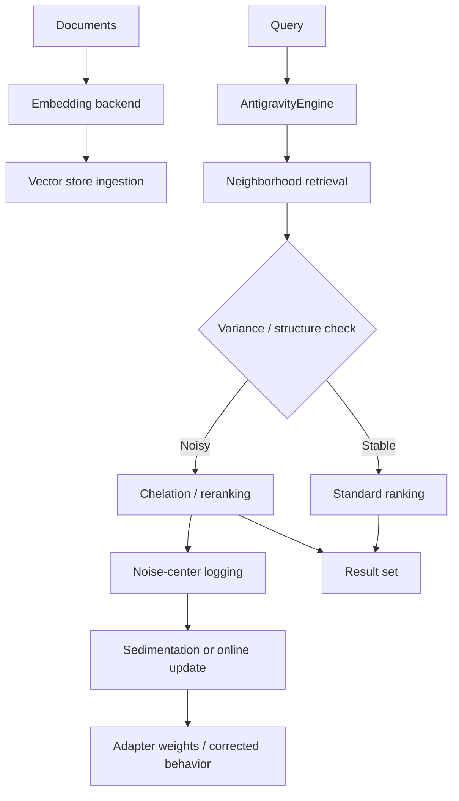
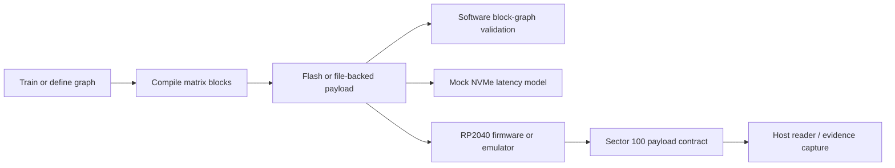

# ChelatedAI

ChelatedAI is a Python research repository for adaptive retrieval, post-hoc embedding correction, multi-dataset evaluation, and computational-storage experiments.

**Primary research path (2026-06):** the [**Liquified Lattice**](docs/VISION_LIQUIFIED_LATTICE.md) program — self-annealing retrieval pools steerable by quant-like shims, linked as a DAG/GNN evidence graph, with disk-scale precomputed pools as the endgame. Active execution is tracked in [docs/ROADMAP_EXECUTION.md](docs/ROADMAP_EXECUTION.md). Phase I is not complete on this commit. `tests/test_learning_loop_e2e.py` is added by this change. It is a floor-tier dim-8 fixture. It is not MiniLM and not BEIR. It fails when the chelated ranked-id list does not change. Steps 1–4 were not re-verified. Some Phase II rungs are already on main; see the status table below.

The repo still carries substantial work on road-course tuning, learned gates, Model-Scope steering, computational storage, and agentic remediation. Those tracks remain on the books and are not abandoned; they are sequenced **after** or **alongside** the primary lattice milestones as capacity allows. See [Research baseline and queued work](#research-baseline-and-queued-work) below.

The codebase spans two connected themes that feed the lattice path:

- improving vector retrieval quality through chelation, sedimentation, distillation, topology analysis, and online correction
- exploring whether parts of model execution can be pushed toward storage-resident node graphs, deterministic transport paths, and multi-drive speculative execution

> Note
> The computational-storage track includes drive-resident graph execution experiments and RP2040 transport tooling. It does not yet prove full on-device LLM inference on physical hard drives or SSDs. The current merged hardware claim is scope-locked to a deterministic transport proof. See [docs/computational-storage-transport-scope-decision.md](docs/computational-storage-transport-scope-decision.md).

## Why This Repo Exists

Most embedding systems assume the base embedding model is fixed and that retrieval quality is mainly a search-index problem. ChelatedAI treats retrieval failures as a dynamic systems problem:

- detect when a query enters a noisy neighborhood
- rerank or adapt before collapse propagates
- track structural drift over time
- benchmark whether improvements generalize across datasets
- test whether some inference primitives can move closer to storage media

## Primary Research Path: Liquified Lattice

This is the **current focus**. It unifies retrieval correction, self-healing (SEAL/EGGROLL), Model-Scope steering, shims, and the disk-first endgame into one phased program.

| Phase | Scope | Status (2026-06-06) |
|---|---|---|
| **Phase I** (steps 1–8) | ML correctness, infra hygiene, Model-Scope shadow pilot, E2E learning loop | Not complete on this commit. Step 8's test `tests/test_learning_loop_e2e.py` is added by this change. It is a floor-tier dim-8 fixture. It is not MiniLM and not BEIR. It fails when the chelated ranked-id list does not change. Phase I is not complete. Steps 1–4 were not re-verified in this PR. Step 7 was not re-opened here. |
| **Phase I defer** | SHIM substrate (production SIP wiring) | `chelated_shim_research.py` is not in this commit. Historical SHIM-CD ids are not closed here. The resume rule is unchanged: after step 8. |
| **Phase II** (steps 9–17) | Annealing controller, evidence DAG, disintegration loop, drift experiment, GNN, quant shim routing, disk pool slice | Not a claim that Phase I is complete. Rungs 13 and 17 are on main (#293, #294). Rung 15 is OPEN, not done, not refused. Rung 16 is not on this commit. See [ROADMAP_EXECUTION.md](docs/ROADMAP_EXECUTION.md). |

**Key docs:** [VISION_LIQUIFIED_LATTICE.md](docs/VISION_LIQUIFIED_LATTICE.md) · [ROADMAP_EXECUTION.md](docs/ROADMAP_EXECUTION.md) · [CHANGELOG.md](CHANGELOG.md)

**What “liquified lattice” means in practice today**

| Lattice piece | Repo surface today | Next milestone |
|---|---|---|
| Crystal pool | `vector_store.py`, sedimentation, adapters | Evidence DAG schema is on main via merged PR #277 (`81e3614bec7d5e5b9cce57af8e7126c6b97775dc`). This cell does not say Phase I is complete. |
| Laser / refraction | `antigravity_engine.py` chelation + masks | Annealing controller is on main via merged PR #260 (`f0c643ae7bf5a7c7ca612ceaa878b7cb15412540`). |
| Annealing | sedimentation, `online_updater.py`, ES optimizer | Post-bank temperature schedule is on main via merged PR #280 (`9db098ea0d2f7df91b54d29e5ee1c6eb9ea65bb8`). Whether one schedule object owns every path was not re-verified in this PR. |
| Disintegration | `isomer_detector.py`, masking | Detector-to-DAG prune is on main via merged PR #293 (`782ab62ddbaf6ab6c40085255e48ff9a21562d34`). `evidence_dag.py` defines `prune_edges` (line 290). |
| Shims (quant-like) | adapters, `model_scope_steering.py` (`chelated_shim_research.py` is not in this commit) | Rung 10 merges #284 (`efe6d1be55b5c702eb3a1cccde3169feb04b6c34`), #285 (`49b36046b6d59a554633f631924005130a05cd1f`), #286 (`d8181f64161522eb39f8b0e1fd9e48aa0fa536b2`), and #289 (`d1bfc0903d7de5c2b81d41a7d081e7da8502ad40`) are ancestors. That does not close historical SHIM-CD ids. |
| Disk pools | `computational_storage_poc/block_graph.py` | `write_pool_shard` (line 100), `read_pool_shard` (line 241), and `verify_pool_shard_parity` (line 286) are on this commit in `computational_storage_poc/pool_shard.py` via merged PR #294 (`8e6e83b7c30bae34015ad12996314b5eea2d1c64`). |

```bash
# Primary-path commands that exist on this commit
python -m unittest discover -s tests -p "test_*.py" -v
python scripts/check_block_flag.py
```

`scripts/phase_development_loop.py` is not in this commit, so it is not a validation step here. The unittest command above was not re-run in this PR. `python3 scripts/check_block_flag.py` was run and exited 0.

## Repository Tracks

All tracks below remain active parts of the portfolio. **Primary** = lattice program; **Queued** = tackle on schedule, not dropped.

| Priority | Track | What it covers | Main entrypoints |
|---|---|---|---|
| **Primary** | Liquified lattice | Self-annealing pools, shims, evidence DAG, disk-scale endgame | [VISION_LIQUIFIED_LATTICE.md](docs/VISION_LIQUIFIED_LATTICE.md), `self_healing_chelation.py`, `build_attribution_pool.py` (`chelated_shim_research.py` is not in this commit) |
| Queued | Adaptive retrieval | Chelation, sedimentation, adapter-based correction, vector-store integration | `antigravity_engine.py`, `chelation_adapter.py`, `vector_store.py`, `config.py` |
| Queued | Distillation and correction | Teacher guidance, cross-lingual routing, online updates, schedule tuning | `teacher_distillation.py`, `cross_lingual_distillation.py`, `teacher_weight_scheduler.py`, `online_updater.py` |
| Queued | Evaluation and reporting | BEIR runs, comparative benchmarks, sweeps, and dashboards | `benchmark_beir.py`, `benchmark_comparative.py`, `benchmark_multitask.py`, `run_sweep.py`, `run_large_sweep.py`, `dashboard_server.py` |
| Queued | Structural analysis | Topology cohesion, isomer drift, embedding quality, stability diagnostics | `topology_analyzer.py`, `isomer_detector.py`, `embedding_quality.py`, `stability_tracker.py` |
| Queued | Computational storage and drive nodes | Block-graph execution, mock NVMe path, multi-drive array simulation, RP2040 firmware, emulator, host reader, evidence capture | `computational_storage_poc/`, `test_computational_storage_poc.py`, `test_computational_storage_payload.py`, `test_computational_storage_emulation.py` |
| Queued | Process and remediation | Agentic review workflow, tracker docs, session logs, verification evidence | `aep_orchestrator.py`, `docs/ARCH AGENTIC ENGINEERING AND PLANNING/` |

## Quick Start

### 1. Install Python dependencies

Windows PowerShell:

```powershell
python -m venv .venv
.\.venv\Scripts\Activate.ps1
pip install -r requirements.txt
pip install -e .
```

macOS / Linux:

```bash
python -m venv .venv
source .venv/bin/activate
pip install -r requirements.txt
pip install -e .
```

`requirements.txt` installs the full research stack, including `requests`, `mteb`, and `scikit-learn`. `pyproject.toml` exposes the installable package metadata and optional dependency groups.

### 2. Optional local embedding backend

If you want to use the Ollama-backed embedding path:

```bash
docker run -d -p 11434:11434 ollama/ollama
docker exec ollama ollama pull nomic-embed-text
```

Use model names like `ollama:nomic-embed-text` to route through the HTTP embedding backend.

### 3. Run the main validation surfaces

```bash
python -m unittest discover -s . -p "test_*.py" -v
python run_live_fire_diagnostics.py --output live_fire_results.json
python run_safety_testbed.py
python run_road_course_campaign.py --task SciFact --max-queries 20 --sample-docs 1200 --output experiment_runs\roadcourse-small\roadcourse_profile_grid.json
python run_road_course_tuning_loop.py --task SciFact --max-queries 100 --sample-docs 1200 --rounds 2 --output experiment_runs\roadcourse-small\scifact_hundred_tuning_loop.json
python run_road_course_tuning_loop.py --task SciFact --max-queries 100 --sample-docs 1200 --rounds 2 --initial-grid modules --output experiment_runs\roadcourse-small\scifact_hundred_module_tuning_loop.json
python run_road_course_tuning_loop.py --task SciFact --max-queries 100 --sample-docs 1200 --rounds 2 --initial-grid calibrated --output experiment_runs\roadcourse-small\scifact_hundred_calibrated_tuning_loop.json
python run_thousand_query_tuning.py --loop-queries 200 --window-queries 50 --sample-docs 400 --output experiment_runs\roadcourse-small\adaptive_thousand_query_tuning.json
python run_thousand_query_tuning.py --phase-queries 5000 --loop-queries 200 --window-queries 50 --sample-docs 250 --output experiment_runs\roadcourse-small\adaptive_fivek_query_tuning.json
python -m unittest test_computational_storage_poc.py -v
python -m unittest test_computational_storage_emulation.py -v
python computational_storage_poc/run_all_tests.py
python computational_storage_poc/emulation/validate_emulation_path.py
```

### 4. Run representative research entrypoints

```bash
python benchmark_beir.py --tier small --output benchmark_beir_small.json
python benchmark_multitask.py --tasks small --epochs 5 --max-queries 100
# Dashboard (fail-closed auth): export a token first, then set it in the
# browser console via sessionStorage.setItem('chelated_dashboard_token', '<token>').
# For loopback dev only you may instead allow unauthenticated mode explicitly.
export CHELATED_DASHBOARD_TOKEN="$(python3 -c 'import secrets; print(secrets.token_hex(16))')"
python dashboard_server.py --port 8080
# Loopback-dev alternative (explicit open mode, never for shared hosts):
# CHELATED_DASHBOARD_ALLOW_UNAUTHENTICATED=1 python dashboard_server.py --port 8080
```

## Information Flows

### Retrieval and adaptation loop


```mermaid
flowchart TD
    A[Documents] --> B[Embedding backend]
    B --> C[Vector store ingestion]
    Q[Query] --> E[AntigravityEngine]
    E --> F[Neighborhood retrieval]
    F --> G{Variance / structure check}
    G -->|Stable| H[Standard ranking]
    G -->|Noisy| I[Chelation / reranking]
    I --> J[Noise-center logging]
    J --> K[Sedimentation or online update]
    K --> L[Adapter weights / corrected behavior]
    H --> M[Result set]
    I --> M
```

### Computational-storage research flow


```mermaid
flowchart LR
    A[Train or define graph] --> B[Compile matrix blocks]
    B --> C[Flash or file-backed payload]
    C --> D[Software block-graph validation]
    C --> E[Mock NVMe latency model]
    C --> F[RP2040 firmware or emulator]
    F --> G[Sector 100 payload contract]
    G --> H[Host reader / evidence capture]
```

## Status on this commit

The text below was checked against ancestor `49804ae3ddcebf4e4060fae95ba812331299f757` (PR #308). That commit is not the tip of this branch. PR [#257](https://github.com/mattmre/CHELATEDAI/pull/257) (`feat/live-progress-tracker-20260606`) is open and is not this commit. Rows below were corrected only where a path or completion sentence was checked. This section does not say Phase I is complete.

| Area | Status | Notes |
|---|---|---|
| ML correctness (InfoNCE, projection, adapter isolation) | Not re-verified in this PR | Steps 1–3 were not opened here, so this cell does not say they are done or not done |
| Sweep / packaging / docs truth | JSONL path and py-modules are in; steps 1–2 are not closed | Each `run_large_sweep.py` result is one JSONL append. The JSON array is written once at the end. `run_large_sweep` and `sweep_result_store` are in `pyproject.toml` `py-modules`. A `--no-deps` install imports `sweep_result_store`. Importing `run_large_sweep` stops at missing `numpy`. CI torch install: `cache: pip` plus the CPU wheel URL, documented in `docs/phase-i-steps-1-3-reverify-2026-09-23.md`. No separate torch cache key. |
| Model-Scope pilot (Phase I #7) | Fixture path done (rung 9) | Not a loaded Qwen3.5-9B. Runtime, steering, bridge, and provenance paths were exercised on a fixture |
| E2E learning loop (Phase I #8) | Floor-tier dim-8 fixture added by this change | `tests/test_learning_loop_e2e.py` is added by this change. It is a floor-tier dim-8 fixture. It is not MiniLM and not BEIR. It fails when the chelated ranked-id list does not change. Phase I is not complete. Steps 1–4 were not re-verified |
| SHIM research (Phase I defer) | Named modules are not in this commit | `chelated_shim_research.py`, `shim_node_promoted.py`, and `scripts/record_shim_*_evidence.py` are absent. This cell does not close SHIM-CD ids |
| Phase / BHS loops | Not runnable from the named paths | `scripts/phase_development_loop.py` and `scripts/loop_core_10m.sh` are not in this commit |
| Liquified Lattice vision + Phase II plan | Documented | [VISION_LIQUIFIED_LATTICE.md](docs/VISION_LIQUIFIED_LATTICE.md), [ROADMAP_EXECUTION.md](docs/ROADMAP_EXECUTION.md) |

**Block flag:** `CLEAR`. `python3 scripts/check_block_flag.py` reports zero OPEN carried-debt rows in [docs/next-session.md](docs/next-session.md) (22 data rows, all status CLOSED). CHANGELOG names seven historical ids, not eight: SHIM-CD-01, SHIM-CD-02, SHIM-CD-06, SHIM-CD-08, SHIM-CD-09, SHIM-CD-03, and SHIM-CD-07. SHIM-CD-05 is marked CLOSED there. SHIM-CD-04 does not occur. Those seven names are not rows in the carried-debt table, so the checker does not count them. This sentence does not close them and does not add debt rows.

**Progress log:** [CHANGELOG.md](CHANGELOG.md)

### New surfaces on the live branch

| Surface | Purpose |
|---|---|
| `chelated_shim_research.py` | Not in this commit |
| `shim_node_promoted.py` | Not in this commit |
| `scripts/record_shim_*_evidence.py` | Not in this commit |
| `scripts/run_five_worker_shim_gate.py` | Not in this commit |
| `scripts/phase_development_loop.py` | Not in this commit |
| `reports/ARCH_AEP_REMEDIATION_FINDINGS*.md` | Not in this commit (`reports/` is absent) |

## Research Baseline and Queued Work

The sections below describe **established results on `main` and work still on the books**. They are not the day-to-day execution queue — that is the Liquified Lattice path above — but they remain valid research context and will be revisited (road-course campaigns, learned gates, RP2040 evidence, etc.) as Phase I/II milestones clear.

### Established baseline (2026-04-27 on `main`)

- the adaptive retrieval, benchmarking, and distillation surfaces are implemented on `main`
- the EGGROLL-inspired optimizer, retrieval-fitness gates, adaptive workflow orchestration, and AI-engineering runtime diagnostics are implemented on `main`
- deterministic live-fire diagnostics validate that engine controls and reporting are wired end-to-end; the tiny fixture is saturated, so proof of chelation lift still requires benchmark campaigns
- the project-car safety testbed now covers instrumentation, component benches, dyno sweeps, non-saturated closed-course loops, calibration profiles, and failure-injection ravine tests
- the first small-model road-course campaign supports a conservative chelation threshold guardrail (`0.01`) and rejects always-on chelation for MiniLM/SciFact
- module-aware hundred-query loops exercise query reformulation, guard+reformulation, and temperature-centered profiles; they currently preserve baseline or regress, so no module profile is promoted
- calibrated actuator loops now prove query reformulation fusion and chelation percentile masks mechanically affect rankings, but those effects reduce quality on first-hundred SciFact/NFCorpus loops
- an adaptive 1,000-query cycle with 50-query checkpoints found directional FiQA lift for `adaptive_p85_t0.002`, but cross-task instability blocks default/profile promotion
- adaptive 5,000-query and FiQA-focused confirmation phases found no global winner; the earlier FiQA-like `adaptive_p85_t0.002` / `adaptive_p85_t0.002_reform_rrf_v2` prospect did not survive repeat confirmation, so no route-specific promotion is justified
- tuning summaries now include fault classifications (`no_op_tied`, `actuator_active_positive`, `actuator_active_negative`, and `metric_changed_without_actuator`) so future runs can separate safe no-ops, working-but-harmful actuators, and implementation/instrumentation faults
- a fault-aware 5,000-query golden-setting search found no default-promotable or golden profile; `adaptive_p99_t0.0015` produced large positive SciFact windows but also larger active-negative regressions, confirming the next path is learned/query-conditional gating rather than another global threshold default
- a gate-learning 5,000-query campaign now emits `gate_feature_rows`, `gate_candidate_report`, and `shippable_gate_candidates`; no shippable diagnostic gate was found, and the result points to a supervised gate trained on held-out windows rather than another hand-written threshold
- conservative learned-gate tooling is now implemented: `chelatedai-train-gate` trains holdout-validated gate artifacts and `run_thousand_query_tuning.py --strategy learned_gate --gate-artifact ...` consumes them; the first trained artifact rejected all 140 candidate rules, so it correctly fails closed instead of promoting an unsafe actuator
- two alternative validation tracks are now implemented: tuning artifacts emit `query_attribution_rows` for per-query actuator/gate learning, and `chelatedai-synthetic-collapse` provides a deterministic semantic-collapse fixture where masking the known noisy dimension recovers NDCG/MRR/Recall from 0.0 to 1.0
- all six follow-up research pathways now have working surfaces: query attribution, synthetic collapse, learned mask smoke, selective reformulation, benchmark-family meta-analysis, and candidate-profile proposals; the first 200-query SciFact meta probe still finds no golden setting, but it identifies always-on `reform_rrf_v2` as the only retest candidate while treating chelation profiles as training data only
- follow-on reformulation-policy and static-mask probes did not produce a new candidate: reformulation policies were neutral/negative across the next 100-query search, and supervised static masks showed train-slice hints but hurt held-out SciFact retrieval
- conditional static-mask gates can reduce damage but are not stable enough yet: the recurring low-stopword gate tied or slightly improved holdout in some compact probes, but one repeat regressed and no run crossed the promotion threshold
- regularized conditional static-mask gates now require an internal train/validation split before holdout application; compact repeats produced one small holdout lift (+0.0014), one tie, and one fail-closed run, so this remains a weak research lead rather than a shippable setting
- classifier-gated conditional masks are now implemented with logistic scoring, internal validation, and a minimum-positive-example floor; 50 compact SciFact loops found no lift, and the safer floor failed closed on all seeds, so this branch is rejected as a current candidate but retained as guarded research tooling
- the remaining non-hardware work is broader road-course campaign execution and evidence review before any aggressive profile promotion, not missing feature delivery
- the computational-storage follow-through is narrowed to real RP2040 evidence capture and a dated retention review
- the repository includes credible storage-node experiments, but not a shipped hard-drive-hosted LLM runtime

### Queued work (tackle over time; feeds lattice path)

| Area | Status | When / how it returns |
|---|---|---|
| Road-course profile promotion | No global golden setting yet; learned/query-conditional gating is the lead | Rung 14 drift apparatus is on main. Profile promotion is still open |
| Learned gates and static masks | Tooling exists; first artifacts fail closed or hurt holdout | Attribution pool → evidence DAG (Phase II #12) |
| SEAL/EGGROLL self-healing depth | Advisory + sandbox; cloned-adapter execution pending | Phase II annealing controller (#11) + [seal-eggroll doc](docs/seal-eggroll-multipanel-architecture-2026-04-28.md) |
| Computational storage / RP2040 | Software transport proof strong; physical evidence capture pending | Rung 17 is a host-parity shard on main via #294. It is not a board and not a production retrieval path. Physical capture is still pending. [storage track](docs/COMPUTATIONAL_STORAGE_DRIVE_NODES.md) |
| Disk-first CPU program | Architecture docs exist; not fully reflected in runtime | After evidence DAG + pool shard milestones |
| Agentic remediation (AEP/BHS) | Active process layer | Continuous; see [docs/next-session.md](docs/next-session.md) |

For the current live-fire validation plan, see [docs/live-fire-diagnostics-2026-04-27.md](docs/live-fire-diagnostics-2026-04-27.md). For the safety testbed road-course gates, see [docs/safety-testbed-road-course-plan.md](docs/safety-testbed-road-course-plan.md). For the first small-model road-course result, see [docs/road-course-results-2026-04-27.md](docs/road-course-results-2026-04-27.md). For the earlier post-feature evaluation plan, see [docs/roadmap-audit-and-weight-refinement-plan-2026-03-06.md](docs/roadmap-audit-and-weight-refinement-plan-2026-03-06.md). Full track inventory: [docs/RESEARCH_TRACKS.md](docs/RESEARCH_TRACKS.md).

## Module Walkthrough

### Core retrieval runtime

- `antigravity_engine.py`: central engine for ingestion, inference, adaptive chelation, logging, and training hooks
- `embedding_backend.py`: routes embeddings to Ollama or local SentenceTransformers
- `vector_store.py`: Qdrant abstraction used by the retrieval engine
- `chelation_adapter.py`: near-identity adapter variants for post-hoc correction
- `config.py`: presets and validation for retrieval, distillation, online updates, topology, and BEIR

### Training, correction, and analysis

- `teacher_distillation.py`: offline, hybrid, and teacher-guided correction helpers
- `cross_lingual_distillation.py`: language-aware teacher routing
- `online_updater.py`: inference-time update mechanisms and diagnostics
- `self_healing_chelation.py`: SEAL/EGGROLL-inspired self-edit planning for advisory adapter-only repair directives
- `topology_analyzer.py` and `isomer_detector.py`: structural drift analysis
- `stability_tracker.py`, `embedding_quality.py`, `convergence_monitor.py`: health and learning diagnostics

### Evaluation and experimentation

- `benchmark_beir.py`, `benchmark_multitask.py`, `benchmark_comparative.py`, `benchmark_distillation.py`: retrieval-quality evaluation
- `run_sweep.py` and `run_large_sweep.py`: grid-search style parameter studies
- `run_live_fire_diagnostics.py`: deterministic live-fire harness for engine controls, telemetry, gates, and reporting
- `run_safety_testbed.py`: staged safety testbed for non-saturated closed-course loops, calibration profiles, failure gates, and road-course campaign planning
- `run_road_course_campaign.py`: small-model road-course profile grid for threshold/default decisions
- `run_road_course_tuning_loop.py`: iterative first-hundred-query profile tuning loop with adaptive and module-aware next-grid selection
- `run_thousand_query_tuning.py`: five-loop adaptive 1,000-query road-course cycle with 50-query validation windows
- `dashboard_server.py` and `dashboard/index.html`: local research dashboard

### Computational storage and drive nodes

- `computational_storage_poc/block_graph.py`: flash-friendly block packing and traversal
- `computational_storage_poc/mock_nvme.py`: software parity and latency model for computational-storage reads
- `computational_storage_poc/mock_array.py`: speculative multipath racing across storage nodes
- `computational_storage_poc/payload_contract.py`: deterministic trigger-sector payload used by firmware and emulator
- `computational_storage_poc/usb_host_inference.py`: host-side raw-sector reader
- `computational_storage_poc/capture_hardware_evidence.py`: auditable RP2040 evidence capture tool
- `computational_storage_poc/firmware/`: RP2040/TinyUSB transport firmware
- `computational_storage_poc/emulation/`: dependency-light emulator validation path

## CI and Validation

GitHub Actions currently verifies:

- Python linting with `ruff`
- full `unittest` discovery across Python 3.9, 3.10, 3.11, and 3.12
- computational-storage fundamentals and the script harness
- computational-storage emulation validation
- RP2040 firmware build and artifact upload

See [`.github/workflows/test.yml`](.github/workflows/test.yml) and [`.github/workflows/build_firmware.yml`](.github/workflows/build_firmware.yml).

## Documentation Guide

Start here:

- [docs/README.md](docs/README.md): canonical docs home and legacy-to-canonical map
- [docs/VISION_LIQUIFIED_LATTICE.md](docs/VISION_LIQUIFIED_LATTICE.md): north-star architecture (self-annealing lattice, shims, disk pools)
- [docs/ROADMAP_EXECUTION.md](docs/ROADMAP_EXECUTION.md): Phase I + Phase II execution queue
- [docs/SYSTEM_BLUEPRINT.md](docs/SYSTEM_BLUEPRINT.md): architecture, stack, and information flows
- [docs/MODULE_GUIDE.md](docs/MODULE_GUIDE.md): module-by-module inventory
- [docs/RESEARCH_TRACKS.md](docs/RESEARCH_TRACKS.md): active and historical research tracks
- [docs/COMPUTATIONAL_STORAGE_DRIVE_NODES.md](docs/COMPUTATIONAL_STORAGE_DRIVE_NODES.md): hard-drive / storage-node research summary
- [docs/INDEX.md](docs/INDEX.md): broader index, including the AEP process archive

## Use Cases

### Retrieval researcher

- compare standard vs. chelated ranking behavior
- run cross-dataset BEIR evaluations
- refine adapter schedules and teacher weights

### Systems researcher

- test whether block-graph traversal can remain correct when moved toward storage media
- compare host-driven vs. storage-driven latency models
- validate deterministic firmware or emulator transport surfaces

### Documentation or review session

- use the canonical docs set first
- fall back to the AEP archive for process evidence, session logs, and prior decisions

## License

This repository is distributed under the MIT license. See [LICENSE](LICENSE).
