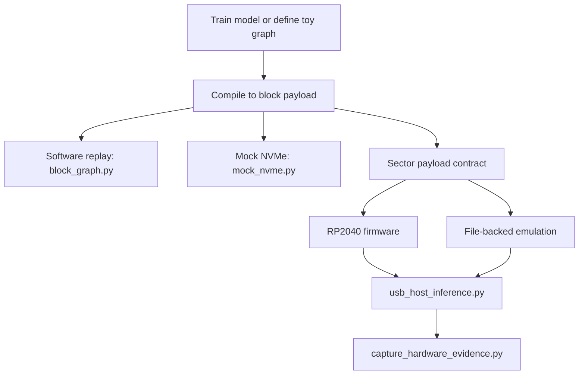

# Computational Storage And Drive-Node Research

This document is the canonical overview for the repo's hard-drive, SSD, and storage-node experiments.

## Plain-English Summary

ChelatedAI contains a serious computational-storage research track, but it is not yet a "full LLM running on a hard drive" repository.

What the repo does contain today:

- a flash-friendly block-graph execution format
- software validation that a compiled digits-model path can be replayed correctly from storage-style blocks
- a mock NVMe latency model
- a speculative multi-drive node-racing simulation
- a deterministic transport path implemented across firmware, emulator, and host tooling

What the repo does not yet contain:

- a promoted full-model LLM runtime executing directly from a production hard drive or SSD controller
- real hardware evidence that the current RP2040 path performs full on-device digits inference

## Research Hypothesis

The storage track asks whether model execution can be split into storage-resident graph nodes and host-side coordination, so the host no longer has to retrieve every block and perform every operation centrally.

This appears in the repo in three different forms:

1. block-graph execution from flash-like storage payloads
2. multi-drive speculative node dispatch
3. deterministic transport/control-plane verification on RP2040 and emulator paths

## Current Architecture

## Subsystems

### 1. Block-graph format

`computational_storage_poc/block_graph.py` defines the storage-native representation:

- fixed-size matrix payload blocks
- 64-bit next-block pointers
- replay logic that walks the graph in offset order
- optional hidden-layer activation handling

This is the foundation for the storage-resident inference story.

### 2. Mock NVMe path

`computational_storage_poc/mock_nvme.py` compares:

- traditional host-side inference that repeatedly reads from storage
- computational-storage style inference where traversal and compute are conceptually colocated

This path is still theoretical, but it is useful because it enforces parity and keeps the latency discussion explicit rather than hand-wavy.

### 3. Storage-node array simulation

`computational_storage_poc/mock_array.py` and `computational_storage_poc/CHELATEDAI_integration_demo.py` model a more speculative idea:

- multiple drives acting as independent node fetchers
- speculative multipath racing across likely next nodes
- latency hidden by parallel storage-node dispatch

This is the closest thing in the repo to the "hard-drive stored LLM nodes" idea. It should still be described as a simulation and research direction, not as a production runtime.

### 4. Deterministic transport contract

`computational_storage_poc/payload_contract.py` defines a transport surface that all execution environments share:

- sector `100`
- deterministic toy input vector
- deterministic `4 -> 3 -> 2` graph output
- JSON payload with logits, predicted class, and block count

That contract is what ties the firmware, emulator, and host tooling together.

### 5. Firmware and emulator surfaces

The firmware and emulator are not interchangeable proofs, but they are designed to preserve the same payload semantics.

| Surface | Role |
|---|---|
| `computational_storage_poc/firmware/` | RP2040/TinyUSB mass-storage transport proof |
| `computational_storage_poc/emulation/` | File-backed validation path that CI can exercise without privileged hardware |
| `computational_storage_poc/usb_host_inference.py` | Host-side raw-sector read path |
| `computational_storage_poc/capture_hardware_evidence.py` | Report generator for real-hardware evidence |

## Validation Matrix

| Claim | Evidence surface |
|---|---|
| Block traversal begins at offset `0x0` and preserves graph semantics | `test_computational_storage_poc.py` |
| Host and storage-style execution match numerically in the mock path | `test_computational_storage_poc.py` |
| Digits-model software round-trip remains within acceptance bounds | `test_computational_storage_poc.py` plus `train_and_compile.py` helpers |
| Deterministic transport payload is shared across layers | `test_computational_storage_payload.py` |
| Emulator parity remains testable in CI | `test_computational_storage_emulation.py` and `computational_storage_poc/emulation/validate_emulation_path.py` |
| RP2040 firmware still compiles | `.github/workflows/build_firmware.yml` |
| Raw-device evidence capture honors Windows path handling | `test_computational_storage_hardware_evidence.py` |

## Scope Boundary

The current merged RP2040 path is intentionally scope-locked.

Authoritative decision:

- [computational-storage-transport-scope-decision.md](computational-storage-transport-scope-decision.md)

Current allowed description:

> A deterministic transport/control-plane proof that validates trigger-sector interception and payload consistency.

Current disallowed description:

- "full on-device digits inference is already proven on RP2040"
- "the repo already runs an LLM directly from a hard drive"

## How To Talk About "Hard-Drive Stored LLM Nodes"

If you need to describe this track externally or in internal research notes, the precise framing is:

- the repo explores storage-resident graph execution and multi-drive node dispatch
- the repo includes simulations and proof-of-contract tooling for drive-node orchestration
- the repo does not yet provide a validated full hard-drive-hosted LLM runtime

That wording preserves the ambition of the track without overstating the hardware results.

## Operator Workflow For Real Hardware

When an RP2040 device is available:

1. build and flash the firmware
2. identify the raw drive number or device path
3. run `python computational_storage_poc/capture_hardware_evidence.py <drive-number-or-path> --notes "..."`
4. review the generated report
5. commit the evidence artifact only if the device identity and payload are trustworthy

Runbook:

- [computational-storage-hardware-evidence-runbook.md](computational-storage-hardware-evidence-runbook.md)

## Open Questions

- Can the block-graph format scale beyond toy or digits-class workloads without breaking the storage-resident premise?
- What controller or device class is credible for a next-stage on-device workload beyond the RP2040 transport proof?
- Can the storage-node racing idea become more than a latency toy model?
- What would count as a defensible "drive-resident LLM node" acceptance test?

## Related Documents

- [../computational_storage_poc/README.md](../computational_storage_poc/README.md)
- [computational-storage-transport-scope-decision.md](computational-storage-transport-scope-decision.md)
- [computational-storage-hardware-evidence-runbook.md](computational-storage-hardware-evidence-runbook.md)
- [computational-storage-retention-policy-2026-03-06.md](computational-storage-retention-policy-2026-03-06.md)
