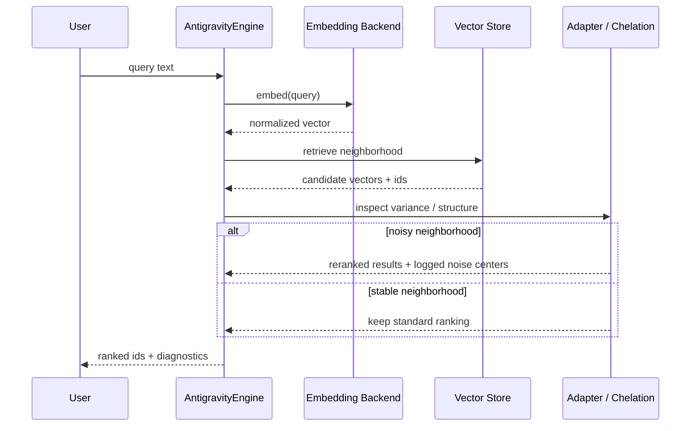
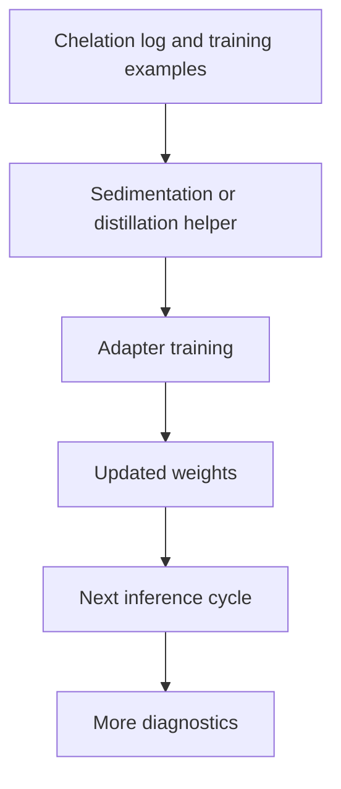
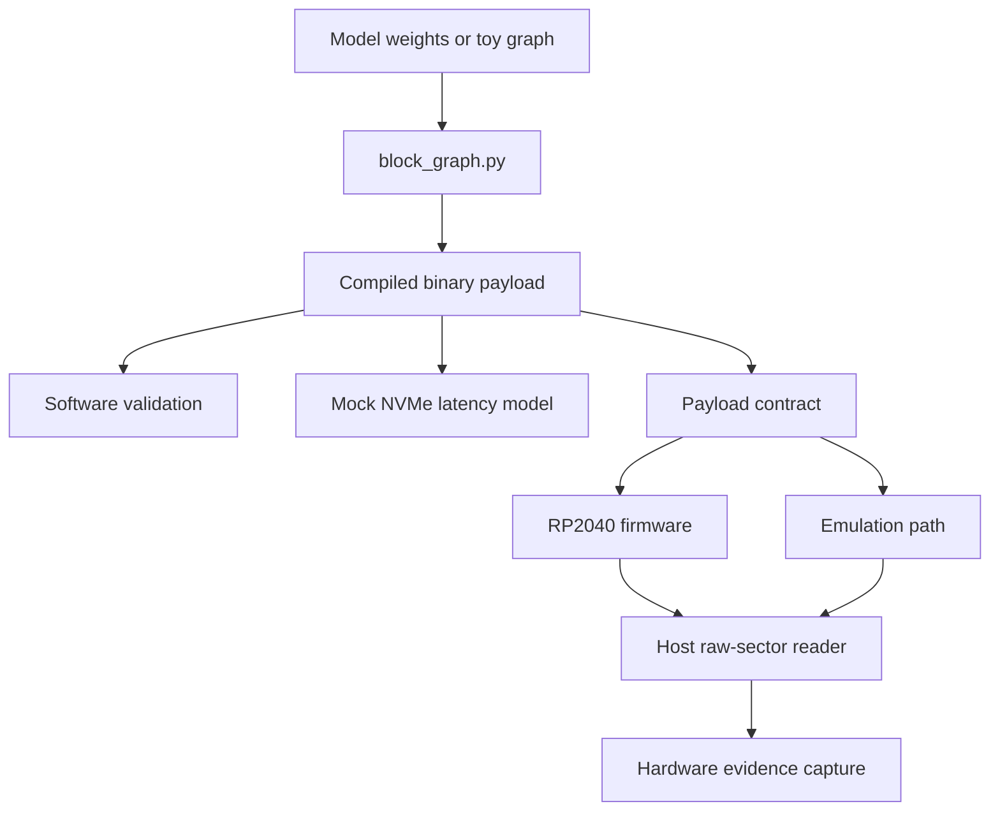

# System Blueprint

## System Summary

ChelatedAI is a flat-layout Python research repository with three major surfaces:

1. a retrieval runtime centered on adaptive chelation and self-correcting embeddings
2. a benchmark and research harness for distillation, generalization, and structural diagnostics
3. a computational-storage proof-of-concept that tests drive-resident node execution and deterministic transport paths

The repository is not a packaged application with a single CLI. It is a research workbench with several top-level runtime, benchmark, and subsystem entrypoints.

## Tech Stack

| Area | Technologies |
|---|---|
| Language | Python 3.9+ |
| ML runtime | PyTorch, sentence-transformers |
| Vector store | Qdrant |
| Evaluation | MTEB, scikit-learn |
| Local embedding alternative | Ollama HTTP API via `requests` |
| Dashboard | Python standard library HTTP server plus static HTML |
| Firmware track | C, CMake, TinyUSB, Raspberry Pi Pico SDK |
| Emulator track | Python plus file-backed validation, Docker assets for FUSE-oriented exploration |
| CI | GitHub Actions |

## Top-Level Topology

```text
CHELATEDAI/
|-- antigravity_engine.py
|-- chelation_adapter.py
|-- config.py
|-- vector_store.py
|-- teacher_distillation.py
|-- cross_lingual_distillation.py
|-- online_updater.py
|-- topology_analyzer.py
|-- isomer_detector.py
|-- benchmark_*.py
|-- run_sweep.py / run_large_sweep.py
|-- dashboard_server.py
|-- computational_storage_poc/
|-- docs/
`-- test_*.py
```

## Information Flows

### Retrieval runtime



### Correction and training loop



### Computational-storage track



## Main Runtime Areas

### Adaptive retrieval

The retrieval engine is built around `AntigravityEngine`, which owns:

- embedding generation
- vector-store interaction
- adaptive chelation or centering behavior
- adapter usage
- logging, diagnostics, and training hooks

This is the operational center of the repo.

### Distillation and online correction

The training surface extends beyond basic sedimentation:

- `teacher_distillation.py` handles teacher-guided and hybrid supervision
- `teacher_weight_scheduler.py` controls schedule families
- `cross_lingual_distillation.py` routes teacher choices by language
- `online_updater.py` experiments with inference-time adaptation

### Evaluation and experiment orchestration

Evaluation is not limited to a single benchmark:

- BEIR suite evaluation
- comparative benchmarks across configurations
- multitask generalization
- sweep runners
- a bounded campaign runner for post-feature weight refinement

### Computational storage and drive nodes

The storage track spans:

- software block-graph compilation and traversal
- mock NVMe parity and theoretical latency accounting
- speculative multi-drive racing
- deterministic sector payload transport
- RP2040 firmware
- file-backed emulation
- host-side evidence capture

## CI Surfaces

The repo uses two workflow files:

- [`../.github/workflows/test.yml`](../.github/workflows/test.yml)
  - `ruff`
  - full `unittest` matrix
  - computational-storage fundamentals
  - computational-storage emulation
- [`../.github/workflows/build_firmware.yml`](../.github/workflows/build_firmware.yml)
  - RP2040 firmware build
  - UF2 / ELF / BIN artifact upload

## Scope Notes

- The runtime and research stack on `main` is broader than the old Phase 4 wording in historical documents.
- The storage-node track is real and test-backed, but its public claim boundary is intentionally narrower than "full hard-drive-hosted LLM inference."
- The AEP process docs are important operational records, but they are not the best first-stop architecture overview for new readers.

## Read Next

- [MODULE_GUIDE.md](MODULE_GUIDE.md)
- [RESEARCH_TRACKS.md](RESEARCH_TRACKS.md)
- [COMPUTATIONAL_STORAGE_DRIVE_NODES.md](COMPUTATIONAL_STORAGE_DRIVE_NODES.md)
