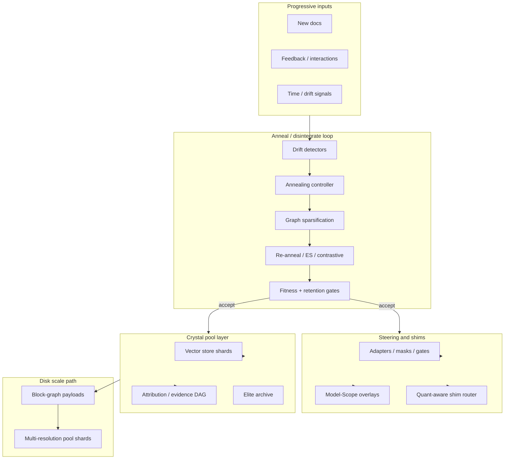

# Vision: Liquified Lattice (Self-Annealing RAG/DAG)

**Status:** Active north-star architecture (2026-06-06)  
**Execution:** Phased via [ROADMAP_EXECUTION.md](ROADMAP_EXECUTION.md) — Phase I (core queue) then Phase II (lattice program)

## One-sentence thesis

ChelatedAI evolves retrieval and model control from static embeddings into a **self-annealing lattice of precomputed pools** — steerable by shims (like quantization layers), linkable as a DAG/GNN evidence graph, and readable at scale from disk — so progressive human and environmental change forces **controlled disintegration and re-alignment** instead of silent pattern decay.

## Metaphor map (design language, not marketing)

| Metaphor | Engineering meaning in this repo |
|---|---|
| **Crystal pool** | Vector store + sedimentation state + adapter/checkpoint artifacts (Qdrant, `.pt`, attribution pool JSON) |
| **Liquified lattice** | Embeddings and clusters that can be masked, reranked, pruned, and re-trained without mutating frozen base weights |
| **Laser / refraction** | Query beam through neighborhood retrieval → variance/structure check → masking, spectral centering, adapter steering |
| **Annealing** | High-temperature exploration (noise, ES candidates, contrastive updates); low-temperature stabilization (sedimentation, retention gates, promotion) |
| **Disintegration** | Deliberate prune of low-fitness links, stale clusters, or degraded subgraphs when drift detectors fire |
| **Shims (quant-like)** | Bounded adapters, learned masks/gates, Model-Scope steering overlays, env-guarded SIP probes — hot-swappable control planes |
| **Disk read at scale** | Computational-storage block graphs + multi-resolution precomputed pools; host coordinates, storage serves shards |

## Invariants (non-negotiable for this program)

1. **Frozen base weights by default** — base embedding and LLM weights do not mutate in production paths. Promotion targets adapters, overlays, routes, pool shards, and shim registries only. See [seal-eggroll-multipanel-architecture-2026-04-28.md](seal-eggroll-multipanel-architecture-2026-04-28.md).
2. **Evidence before promotion** — road-course, live-fire, retention replay, and quantization survival gates must pass before any default changes. No doc-only promotion.
3. **Progressive inputs are first-class** — new documents, interaction feedback, and concept drift trigger anneal/disintegrate cycles; static pools are a failure mode.
4. **One track at a time** — Phase I core queue completes before Phase II lattice slices; SHIM substrate resumes only after step 8 per execution policy.
5. **Honest scope on disk** — transport/control-plane proof today; full disk-resident LLM inference is endgame, not current claim. See [computational-storage-transport-scope-decision.md](computational-storage-transport-scope-decision.md).

## What already exists (repo grounding)

```text
Query ──► AntigravityEngine ──► VectorStore (pool)
              │                      ▲
              ├── chelation / masks ─┤ sedimentation, adapters
              ├── learned gates ─────┤ attribution pool
              ├── self_healing_chelation (SEAL advisory)
              ├── evolution_strategies_optimizer (EGGROLL)
              ├── model_scope_steering (shadow overlays)
              ├── topology / isomer drift signals
              └── chelated_shim_research (env-guarded SIPs)
                        │
                        ▼
              computational_storage_poc (block-graph / disk path)
```

| Capability | Primary modules | Maturity |
|---|---|---|
| Pool + steering | `vector_store.py`, `antigravity_engine.py`, `chelation_adapter.py` | Production research path |
| Annealing loops | `sedimentation_trainer.py`, `online_updater.py`, `evolution_strategies_optimizer.py` | Implemented; not unified under one temperature controller |
| Self-healing | `self_healing_chelation.py`, `fitness_composition_orchestrator.py` | Advisory + sandbox; persistent loop incomplete |
| Drift detection | `isomer_detector.py`, `convergence_monitor.py`, `topology_analyzer.py` | Implemented; not wired to graph prune triggers |
| Evidence / attribution DAG (flat) | `build_attribution_pool.py`, `elite_archive.py` | JSON pool; no explicit graph schema or GNN yet |
| Shims | `chelated_shim_research.py`, `model_scope_steering.py`, `learned_mask_gate.py` | Partial; production SIP wiring deferred (SHIM-CD rows) |
| Disk path | `computational_storage_poc/block_graph.py` | Software proof; pool shard integration pending |

## Target architecture (Phase II outcome)



## Phase II program (after Phase I step 8)

Detailed step table lives in [ROADMAP_EXECUTION.md](ROADMAP_EXECUTION.md#phase-ii--liquified-lattice-program). Summary:

| Step | Deliverable |
|---|---|
| 9 | Model-Scope shadow pilot + provenance (complete Phase I step 7) |
| 10 | SHIM substrate DoD — production seams, not env-only research |
| 11 | **Annealing controller** — unified temperature schedule across sedimentation, online update, ES |
| 12 | **Evidence DAG schema** — typed graph over attribution pool (JSON/schema first) |
| 13 | **Disintegration loop** — drift-triggered prune + fitness-gated re-anneal |
| 14 | **Concept-drift experiment** — synthetic or road-course drift injection; measure recovery before GNN |
| 15 | **GNN prototype** (optional PyG/DGL) — only after steps 12–14 pass |
| 16 | **Quant-aware shim routing** — promotion gate + adapter router integration |
| 17 | **Disk pool slice** — one precomputed shard + block-graph read integration |

## Claim boundaries

**In scope for Phase II planning:**

- Adapter-only self-healing with measurable recovery after injected drift
- Dynamic evidence-graph linking for query–doc–actuator relationships
- Lazy pool updates via annealing cycles
- Stronger shim steering with quantization survival checks

**Out of scope until separately proven:**

- Autonomous base-model weight mutation
- Full GNN stack without a stable DAG schema and drift benchmark
- Disk-resident LLM training/inference at production scale
- Default promotion of chelation profiles without road-course lift evidence

## Related canonical docs

- [ROADMAP_EXECUTION.md](ROADMAP_EXECUTION.md) — operator execution queue (Phase I + II)
- [seal-eggroll-multipanel-architecture-2026-04-28.md](seal-eggroll-multipanel-architecture-2026-04-28.md) — self-healing loop design
- [ARCH AGENTIC ENGINEERING AND PLANNING/architecture-2026-05-01-model-scope-roadmap.md](ARCH%20AGENTIC%20ENGINEERING%20AND%20PLANNING/architecture-2026-05-01-model-scope-roadmap.md) — Model-Scope phases
- [RESEARCH_TRACKS.md](RESEARCH_TRACKS.md) — track portfolio including disk-first program
- [COMPUTATIONAL_STORAGE_DRIVE_NODES.md](COMPUTATIONAL_STORAGE_DRIVE_NODES.md) — storage-node scope

## Success metrics (program-level)

| Metric | Target signal |
|---|---|
| Drift recovery | NDCG/MRR returns toward baseline within N anneal cycles after injected drift |
| Graph health | Edge/node count stable or decreasing under sparsification without recall collapse |
| Shim survival | Quantization gate pass rate for promoted shim routes ≥ documented threshold |
| Pool freshness | Lazy update latency and staleness bounds documented per shard |
| Disk path | One end-to-end read of pool shard via block-graph payload with parity check |

These metrics gate Phase II promotions the same way road-course gates retrieval profiles today.