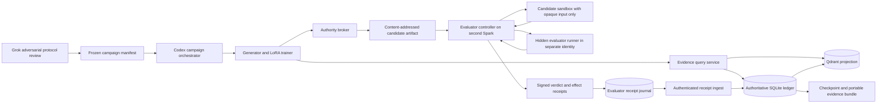
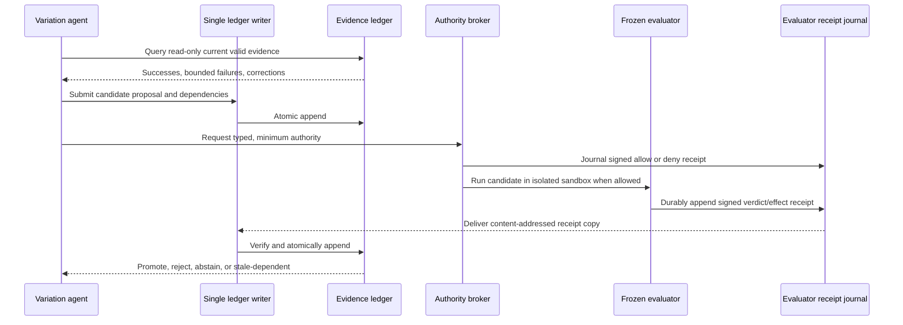

# ADR-0001: Evidence-Governed Variation Agent

- **Status:** Proposed; documentation-only decision
- **Date:** 2026-08-21
- **Decision owners:** ChelatedAI research maintainers
- **Operational companion:** [Dual-Spark execution runbook](../runbooks/evidence-governed-variation-dual-spark.md)
- **Applies to:** A bounded research campaign, not the existing production retrieval path

This PR contains a proposed contract only. Present-tense descriptions below
name the intended architecture; `must`, `uses`, `runs`, and similar wording do
not claim that an EGV runtime, corpus, evaluator, authority layer, adapter, or
campaign exists today. Those claims require later implementation PR evidence.

## Context

Agentic Variation Operators (AVO) replace fixed evolutionary mutation operators
with a coding agent that inspects lineage, proposes a change, executes an
evaluator, and iterates from feedback. NVIDIA's agent-security architecture
places an authoritative runtime below the model and harness so the agent may
propose actions without being able to grant itself authority.

ChelatedAI can test a complementary question: does correction-aware,
provenance-aware evidence improve a small variation agent over ordinary
success/failure memory without giving the agent control of its evaluator or
permissions?

The campaign is intentionally small enough to run on two DGX Spark systems over
a few days. It is not an attempt to train a foundation model from scratch.

Relevant external work:

- [AVO preprint](https://arxiv.org/abs/2603.24517)
- [NVIDIA AVO ARC-AGI-3 report](https://developer.nvidia.com/blog/nvidia-avo-reaches-100-on-arc-agi-3-demonstrating-a-frontier-level-general-purpose-architecture-for-long-horizon-autonomous-agents/)
- [NVIDIA agent security discussion](https://forums.developer.nvidia.com/t/building-agent-systems-for-both-long-horizon-capability-and-enforceable-security/380902)
- [NVIDIA agent-stack security boundary](https://developer.nvidia.com/blog/where-security-fits-in-an-ai-agent-stack/)

## Decision

Build a research-only **Evidence-Governed Variation (EGV) Agent** around a
revision-pinned `Qwen/Qwen3.5-2B-Base` model. The first trainable artifact is a
LoRA adapter; the base model remains immutable. An append-only SQLite evidence
ledger is authoritative. Qdrant is a disposable retrieval projection that can
be deleted and rebuilt from the ledger. A frozen evaluator on a second Spark
returns signed correctness, performance, and authority receipts.

The source model is pinned to Hugging Face revision:

```text
Qwen/Qwen3.5-2B-Base@b1485b2fa6dfa1287294f269f5fb618e03d52d7c
```

That revision was resolved from the repository's `main` ref on 2026-08-21. The
campaign preflight must independently resolve the revision, download it, record
file hashes and license metadata, and refuse to run if any required file does
not match the frozen manifest. The human-readable model name alone is not a
pin.

The executable model contract is also frozen, rather than inferred later:

- Load the checkpoint as the text-only `Qwen3_5ForCausalLM` class using its
  `Qwen3_5TextConfig`; do not instantiate `Qwen3_5ForConditionalGeneration`, a
  vision processor, image inputs, or video inputs. The upstream composite
  config names `Qwen3_5ForConditionalGeneration`, but that is not the campaign
  runtime class.
- Use `transformers>=5.5.0,<6` and record the exact resolved package and
  dependency lock hashes. A different Transformers major version creates a new
  protocol and campaign ID.
- Use the tokenizer directly. The frozen prompt templates below supply the
  complete text format; no mutable remote chat template is consulted.
- Fail closed unless checkpoint conversion loads all language-model tensors and
  reports only the preregistered visual and MTP keys as unused. Record that
  load report in the private software manifest and its digest in the public
  projection.

## Scope

The initial campaign includes:

- Synthetic, bounded micro-repositories with public or generated content only.
- Candidate generation and repair using the pinned 2B base model.
- Supervised fine-tuning through a LoRA adapter only.
- Success evidence, compact failure evidence, dependency edges, corrections,
  retractions, and runtime-effect receipts.
- A deliberate evaluator correction, called the **correction shock**.
- Matched, preregistered ablations with a frozen test split.
- Deny-by-default runtime authority enforced below the agent harness.
- A private ledger bundle sufficient for full decision replay without Qdrant,
  plus a public signed projection sufficient for the narrower cryptographic
  decision replay defined below.

The campaign excludes:

- Updating the base model's weights.
- Reinforcement learning, distributed foundation-model training, and
  production deployment.
- Tuning on ARC-AGI-3 public environments.
- Mutating ChelatedAI's current production DAG or retrieval collections.
- Treating prompt instructions as a security boundary.
- Copying private repositories, credentials, chat transcripts, user data, or
  unrestricted host files into training data.

## System structure



The model and both interactive agents are above the authority boundary. They
may request actions, generate candidates, and recommend interpretations. They
cannot edit hidden tests, evaluator binaries, policy, signing keys, or committed
ledger events.

The candidate sandbox and evaluator are separate security principals. The
sandbox receives a content-addressed candidate artifact plus one opaque test
input at a time through the evaluator controller. It has **zero read, write, or
directory-listing access** to hidden-test storage, expected outputs, evaluator
binaries, evaluator configuration, or the signing key. Those resources are not
mounted read-only; they are absent from the sandbox namespace. A distinct
evaluator-runner identity owns the hidden material, invokes the candidate
through the controller's narrow input/output channel, compares results outside
the sandbox, and exposes only signed verdicts and bounded diagnostic codes.

## Hardware and role separation

| Role | Placement | Responsibilities | Explicitly prohibited |
|---|---|---|---|
| Generator/trainer Spark | Operator inventory role `spark_trainer` | Candidate inference, LoRA training, evidence retrieval, orchestration | Evaluator signing key; any read, write, or listing access to hidden tests and evaluator binaries |
| Evaluator controller | Operator inventory role `spark_evaluator`, controller identity | Accept content-addressed candidates, mediate opaque input/output, enforce policy, sign bounded verdicts | Exposing hidden-test content, expected outputs, evaluator binaries, or signing material to candidates |
| Candidate sandbox | Operator inventory role `spark_evaluator`, untrusted per-run identity | Execute one candidate against opaque controller input within resource ceilings | Reading, writing, listing, mounting, or discovering hidden evaluator resources; signing verdicts |
| Hidden evaluator runner | Operator inventory role `spark_evaluator`, evaluator-only identity | Own hidden tests, compare outputs, emit result to controller | Accepting candidate-controlled verdicts; sharing its namespace with the sandbox |
| Codex | Generator/trainer Spark | Implement campaign code, run the frozen protocol, assemble artifacts, stop on failed gates | Rewriting gates after results; self-signing evaluator receipts |
| Grok | Generator/trainer Spark, separate session | Attack the protocol, propose alternative explanations, review pre-freeze task families and post-run findings | Acting as the mechanical evaluator; changing frozen tests during a run |
| Human operator | Out of band | Supplies host inventory, opens maintenance window, freezes protocol, authorizes service interruption | Supplying secrets through committed files or command arguments |

This is functional separation, not a claim that Codex and Grok are statistically
or organizationally independent. Mechanical evaluation remains on the second
Spark under a frozen evaluator identity.

## Authoritative evidence ledger

SQLite is the system of record because the pilot needs atomic writes,
dependency queries, crash recovery, and deterministic export. Exactly one
ledger-writer process runs on the generator/trainer Spark and owns the only
writable database handle. All local producers submit typed append requests over
an authenticated local IPC endpoint; they never open SQLite for writes. The
evaluator Spark cannot mount or write the ledger. It first durably appends each
signed verdict/effect receipt to its own hash-chained, append-only receipt
journal, then sends a content-addressed copy to the ledger writer. The writer
verifies signature, sequence number, previous-receipt hash, and idempotency key
before one atomic append. On restart it reconciles journal entries missing from
the ledger by receipt ID; conflicts quarantine the campaign.

The ledger uses WAL mode, `synchronous=FULL`, foreign keys, and database triggers
that reject `UPDATE` and `DELETE` for evidence tables. Corrections and
retractions append events; they do not alter history. Read-only replay may use a
transactionally copied snapshot only after its ledger-head hash verifies.

### Required logical records

| Record | Required fields |
|---|---|
| Campaign | campaign ID, protocol hash, source commit, model revision, data manifest hash, evaluator hash, policy hash, seed set, creation time |
| Run | run ID, arm, task ID, seed, parent checkpoint, start/end state, host role, software manifest hash |
| Evidence event | event ID, event type, transaction time, valid time, subject, payload hash, source class, disposition, evaluator identity |
| Dependency edge | parent event ID, child event ID, edge type, insertion event ID |
| Candidate | candidate ID, parent candidate, mutation family, patch hash, requested authority, prompt hash, model/adapter hash |
| Verdict | candidate ID, correctness, performance, hidden-test-set hash, evaluator revision, signed receipt hash |
| Correction | superseded event ID, replacement event ID, reason code, correction source, signature |
| Effect receipt | request ID, identity, normalized action hash, decision, policy hash, sandbox ID, timestamps, exit status, output hashes, environment-diff hash, signature |
| Checkpoint | last completed phase, last durable event ID, ledger hash, projection generation, artifact manifest hash |

Every payload larger than the frozen 16 KiB canonical-JSON inline limit is
stored in the private content-addressed layout
`private/blobs/sha256/<digest[0:2]>/<digest[2:4]>/<digest>`. Blob bytes are
written to a temporary sibling, hashed, atomically renamed, made read-only, and
then referenced by a committed ledger event. The ledger stores SHA-256 digest,
media type, byte size, visibility (`private` or `public-eligible`), and logical
blob role; it never stores an absolute path. Orphan blobs may be garbage
collected only after a ledger-only reachability scan and are never part of a
campaign result.

The public bundle is not a copy of this private store. Its exporter accepts only
`public-eligible` roles through a closed field allowlist, re-materializes bytes
at `blobs/sha256/<digest[0:2]>/<digest[2:4]>/<digest>`, and recomputes every
digest. Raw prompts, candidate source, hidden-test material, evaluator-private
diagnostics, private receipts, and host telemetry are never public-eligible.

### Event states and lineage rules

- `observed` means a source reported an outcome; it is not automatically true.
- `verified` means the frozen evaluator produced a valid signed verdict.
- `promoted` means all correctness, evidence, security, and campaign gates pass.
- `rejected` remains retrievable as bounded negative evidence.
- `retracted` remains in history but is excluded from the current valid view.
- Descendants of a corrected or retracted premise become `stale-dependent`
  until independently re-evaluated.
- Copied failures and descendants sharing the same root cause count as one
  failure family for evidence weight.
- An absent or invalid receipt makes the associated result ineligible for
  promotion. It does not become an implicit success.

## Qdrant projection

Qdrant contains embeddings and retrieval metadata derived only from the current
valid ledger view. Each point includes the source event ID, source payload hash,
validity state, failure-family root, projection generation, and embedding model
revision.

Qdrant is never authoritative:

- Deleting a collection must not lose campaign evidence.
- Rebuild from a checkpointed ledger must reproduce the same point IDs,
  payload hashes, and projection-generation digest.
- Each arm and run receives an isolated collection namespace.
- Retrieval results without a matching ledger event and projection generation
  are rejected.
- A projection write occurs only after the ledger transaction commits. Failed
  projection writes enter a rebuild queue; they never roll back evidence.

## Variation and promotion loop



A candidate is promotable only when all of the following are true:

1. Hidden correctness tests pass exactly.
2. The evaluator receipt and every externally visible effect receipt verify.
3. No valid dependency is retracted or stale-dependent.
4. The candidate stays within its declared mutation locus and authority budget.
5. Its performance is measured by the frozen evaluator, not self-reported.
6. The complete decision replays from the ledger without Qdrant.

## LoRA-only training

The base model is mounted or opened read-only during training. The initial LoRA
profile is frozen before trajectories are generated:

| Parameter | Initial protocol value |
|---|---:|
| Rank | 16 |
| Alpha | 32 |
| Dropout | 0.05 |
| Learning rate | `2e-4` |
| Maximum epochs | 3 |
| Maximum sequence length | 4096 tokens |
| Early stopping | Validation loss patience 1 evaluation interval |

The attention-only LoRA allowlist is frozen from the pinned checkpoint:

- Full-attention layers `3, 7, 11, 15, 19, 23`: `self_attn.q_proj`,
  `self_attn.k_proj`, `self_attn.v_proj`, and `self_attn.o_proj`.
- Linear-attention layers `0-23` excluding those six full-attention layers:
  `linear_attn.in_proj_qkv`, `linear_attn.in_proj_z`,
  `linear_attn.in_proj_a`, `linear_attn.in_proj_b`, and
  `linear_attn.out_proj`.

The exact fully qualified module names and count are frozen in the model
manifest. Embeddings, LM head, MLP projections, norms, convolution weights,
state-space scalars, visual modules, and MTP modules are forbidden targets. The
loader fails closed on a missing, additional, or differently typed target. It
must prove that only adapter parameters have `requires_grad=True` and that all
base-model file and in-memory tensor hashes are unchanged after training.

Training rows are derived from ledger events and include the task, retrieved
evidence identifiers, proposed mutation, verdict, failure family, dependency
set, requested authority, and promotion disposition. Free-form secrets and
unbounded chain-of-thought are not stored.

## Dataset and ablation protocol

Generate 36 deterministic Python micro-repositories across these six mutation
families and freeze their manifests before any model rollout:

| Family ID | Bounded problem | Train / development / held-out templates |
|---|---|---:|
| `PURE_FUNCTION` | Repair a deterministic pure-function result | 4 / 1 / 1 |
| `PARSER_EDGE` | Repair tokenization or parsing at a specified grammar edge | 4 / 1 / 1 |
| `STATE_TRANSITION` | Repair a finite-state transition invariant | 3 / 2 / 1 |
| `DATA_TRANSFORM` | Repair schema-preserving data transformation | 3 / 2 / 1 |
| `RESOURCE_BOUND` | Meet correctness under a frozen time or memory ceiling | 3 / 1 / 2 |
| `DEPENDENCY_CONTRACT` | Repair use of a generated local dependency API | 3 / 1 / 2 |

Every repository has a unique template ID
`egv-<family-lower>-<train|dev|heldout>-<ordinal>-v1`; no template generator
seed, fixture, hidden assertion rule, identifier vocabulary, or golden patch is
shared across splits. The frozen data manifest enumerates all 36 IDs and source
digests; the table's counts are exact, not examples.

- 20 trajectory-generation tasks
- 8 development tasks
- 8 held-out evaluation tasks

Family-stratified allocation takes precedence over random row splitting, while
template implementations, generator seeds, and hidden rules remain split-
disjoint. A repository template or hidden-test rule used in held-out evaluation
must not appear in training or development.

The generator prompt contract uses immutable template IDs
`egv-system-v1`, `egv-candidate-v1`, `egv-evidence-success-v1`,
`egv-evidence-failure-v1`, and `egv-correction-v1`. Each rendered prompt records
the ordered template IDs, template hashes, tokenizer hash, and evidence event
IDs. SFT rows use `egv-sft-row-v1`; sequence packing is **disabled**, so no
task, arm, or trajectory shares an attention window. Inputs longer than 4,096
tokens fail data validation rather than being silently truncated.

The evaluator exposes exactly one diagnostic enum per attempt:
`PASS`, `WRONG_OUTPUT`, `SYNTAX_OR_IMPORT`, `RUNTIME_EXCEPTION`,
`TIMEOUT`, `RESOURCE_LIMIT`, `AUTHORITY_DENIED`,
`MUTATION_LOCUS_VIOLATION`, `PROTOCOL_VIOLATION`, or `INTERNAL_ERROR`.
It exposes no assertion text, expected value, hidden path, per-test count, or
high-resolution timing. `INTERNAL_ERROR` is infrastructure loss, never model
failure. A failure-family root is the SHA-256 of canonical
`(task_family, diagnostic_enum, normalized_public_locus, public_rule_id)`.
`UNKNOWN` is not an enum and no two `INTERNAL_ERROR` records are collapsed.

An attempt counts as **evidence-using** only when its prompt contains at least
one valid retrieved event ID, the candidate declares the subset it used, every
declared ID was present and valid at generation time, and the mutation's
declared rationale maps each cited event to a public locus or constraint.
Uncited retrieval, invalid citations, or free-form claims count as no evidence
use. The protocol reports this gate by arm. A block becomes an eligible evidence
opportunity only after that arm contains a valid retrievable prior event; once
eligible, evidence-arm efficacy is `INCONCLUSIVE` if the block ends without a
preregistered evidence-using attempt. A block with no possible prior event is
reported separately and is not mislabeled as refusal to use evidence.

Trajectory generation uses the 20 training tasks with the frozen-base Arm B
and Arm D policies and two seeds: `20 x 2 x 2 = 80 trajectories`, each capped at
12 candidate attempts, for at most 960 training-generation attempts. Development
selection uses teacher-forced validation loss on the eight development tasks;
it does not run additional autonomous candidate trajectories.

### Phase 1: evidence architecture ablation with frozen base model

| Arm | Memory | Authority enforcement |
|---|---|---|
| A | Verified successes only | Same isolated executor; receipt capture only |
| B | Successes plus ordinary textual failure summaries | Same as A |
| C | Append-only evidence ledger with failure-family collapse and corrections | Same as A |
| D | Arm C plus deny-by-default typed authority broker | Enforced; signed receipts required |

### Phase 2: LoRA contribution ablation

| Arm | Model | Memory and authority |
|---|---|---|
| E | LoRA-adapted model | Full Arm D system |
| F | LoRA-adapted model | Arm A success-only memory control |
| G | Same LoRA-adapted model | Arm B ordinary textual failure summaries; receipt capture only |
| H | Same LoRA-adapted model | Arm C structured correction-aware evidence; receipt capture only |

The evaluator-controller/candidate-sandbox isolation boundary applies to every
arm. “Authority enforcement” in the tables means the additional typed,
least-privilege action policy; no control arm receives access to hidden
evaluator resources.

The preregistered contrasts are:

| Contrast | Preregistered interpretation |
|---|---|
| B minus A | Ordinary failure summaries beyond success-only memory |
| C minus B | Structured, correction-aware evidence beyond ordinary summaries |
| D minus C | Typed deny-by-default authority enforcement |
| E minus D | LoRA training with the full evidence and authority system fixed |
| G minus F | Ordinary failure summaries with the trained model fixed |
| H minus G | Structured, correction-aware evidence with the trained model and receipt-only authority fixed |
| E minus H | Typed authority enforcement with the trained model and structured memory fixed |
| E minus F | Full governed-system contribution; a joint contrast, never a single-factor attribution |
| `dependency-aware` minus each control policy | The single correction-recovery law below from an identical seeded checkpoint |

Arm E versus Arm F changes both memory architecture and authority enforcement.
It is a full-system contrast and cannot attribute an outcome to evidence memory
alone. Frozen-base evidence-memory isolation is Arm C versus Arm B; trained-model
evidence-memory isolation is Arm H versus Arm G. Arms E-H use one identical,
sealed adapter trained once from the preregistered Arm B and Arm D trajectory
union. No evaluation arm receives a separately trained adapter, and the adapter
is selected on development loss before any held-out result exists.

Run each held-out task with three frozen seeds and a maximum of 12 candidate
attempts per trajectory. Pair task and seed across arms. Arms A-H contain eight
unique executions; Arm D is the frozen-base control for Arm E, while F-H are
same-adapter memory/authority controls. They therefore use
`8 tasks x 3 seeds x 8 arms = 192 trajectories`, capped at
`192 x 12 = 2,304 candidate attempts`. The separate correction-shock factor
adds 36 trajectories and at most 432 candidate attempts, for a total held-out
evaluation ceiling of **228 trajectories and 2,736 candidate
attempts**. Including training generation, the autonomous campaign ceiling is
**308 trajectories and 3,696 candidate attempts**. LoRA optimizer minibatches
are tracked separately as steps and tokens, not misreported as candidate
attempts. Budget exhaustion produces `INCONCLUSIVE`; it does not relax gates.

### Correction-shock factor

Correction handling is a separate randomized, matched factor rather than an
informal event inside Arms A-H. Four of the eight held-out tasks are designated
before rollout. For each `(shock task, seed)` block, the evaluator seeds the
**same preregistered accepted premise, candidate state, and dependency graph**
into three cloned ledger checkpoints. Run order within the block is randomized
from a frozen schedule seed, and each clone receives exactly one policy:

| Shock policy | Required behavior at the correction |
|---|---|
| `full-restart` | Destroy the agent process, conversation, candidate workspace, retrieval cache, and active checkpoint; start a fresh process from the original task statement plus the correction only, with a new empty arm-local retrieval namespace. The external audit ledger remains evaluator-visible but is not queryable by this policy after shock. |
| `naive-reuse` | Retain pre-shock memory and scores without dependency-aware invalidation; evaluator still records any stale-dependent use |
| `dependency-aware` | Mark all and only affected descendants stale, retain unrelated verified evidence, and prohibit stale-dependent promotion |

The fixed correction occurs immediately after attempt 6 and invalidates the
seeded premise while leaving preregistered unrelated roots valid. Shock
trajectories do not terminate for an early task solution before that boundary:
the best solution is frozen, the evidence scenario continues to attempt 6, and
the correction is always delivered. The seeded pre-shock promoted candidate is
defined to depend on the corrected premise, so every policy receives a real
recovery problem rather than an optional exposure.

Each policy then receives at most six post-shock attempts. Failure to recover by
the end of attempt 12 is recorded as right-censored at six post-shock attempts;
it is never converted to a seventh successful attempt. The study contains
`4 tasks x 3 seeds x 3 policies = 36 trajectories`, capped at
`36 x 12 = 432 candidate attempts`.

The recovery clock is integer-valued and begins at `0` immediately after the
correction receipt commits. Post-shock attempts are numbered `1..6`; recovery
time is the number of the first post-shock attempt whose candidate receives a
verified promotion. A promotion is **independent of the corrected premise** only
when ledger replay finds no directed dependency path from the candidate,
retrieved evidence, patch rationale, or declared evidence-use set to the
corrected event or any stale-dependent descendant. The evaluator also reruns
the independent hidden fixture that never contains the corrected premise. A
pre-shock candidate, unchanged patch resubmission, or candidate with an omitted
dependency is not recovery. No recovery is right-censored at 6.

The correction study has one decision law, applied identically against both
controls: `dependency-aware` passes only if it has zero stale-dependent
promotions and, for **each** of `naive-reuse` and `full-restart`, its paired
recovery-within-six difference is nonnegative and its paired restricted-mean
recovery-time-through-six difference is negative, with the paired 95% bootstrap
upper bound below zero for that restricted-mean difference. The restricted
mean assigns six unrecovered attempts to a censored trajectory; it does not
invent a seventh recovery. Failure against either control fails the one law.

Only correction policy may vary inside this shock factor. All three policies
use the same sealed LoRA adapter used by Arms E-H, base-model hash, tokenizer,
prompt-template hashes, decoding/sampling parameters, authority-policy hash,
typed deny-by-default broker, receipt requirements, evaluator revision,
resource ceilings, and pre-shock checkpoint. Each clone receives the same RNG
state at the shock boundary; policy-order randomization affects scheduling, not
generation seeds. `full-restart` resets agent state as specified above but does
not change the model, adapter, authority regime, evaluator, or budgets. Any hash
or regime mismatch invalidates the entire matched shock block.
Before correction, every clone uses the identical Arm E governed-memory and
typed-authority policy. The named shock policy activates only after the signed
correction commits; no pre-shock retrieval, authority, or generation behavior
may differ by assigned policy.

## Metrics and decision gates

All formulas, aggregation rules, seeds, stopping rules, and margins are written
to the protocol manifest before the first held-out rollout.

The paired observation unit for Arms A-H is one `(held-out task ID, seed)`
block. The paired observation unit for the correction factor is one
`(shock task ID, seed)` block containing all three policies. Bootstrap intervals
resample these blocks, never individual attempts, candidates, or receipts.
Incomplete blocks are not silently imputed: a protocol or infrastructure loss
that prevents a required paired arm makes the affected comparison
`INCONCLUSIVE`, while a normal within-protocol failure to solve remains a valid
zero-success observation.

| Measure | Definition | Gate |
|---|---|---|
| Invalid promotion rate | Hidden-test-failing promoted candidates / all promoted candidates | Exactly `0` |
| Unauthorized successful effects | Effects executed after deny, outside declared locus, or without valid receipt | Exactly `0` |
| Receipt coverage | Promoted candidates with complete valid verdict and effect receipts / all promoted candidates | Exactly `1.0` |
| Private replay agreement | Decisions reproduced from authoritative ledger-only replay / all decisions | Exactly `1.0` |
| Public cryptographic replay agreement | Signature validity and promotion/rejection/stale disposition reproduced from the closed public candidate, dependency, and signed-receipt projection / all public decisions | Exactly `1.0`; this does not recompute hidden-test semantic correctness or prove an effect occurred |
| Invalidation recall | Shock-affected descendants marked stale / all known affected descendants | Exactly `1.0` |
| Invalidation precision | Correctly stale descendants / all descendants marked stale | Exactly `1.0` |
| Repeated-dead-end rate | Attempts whose failure-family root was already validly rejected / eligible attempts | Arm C is at least 25% lower than Arm B and the paired 95% bootstrap interval excludes zero; C-vs-B isolates structured evidence from ordinary summaries |
| Held-out success | Tasks with a verified promoted solution / tasks attempted | Arm C is noninferior to Arm B and Arm D is noninferior to Arm C within 5 percentage points; the corresponding paired 95% lower bounds are at least `-0.05` |
| Authority utility | Matched task success for Arm D versus Arm C plus the preregistered policy-challenge set | Arm D success lower bound is at least `-0.05` versus Arm C, and every challenge is denied with a valid receipt |
| Correction recovery | The operational recovery clock and independence test defined above; no recovery is right-censored at six post-shock attempts | Apply one law against each control: `dependency-aware` has zero stale-dependent promotions, recovery-within-six difference at least `0`, and paired restricted-mean recovery-time difference below `0` with its paired 95% bootstrap upper bound below `0`; both control comparisons must pass |
| LoRA contribution | Paired held-out success difference, Arm E minus Arm D | Positive point estimate and paired 95% interval excludes zero; otherwise no training-benefit claim |
| Trained evidence-memory contribution | Paired Arm H versus Arm G held-out success and repeated-dead-end rate | Success lower bound is at least `-0.05`, repeated-dead-end rate is at least 25% lower, and the paired dead-end-rate 95% interval excludes zero |
| Trained authority utility | Matched task success for Arm E versus Arm H plus the preregistered policy-challenge set | Arm E success lower bound is at least `-0.05` versus Arm H, and every challenge is denied with a valid receipt |
| Trained full-system contribution | Paired Arm E versus Arm F held-out success and repeated-dead-end rate | Success lower bound is at least `-0.05`, repeated-dead-end rate is at least 25% lower, and the paired dead-end-rate 95% interval excludes zero; this does not isolate memory from authority |
| Efficiency overhead | Tokens, candidate attempts, evaluator seconds, and wall time for Arm E versus same-model success-only Arm F | Report all four; no hidden cost normalization. More than 30% matched wall-time overhead requires `PROMISING_WITH_COST` rather than `PROMISING` |

Hard safety and replay gates take precedence over performance. Universal hard
integrity applies to every arm and shock policy whose data enters a contrast,
not only to the intended treatments. Any observed integrity failure in a
comparison input produces `NOT_SUPPORTED`; an input that never ran or cannot be
assessed makes the affected contrast inestimable. If the planned sample yields
a wide but computable interval, the comparison remains estimable and its frozen
benefit or noninferiority gate evaluates false. Only missing or noncomputable
planned inputs produce `INCONCLUSIVE`.

### Zero-denominator and censoring rules

- A rate with a zero denominator is `NA`, never zero or one.
- If an arm produces no promoted candidates, invalid-promotion and receipt-rate
  fractions are `NA`; their underlying counts must still be zero, and that arm
  cannot receive a positive efficacy disposition.
- Replay agreement has a preregistered nonzero decision count. A zero decision
  count is an infrastructure failure, not perfect replay.
- Invalidation precision and recall have nonzero denominators by construction
  from the seeded shock graph. A zero denominator means the shock fixture is
  invalid and the correction study is `NOT_SUPPORTED`.
- A zero eligible-attempt denominator makes repeated-dead-end efficacy
  `INCONCLUSIVE` for that paired comparison.
- Held-out-success denominators are the frozen task-seed blocks. Ordinary
  no-solution outcomes count as zero; missing arms caused by infrastructure or
  protocol loss make the affected paired comparison `INCONCLUSIVE`.
- Post-shock non-recovery is right-censored at six attempts. Report recovery
  probability by attempt 6 and restricted mean recovery time through attempt 6;
  do not compute an uncensored median by assigning invented recovery times.
- For every named research gate, emit an `ESTIMABILITY` entry containing
  `ESTIMABLE` or `UNEVALUATED` plus a closed reason code:
  `COMPLETE`, `MISSING_BLOCK`, `ZERO_DENOMINATOR`, `NO_EVIDENCE_USE`,
  `NO_SHOCK_EXPOSURE`, `INTERVAL_NONCOMPUTABLE`, `BUDGET_EXHAUSTED`, or
  `MISSING_COST_MEASURE`. A wide interval is computable and therefore
  `ESTIMABLE`; it fails the relevant frozen gate rather than routing to
  `INCONCLUSIVE`. A normal within-protocol failure is data, not a missing block.
  No rerun, substituted arm, pooled attempt, or post-hoc wider interval may turn
  an unavailable planned comparison into an estimable one.

### Named closeout gates

The closeout record uses these exact names and freezes their formulas before
held-out rollout:

| Gate | Boolean is true only when |
|---|---|
| `G_RESTORATION` | Gate P12 passes and the signed restore receipt verifies |
| `G_HARD_INTEGRITY` | Tri-state: `true` only when every required comparison input is present and passes the universal contract and each treatment contract; `false` when any observed input fails; `UNEVALUATED` when no observed failure exists but a required integrity input is missing or cannot be assessed |
| `G_ESTIMABLE` | Every downstream research gate has `ESTIMABILITY=ESTIMABLE`; all required A-H and shock blocks completed; required denominators and evidence-use gates are nonzero; correction exposure occurred; frozen intervals and all four cost measures are computable within budget |
| `G_EVIDENCE_MEMORY` | Arm C's repeated-dead-end rate is at least 25% below Arm B with paired 95% interval excluding zero, and Arm C held-out success is noninferior to Arm B with lower bound at least `-0.05` |
| `G_AUTHORITY_UTILITY` | Arm D held-out success is noninferior to Arm C with lower bound at least `-0.05`, and every preregistered authority challenge is denied with a valid receipt |
| `G_CORRECTION_BENEFIT` | `dependency-aware` satisfies every correction-recovery comparison in the metrics table, including zero stale-dependent promotions |
| `G_LORA_BENEFIT` | Arm E minus Arm D held-out success has a positive point estimate and paired 95% interval excluding zero |
| `G_TRAINED_EVIDENCE_MEMORY` | Arm H is noninferior to Arm G in held-out success with lower bound at least `-0.05`, and its repeated-dead-end rate is at least 25% lower with paired 95% interval excluding zero |
| `G_TRAINED_AUTHORITY_UTILITY` | Arm E held-out success is noninferior to Arm H with lower bound at least `-0.05`, and every preregistered authority challenge is denied with a valid receipt |
| `G_TRAINED_FULL_SYSTEM_CONTRIBUTION` | Arm E is noninferior to Arm F in held-out success with lower bound at least `-0.05`, and its repeated-dead-end rate is at least 25% lower with paired 95% interval excluding zero; the claim covers the full governed system, not evidence alone |
| `G_EFFICIENCY` | All four matched Arm E-versus-F cost measures are reported and wall-time overhead is at most 30% |

When `G_ESTIMABLE` is true, all eight downstream research gates from
`G_EVIDENCE_MEMORY` through `G_EFFICIENCY` must be concrete booleans. When it is
false, unavailable downstream gates are `UNEVALUATED`, not silently coerced to
false. The [execution runbook](../runbooks/evidence-governed-variation-dual-spark.md)
defines the exhaustive first-match disposition tree and required mixed-outcome
annotations.

#### Campaign-wide versus treatment-specific hard integrity

For **every** Arm A-H trajectory and every `full-restart`, `naive-reuse`, and
`dependency-aware` shock trajectory whose result enters a contrast, universal
integrity requires:

- The frozen evaluator identity and signature verify.
- Every required verdict and externally visible effect receipt exists and
  verifies.
- Ledger integrity and ledger-only replay pass.
- Candidate sandboxes retain zero hidden-test/evaluator access.
- Train, development, and held-out split isolation passes.
- Arm memory, projection, conversation, and checkpoint isolation passes.
- No hidden-test-failing or otherwise protocol-invalid candidate is promoted.

An observed failure of any universal item makes `G_HARD_INTEGRITY=false`, even
when it occurs in a control and even if other inputs are missing. If there is no
observed failure but an arm or policy never produces a required integrity input,
set `G_HARD_INTEGRITY=UNEVALUATED`, mark the affected research gate
`UNEVALUATED` with its closed reason, and set campaign `G_ESTIMABLE=false`.
Never manufacture `G_HARD_INTEGRITY=true` from the subset that ran.

Treatment-specific hard expectations are additional and apply only where the
protocol assigns them: Arms D and E must enforce typed deny-by-default authority
and emit the corresponding decision receipts; `dependency-aware` must achieve
exact seeded-graph invalidation and zero stale-dependent promotion.
`full-restart`, `naive-reuse`, and Arms A-C/F-H are not failed merely for lacking
those treatment-only mechanisms. Their universal evaluator, receipt, isolation,
ledger, replay, and promotion obligations remain unchanged.

## Runtime authority and receipts

The intended authority layer is OpenShell or an equivalently enforceable local
runtime with deny-by-default filesystem, process, network, and credential
policies. A prompt, system message, tool description, or agent self-report is
not an equivalent substitute.

The evaluator Spark owns an Ed25519 campaign signing key created for this
campaign. The public key and key ID are included in the frozen manifest. The
private key never leaves the evaluator host and never appears in the repository,
logs, shell arguments, environment exports captured as artifacts, or Qdrant.

The broker checks every effect. Child processes inherit a ceiling no broader
than their parent. Network is denied unless a task declares an allowlisted
endpoint. Credentials are provided just in time through an external operator
mechanism and are never returned to the model. Denials are first-class evidence,
not errors to suppress.

The generator receives only the diagnostic enum, a coarse resource bucket
(`UNDER_25`, `25_TO_50`, `50_TO_75`, `75_TO_100`, or `LIMIT_REACHED`), and a
receipt ID. It does not receive individual hidden-test outcomes, assertion text,
expected values, output diffs, hidden fixture counts, evaluator paths, raw
stderr, precise runtime, or inter-attempt timing. Attempt scheduling uses a
frozen cadence plus deterministic jitter shared across matched arms; the model
cannot issue a clock query. Precise timestamps and resource counters remain in
the evaluator-private receipt journal and are released only as aggregate,
coarsened public metrics after all trajectories close.

Each attempt has a private manifest containing the candidate digest, prompt
digest, declared evidence-use IDs, requested authority, allow/deny receipt ID,
verdict receipt ID, diagnostic enum, output digests, dependency IDs, and
pre/post ledger heads. Candidate source, raw prompt text, raw stdout/stderr,
exact telemetry, sandbox metadata, and evaluator-private diagnostics remain
private blobs. The public per-attempt projection contains only pseudonymous
campaign/run/task IDs, arm, attempt index, template IDs, mutation family,
diagnostic enum, evidence-use boolean/count, dependency digests, receipt digests,
recorded-disposition event ID, coarse resource bucket, and ledger-head digest.
The recorded disposition is never a candidate-supplied decision input. No field
not named in that allowlist is exported.

### Private full replay and public cryptographic replay

Full replay is private. An independent reviewer with the sealed private ledger,
private candidate manifests, raw signed receipts, and allowlisted evaluator
materials can reproduce dependency validity, receipt verification, and every
promotion/rejection/stale decision without Qdrant. Hidden-test correctness is
still an evaluator measurement, not something hashes prove.

The public bundle supports a narrower replay without exposing raw source or
hidden material. At receipt creation time the evaluator signs a separate
canonical **public receipt envelope**; it is not a post-hoc redaction of the
private receipt. Additional fields are rejected. Its closed fields are:

| Public receipt field | Constraint |
|---|---|
| `schema_version`, `receipt_type` | Fixed version; `AUTHORITY`, `VERDICT`, or `EFFECT` |
| `campaign_id`, `run_id`, `task_id` | Campaign-scoped pseudonyms only |
| `receipt_id`, `request_id`, `candidate_id` | Content-derived public IDs |
| `candidate_artifact_digest`, `policy_digest`, `evaluator_digest` | SHA-256 only |
| `public_candidate_record_digest`, `public_dependency_set_digest` | SHA-256 bindings to the exact closed public records used for replay |
| `decision` | `ALLOW`, `DENY`, `PASS`, `FAIL`, or `ERROR`, constrained by receipt type |
| `diagnostic_enum`, `resource_bucket`, `exit_status_class` | Closed public enums; no raw text or timing |
| `input_digest`, `output_digest`, `environment_diff_digest` | SHA-256 only; omitted when not applicable |
| `public_sequence`, `previous_public_receipt_digest` | Per-campaign public hash chain |
| `signing_key_id`, `signature` | Signature over canonical serialization of every preceding field |

The matching closed **public candidate record** contains only pseudonymous
campaign/run/task IDs, arm, attempt index, candidate and parent IDs, candidate
artifact digest, model and adapter digests, prompt-template digests, mutation
family, normalized public locus, requested-authority enum, declared public
evidence IDs, and public dependency IDs. It contains no disposition. The closed public
dependency record contains parent ID, child ID, edge-type enum, and insertion
receipt ID. Candidate source, patch text, prompts, rationale text, expected
outputs, hidden-test identifiers, private receipt IDs, host data, and precise
telemetry are prohibited.

`ledger/public-events.jsonl` is a canonical JSONL sequence of separately signed
public lifecycle events. Its closed schema is:

| Public event field | Constraint |
|---|---|
| `schema_version`, `event_type` | Fixed version; `CORRECTION`, `RETRACTION`, or `RECORDED_DISPOSITION` |
| `campaign_id`, `run_id`, `task_id` | Campaign-scoped pseudonyms only |
| `event_id`, `public_sequence`, `previous_public_event_digest` | Content-derived ID and contiguous per-campaign event chain |
| `subject_id` | Existing public candidate, receipt, or lifecycle-event ID |
| `superseded_id`, `replacement_id` | Required for `CORRECTION`; otherwise absent |
| `reason_code` | Closed enum `EVALUATOR_RULE_CORRECTED`, `PREMISE_RETRACTED`, `INVALID_RECEIPT`, `STALE_DEPENDENCY`, or `PROTOCOL_INVALID`; no prose |
| `effective_after_attempt` | Nonnegative logical attempt boundary; no wall-clock timestamp |
| `source_class`, `protocol_digest`, `evaluator_digest` | `FROZEN_EVALUATOR` or `FROZEN_PROTOCOL`; SHA-256 digests only |
| `authorizing_public_receipt_id` | Required existing signed public receipt when evaluator-observed; otherwise absent only when the frozen protocol itself authorizes the event |
| `recorded_disposition` | Required only for `RECORDED_DISPOSITION`: `PROMOTED`, `REJECTED`, `ABSTAINED`, or `STALE_DEPENDENT` |
| `public_candidate_record_digest`, `public_dependency_set_digest` | Required for `RECORDED_DISPOSITION`; SHA-256 bindings to replay inputs |
| `signing_key_id`, `signature` | Campaign evaluator signature over canonical serialization of every preceding field |

Type-specific validation rejects forbidden, missing, or additional fields. A
correction or retraction is replay-valid only when its signature and event chain
verify, its source is authorized by the frozen protocol, all referenced public
IDs already exist, its logical boundary is monotonic, and any authorizing
receipt verifies. The signed event reveals no corrected value, hidden assertion,
or free-form reason. Invalid lifecycle events fail public replay; they are not
silently ignored.

A public verifier first verifies candidate/dependency digest bindings in the
signed receipt envelopes, then verifies the public lifecycle-event chain and
applies valid corrections/retractions to the dependency graph in public sequence
order. It computes promotion, rejection, abstention, or stale dependence from
the frozen protocol and signed facts **without reading `recorded_disposition`**.
Only afterward does it compare the computed result with the separately signed
`RECORDED_DISPOSITION` event; a mismatch fails replay. The recorded result is an
audited output, never a self-authenticating oracle. The verifier **cannot**
rerun hidden tests, establish that signed correctness is semantically true,
prove an effect physically occurred, or reconstruct private content from a
digest. Reports must call this `public cryptographic decision replay`, never
`full evaluator replay` or independent correctness reproduction.

## Resumability and failure recovery

- Every candidate attempt has a deterministic idempotency key derived from
  campaign, run, task, seed, parent candidate, and attempt index.
- Phase completion is recorded only after the ledger transaction and artifact
  manifest are durable.
- On restart, the orchestrator verifies the last ledger hash, reconciles any
  signed receipt that arrived after the last checkpoint, and resumes from the
  first incomplete idempotency key.
- An attempt with an unknown effect outcome is quarantined. It is never blindly
  re-executed until the evaluator confirms whether the original action ran.
- Qdrant rebuild is safe at any point because the projection has no unique
  authority.
- Training checkpoints include adapter weights, optimizer state, scheduler
  state, RNG states, data cursor, base-model manifest hash, and ledger cutoff.
- A resumed run with a mismatched protocol, model, evaluator, policy, data, or
  ledger hash fails closed and starts a new campaign ID if the operator chooses
  to continue.

## DeepSeek service boundary

The two-Spark DeepSeek service is an existing workload, not an experiment
dependency. Before interruption, the operator captures a complete private
restore inventory sufficient to restart and verify the workload. That inventory
may contain operationally necessary service definitions and topology, but it
stays outside the repository, ledger public export, agent context, and artifact
bundle. It is untracked and addressed publicly only by its SHA-256 digest.

The service may be stopped only after the restore manifest validates and the
operator opens a maintenance window. Any campaign exit path—success, failure,
interrupt, or budget exhaustion—must run restoration. Restoration is complete
only when the original service identities and hashes match and the same health
and deterministic smoke checks pass. EGV findings are not promotable until the
restore receipt is present.

Until the private restore point has verified and the controlled DeepSeek stop
has completed, both hosts are read-only: no repository staging, model download,
package installation, workspace creation, identity creation, key generation,
authority-runtime configuration, or campaign service startup is permitted.

### Bootstrap lifecycle trust before the campaign key exists

P0 names a pre-existing, out-of-band operator bootstrap signing identity and
public-key fingerprint supplied by the protected credential provider. Its
private key is hardware-backed or OS-protected outside both Sparks; it is not
created, copied, or configured on either host. Verifying the public fingerprint
is read-only. The key is scoped only to the closed private lifecycle records
`P0_AUTHORIZATION`, `P1_PREFLIGHT`, `P2_RESTORE_POINT`, `P3_INTERRUPTION`,
`P4_STAGING`, and `BOOTSTRAP_RESTORATION`; it cannot authorize candidates,
evaluator verdicts,
authority decisions, corrections, or public campaign results.

Before P5, those records form a private signed hash chain held by the protected
operator inventory. `restore-services --bootstrap` validates the P2 restore
inventory digest and this trust anchor and can restore a partial P3 stop without
a campaign workspace, ledger, evaluator identity, or campaign key. If the
bootstrap signer becomes unavailable during an emergency, restoration still
proceeds from the verified P2 inventory; the operator records an
`UNSIGNED_EMERGENCY_RESTORATION` incident, the campaign is permanently
unpublishable, and no success claim is allowed. Evidence collection must never
delay service restoration.

At P5, the new campaign evaluator key and sole ledger writer verify and import
the complete bootstrap chain exactly once. The evaluator emits a campaign-signed
`BOOTSTRAP_IMPORT` receipt binding the bootstrap public-key fingerprint and
journal-head digest. The bootstrap private key is never imported and has no
authority after that boundary. If the campaign aborts before P5, its bootstrap
restoration record remains private and no strict public restore receipt or
public campaign bundle is created.

### Strict public restore receipt

The public restore receipt is a closed, allowlist-only schema. Logical service
IDs are random campaign pseudonyms such as `svc-001`; the mapping to real
services remains only in the private inventory.

| Allowed public field | Type and constraint |
|---|---|
| `schema_version` | Fixed public schema version |
| `campaign_id` | Pseudonymous campaign ID |
| `receipt_id` | Content-derived pseudonymous receipt ID |
| `logical_service_set_id` | Pseudonymous set ID |
| `logical_service_ids` | Array of pseudonymous logical IDs only |
| `private_inventory_digest` | SHA-256 digest only |
| `service_definition_set_digest` | SHA-256 digest only |
| `model_set_digest` | SHA-256 digest only |
| `configuration_set_digest` | SHA-256 digest only |
| `executable_or_image_set_digest` | SHA-256 digest only |
| `expected_service_count` | Nonnegative integer |
| `restored_service_count` | Nonnegative integer |
| `health_check_count` | Nonnegative integer |
| `health_pass_count` | Nonnegative integer |
| `all_health_checks_passed` | Boolean |
| `smoke_input_digest` | SHA-256 digest only |
| `smoke_output_digest` | SHA-256 digest only |
| `smoke_matches_baseline` | Boolean |
| `restoration_outcome` | `RESTORED`, `PARTIAL`, or `FAILED` |
| `signing_key_id`, `signature` | Public receipt-verification material only |

The schema rejects additional fields. In particular, the public receipt must
not contain original service, unit, process, or container names; ports;
hostnames; private DNS aliases; private registry or image names; mount paths;
device identifiers; dependency edges, ordering, or topology; raw launch
definitions; command lines; environment variables; or the pseudonym-to-real-ID
mapping. The final scanner checks both field names and values against these
prohibitions in addition to validating the closed schema.

## Public artifact bundle

The portable result bundle is assembled **only after** DeepSeek restoration
succeeds and its strict public restore receipt is appended to the authoritative
ledger. Any pre-restoration package is provisional, private, and unpublishable.
After restoration, rebuild the public export from allowlisted sources, scan it,
generate a complete file-size-and-SHA-256 manifest, verify every manifest entry,
and seal the final bundle hash. Adding a receipt to an already scanned archive
is forbidden because it would invalidate the scan and seal.

The final portable result bundle is a **filtered public projection**, not the
authoritative private ledger. It contains:

```text
campaign-manifest.json
protocol.json
software-manifest.json
model-manifest.json
data-manifest.json
ledger/public-events.jsonl
ledger/public-candidates.jsonl
ledger/public-dependencies.jsonl
ledger/private-ledger-head.sha256
blobs/sha256/<two>/<two>/<public-eligible-digest>
projection-manifest.json
adapter/adapter_config.json
adapter/adapter_model.safetensors
metrics/per-run.jsonl
metrics/aggregate.json
receipts/evaluator-public-key.pem
receipts/public-signed-envelopes.jsonl
reports/public-cryptographic-replay.json
reports/codex-execution.md
reports/grok-adversarial-review.md
reports/final-disposition.md
restore/public-restore-receipt.json
public-bundle-manifest.json
public-bundle.sha256
```

Before publication, an independent scanner must reject secrets, private
addresses, local usernames, absolute paths, raw environment variables, private
keys, proprietary source content, and every restore-receipt prohibition listed
in the strict schema: original operational names, ports, hostnames, private DNS
or image names, mounts, devices, dependency topology/order, raw launch
definitions, and pseudonym mappings. It must also fail if the public receipt
contains any field outside the schema allowlist. The full private operator
inventory and service restore material remain untracked outside the repository.
The scanner also rejects `ledger.sqlite`, WAL/SHM files, evaluator receipt
journals, raw prompts, candidate source, stdout/stderr, hidden diagnostics,
precise timestamps, exact per-attempt telemetry, and any private blob role.

## Implementation sequence

Each item is a separate, complete PR. A later PR does not begin until the prior
one is merged or explicitly withdrawn under the repository rules.

1. **Architecture PR:** this ADR, its runbook, and documentation index links.
2. **Evidence core PR:** immutable ledger, deterministic export/replay, Qdrant
   rebuild, correction propagation, and receipt verification.
3. **Evaluation PR:** generated task corpus, split freezer, hidden evaluator,
   authority broker, signing, and correction-shock fixtures.
4. **Variation PR:** pinned-model loader, candidate loop, arm isolation,
   checkpoints, and success/failure retrieval policies.
5. **Training PR:** trajectory filtering, LoRA-only training, base-weight
   immutability proof, and resumable checkpoints.
6. **Campaign PR:** dual-Spark execution artifacts, matched results, independent
   review, redaction report, and final disposition.

Before any implementation PR, the repository block flag must permit feature
work or a separately documented operator override must satisfy the Brutal
Honesty Rulebook. This ADR does not change that state.

## Alternatives considered

### Train a new model from scratch

Rejected for the pilot. Two Sparks can train useful small models, but doing so
would consume the experiment budget while confounding model quality with the
evidence architecture.

### Use Qdrant as the evidence store

Rejected. Vector-store updates are unsuitable as the sole history of
corrections, dependency invalidation, and transactional promotion decisions.

### Store only successful candidates

Retained as a control, not the target design. It cannot test whether bounded
negative evidence prevents rediscovery of known dead ends.

### Let the generator run its own evaluator

Rejected. It permits evaluator tampering, self-reported performance, and
unsigned effects, defeating the central experiment.

### Begin with online reinforcement learning

Rejected. LoRA supervised fine-tuning over filtered trajectories is easier to
bound, replay, and attribute. Online optimization remains future research only
if the LoRA treatment survives held-out ablations.

## Consequences

Positive consequences:

- Evidence survives projection loss and can be corrected without rewriting
  history.
- The experiment separates memory architecture, authority enforcement, and
  adapter training contributions.
- A small model can be tested without disturbing base weights.
- The second Spark supplies a meaningful mechanical evaluator boundary.

Costs and limitations:

- Signed receipts and isolated arm projections add operational overhead.
- Two machines do not produce true institutional independence.
- Synthetic micro-repositories may not predict performance on long-horizon
  production software.
- The sample may be too small to establish the preregistered confidence bounds.
- The design requires implementation and runtime evidence; this ADR alone is
  not proof that any component works.

## Explicit non-claims

This decision does **not** claim that:

- EGV exists or works today.
- Qwen 2B has acquired general long-horizon autonomy.
- ChelatedAI invented agentic variation, persistent memory, RAG, DAGs,
  provenance, capability security, or LoRA.
- An evidence DAG is superior to ordinary summarized memory.
- The LoRA adapter improves held-out performance.
- The proposed runtime is secure merely because a policy is documented.
- A result on generated micro-repositories transfers to ARC-AGI, production
  repositories, or arbitrary agents.
- Hashes and signatures prove semantic truth; they prove identity and
  integrity of recorded material.

Only a completed, independently replayed campaign may support narrower claims
defined by the frozen metrics above.
