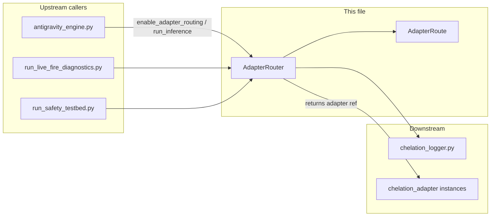
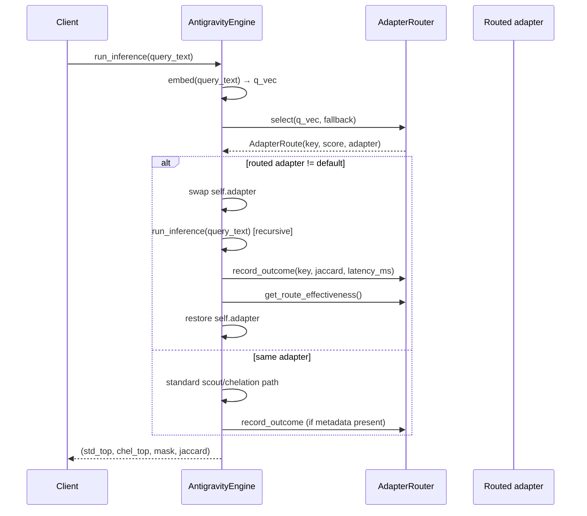

---
brain:
  schema_version: "1.0"
  dossier_type: component
  repo: "CHELATEDAI"
  file_path: "adapter_router.py"
  language: "python"
  layer: "backend"
  subsystem: "adapter_routing"
  stability: "experimental"
  trust_tier: "research_path"
  last_verified: "2026-06-29"
  last_verified_sha: "9473e9f7"
  verified_by: agent
  ingest_tags: [adapter, routing, moe, retrieval, research]
  related_docs:
    - docs/MODULE_GUIDE.md
    - docs/brain/file-map/antigravity_engine/dossier.md
    - docs/brain/file-map/chelation_adapter/dossier.md
  upstream_callers:
    - antigravity_engine.py
    - run_live_fire_diagnostics.py
    - run_safety_testbed.py
  downstream_dependencies:
    - chelation_logger.py
---

# adapter_router — File Dossier

> **Source:** `adapter_router.py`  
> **Template:** `component-dossier` v1.0 — **not** an HTTP route; in-process routing utility only.

---

## §1 Executive summary

`adapter_router.py` provides an **opt-in, centroid-similarity router** that maps a query embedding vector to one of several pre-registered chelation adapters. Selection is cosine similarity between the query and per-route centroids; outcomes (Jaccard overlap, latency) are recorded for effectiveness summaries. The router is **not wired by default** — `AntigravityEngine.enable_adapter_routing()` must be called explicitly.

**Invariant:** Routing never mutates adapter weights; it only **selects** which adapter instance `run_inference()` temporarily swaps in. Empty registry requires an explicit `fallback` callable or `select()` raises `ValueError`.

---

## §2 Architectural role

### Subsystem context

### Layer table

| Layer | Role of this file |
|---|---|
| Frontend | N/A |
| API | N/A — no HTTP surface |
| Worker / pipeline | Optional inference-time adapter selection inside `AntigravityEngine.run_inference()` |
| Data / persistence | In-memory route registry and rolling outcome history (max 256) |
| Config / ops | None |

### Execution context

| Context | Detail |
|---|---|
| Process | Same Python process as `AntigravityEngine`; invoked synchronously during `run_inference()` |
| Thread safety | `register`, `record_outcome`, and getters use `threading.Lock`; `select()` copies route list under lock then scores outside lock |
| Lifecycle hook | Created by `enable_adapter_routing()`; lives on `engine._adapter_router` for engine lifetime |

### Feature gates

| Gate | Default | When false / unset |
|---|---|---|
| `enable_adapter_routing()` | not called | Engine uses single `self.adapter`; router unused |
| Non-empty centroid registry | required for routed selection | `select()` uses `fallback` or raises |

---

## §3 Dependency graph

### Inbound (who calls this file)

| Caller | Call pattern | Notes |
|---|---|---|
| `antigravity_engine.py` | `enable_adapter_routing(routes)` → `AdapterRouter.register/select/record_outcome` | Swaps adapter during inference when route differs from default |
| `run_live_fire_diagnostics.py` | Direct `AdapterRouter` for bench harness | Exercises selection + effectiveness |
| `run_safety_testbed.py` | Direct `AdapterRouter` | Safety closed-course routing scenarios |
| `test_safety_*.py`, `test_eggroll_strategic_platform.py` | Unit/integration tests | Prove fallback, bad inputs, engine integration |

### Outbound (what this file calls)

| Dependency | Type | Purpose |
|---|---|---|
| `chelation_logger.get_logger` | import | Structured `adapter_route_selected` / `adapter_route_outcome` events |
| `numpy` | pip | Centroid normalization and cosine scoring |

### External systems

None — in-process only.

### Package pins (file-relevant only)

| Package | Version pin | Why this file cares |
|---|---|---|
| `numpy` | (project pin) | Vector math for cosine similarity |

---

## §4 Interconnection narrative

When `AntigravityEngine.enable_adapter_routing(routes)` is called, the engine constructs an `AdapterRouter`, registers each `(key, centroid, adapter)` tuple, and stores the router on `self._adapter_router`. During `run_inference()`, after query embedding (and optional TTS/static mask), if routing is active and not re-entrant, the engine calls `select(q_vec, fallback=lambda: self.adapter)`. If the chosen adapter differs from the default, the engine **temporarily replaces** `self.adapter`, recursively calls `run_inference(query_text)` once, records `record_outcome(route_key, jaccard, latency_ms)`, enriches diagnostics with `get_route_effectiveness()`, then restores the original adapter in a `finally` block.

For diagnostics-only harnesses (`run_live_fire_diagnostics.py`), the router is used standalone without engine swap semantics.

### Sequence (inference routing path)

---

## §5 Public surface reference

### `AdapterRoute` (dataclass)

| Field | Value |
|---|---|
| **Purpose** | Immutable record of a routing decision: key, similarity score, adapter reference, optional metadata |
| **Parameters** | `key: str`, `score: float`, `adapter: Any`, `metadata: Dict[str, Any]` (default `{}`) |
| **Returns** | N/A (dataclass instance) |
| **Raises / errors** | None at construction |
| **Side effects** | None |
| **Thread safety** | Immutable after construction |
| **Feature flags** | N/A |
| **Forensic note** | `adapter` object is not JSON-serializable; use `to_dict()` for logs |

#### `AdapterRoute.to_dict() -> Dict[str, Any]`

| Field | Value |
|---|---|
| **Purpose** | Serialize route metadata for diagnostics without embedding the adapter object |
| **Parameters** | None |
| **Returns** | `{"key", "score", "adapter_type", "metadata"}` where `adapter_type` is `type(adapter).__name__` |
| **Raises / errors** | None |
| **Side effects** | None |
| **Thread safety** | Safe on immutable route |
| **Feature flags** | N/A |
| **Forensic note** | Used in `run_inference` diagnostics `route` field |

---

### `AdapterRouter.__init__(logger=None)`

| Field | Value |
|---|---|
| **Purpose** | Construct empty router with thread-safe registry and outcome history |
| **Parameters** | `logger` — optional `ChelationLogger`; defaults to `get_logger()` |
| **Returns** | `AdapterRouter` instance |
| **Raises / errors** | None |
| **Side effects** | Initializes `_routes`, `_route_history` (deque maxlen=256), `_last_route_outcome` |
| **Thread safety** | Safe; per-instance lock |
| **Feature flags** | N/A |
| **Forensic note** | Does not register routes until `register()` |

---

### `AdapterRouter.register(key: str, centroid: Iterable[float], adapter: Any) -> None`

| Field | Value |
|---|---|
| **Purpose** | Register or overwrite a named route with centroid vector and adapter instance |
| **Parameters** | `key` — route identifier; `centroid` — non-empty 1D float iterable; `adapter` — any object (typically `nn.Module`) |
| **Returns** | `None` |
| **Raises / errors** | `ValueError` if centroid is empty or not 1D |
| **Side effects** | Writes to `_routes` under lock |
| **Thread safety** | Lock-protected |
| **Feature flags** | N/A |
| **Forensic note** | Overwrites existing key silently |

---

### `AdapterRouter.select(query_vector: Iterable[float], fallback: Optional[Callable[[], Any]] = None) -> AdapterRoute`

| Field | Value |
|---|---|
| **Purpose** | Pick the registered route whose centroid has highest cosine similarity to the query |
| **Parameters** | `query_vector` — non-empty non-zero 1D vector; `fallback` — callable returning adapter when registry empty |
| **Returns** | `AdapterRoute` with best-matching adapter and cosine score |
| **Raises / errors** | `ValueError` if query empty, zero-norm, or no routes and no fallback |
| **Side effects** | Emits `adapter_route_selected` log event (DEBUG) |
| **Thread safety** | Copies routes under lock; scoring outside lock |
| **Feature flags** | Requires prior `register()` calls for non-fallback path |
| **Forensic note** | Zero centroid yields score `0.0` for that route |

---

### `AdapterRouter.record_outcome(route_key: str, jaccard: float, latency_ms: Optional[float] = None) -> Dict[str, Any]`

| Field | Value |
|---|---|
| **Purpose** | Append observed retrieval effectiveness for a route to rolling history |
| **Parameters** | `route_key` — key from prior `select()`; `jaccard` — overlap metric (typically from inference); `latency_ms` — optional float |
| **Returns** | Outcome dict `{"route_key", "jaccard"}` plus optional `"latency_ms"` |
| **Raises / errors** | None |
| **Side effects** | Updates `_last_route_outcome`, appends to `_route_history`; logs `adapter_route_outcome` |
| **Thread safety** | Lock-protected |
| **Feature flags** | N/A |
| **Forensic note** | Jaccard source is engine `run_inference` return tuple index 3 |

---

### `AdapterRouter.get_last_route_outcome() -> Optional[Dict[str, Any]]`

| Field | Value |
|---|---|
| **Purpose** | Return copy of most recent outcome record |
| **Parameters** | None |
| **Returns** | Outcome dict or `None` if never recorded |
| **Raises / errors** | None |
| **Side effects** | None |
| **Thread safety** | Lock-protected read |
| **Feature flags** | N/A |
| **Forensic note** | Diagnostic read path |

---

### `AdapterRouter.get_route_history() -> list[Dict[str, Any]]`

| Field | Value |
|---|---|
| **Purpose** | Return shallow copies of all outcomes in deque (up to 256) |
| **Parameters** | None |
| **Returns** | `list[dict]` |
| **Raises / errors** | None |
| **Side effects** | None |
| **Thread safety** | Lock-protected read |
| **Feature flags** | N/A |
| **Forensic note** | Used for campaign post-mortems |

---

### `AdapterRouter.get_route_effectiveness() -> Dict[str, Any]`

| Field | Value |
|---|---|
| **Purpose** | Aggregate per-route mean Jaccard and mean latency from history |
| **Parameters** | None |
| **Returns** | `{"total_routes_observed", "last_route_outcome", "routes": {key: {count, mean_jaccard, mean_latency_ms}}}` |
| **Raises / errors** | None |
| **Side effects** | None |
| **Thread safety** | Reads history under lock |
| **Feature flags** | N/A |
| **Forensic note** | Attached to engine runtime diagnostics as `route_effectiveness` |

### Private helpers (one-line)

- None beyond dataclass `field(default_factory=dict)` — module is intentionally minimal.

---

## §6 Internal control flow

1. **Happy path:** `register` N routes → `select(query)` scores all centroids → return max cosine → caller runs inference → `record_outcome`.
2. **Empty registry:** `select` invokes `fallback()` → returns `AdapterRoute(key="fallback", score=0.0, ...)`.
3. **Degrade path:** Invalid query (zero vector) → raise `ValueError` before any adapter swap.

---

## §7 Data contracts

| Artifact | Shape | Notes |
|---|---|---|
| Centroid | `np.ndarray` shape `(D,)` | Coerced from iterable; must match query dimension in practice |
| Query vector | 1D float, non-zero | Same `D` as centroids expected by caller |
| Outcome record | `{"route_key": str, "jaccard": float, "latency_ms"?: float}` | Stored in deque |
| Effectiveness summary | Nested dict per §5 | Consumed by engine diagnostics JSON |

---

## §8 Configuration & environment

| Variable | Default | Effect on this file |
|---|---|---|
| (none) | — | Router has no env vars; opt-in via engine API only |

---

## §9 Failure modes & observability

| Symptom | Cause | Behavior |
|---|---|---|
| `ValueError: no adapters registered` | `select()` without `register` or `fallback` | Raises before inference |
| `ValueError: query_vector must be non-zero` | Zero embedding | Raises; engine should not reach here with valid embed |
| Fallback route always | Empty registry with fallback | `key="fallback"`, score `0.0` |
| Stale effectiveness stats | History maxlen 256 | Older outcomes dropped silently |

**Log events:** `adapter_route_selected`, `adapter_route_outcome` (DEBUG).

---

## §10 Security & trust boundary

- No network egress or filesystem access.
- Adapter objects are opaque references — caller responsible for adapter trust and weight provenance.
- No authentication; in-process only.

---

## §11 Tests & verification

| Test file | What it proves |
|---|---|
| `test_safety_component_controls.py` | Fallback selection, registration, outcome recording, bad inputs |
| `test_safety_failure_injection.py` | Router under failure injection harness |
| `test_safety_control_surfaces.py` | Control surface coverage |
| `test_safety_instrumentation.py` | Engine + router instrumentation wiring |
| `test_eggroll_strategic_platform.py` | Nearest-centroid selection; engine recursive routing mock |

**Smoke tier:**

| Tier | Command | Proof level |
|---|---|---|
| **Floor** | `python -m unittest test_safety_component_controls.TestStage1ComponentBench.test_adapter_router_bench_selection_fallback_outcomes_and_bad_inputs test_eggroll_strategic_platform.TestP3ResearchScaffolding.test_adapter_router_selects_nearest_centroid -v` | Pure numpy/torch; no Qdrant/Ollama |
| **Ceiling** | `python -m unittest test_eggroll_strategic_platform.TestP3ResearchScaffolding -v` | Engine integration with mocked adapters |

Honest ceiling: full MoE-style multi-adapter production routing is **research scaffold** — tests prove selection math and engine hook, not learned centroid quality at scale.

---

## §12 Related documentation

- `docs/MODULE_GUIDE.md` — Core Retrieval Runtime table
- `../antigravity_engine/dossier.md` — `enable_adapter_routing`, `run_inference` swap semantics
- `../chelation_adapter/dossier.md` — Adapter types being routed

---

## §13 Drift watch / known gaps

- **Opt-in MoE scaffold** (`adapter_router.py:1`): Module docstring states "future MoE-style retrieval adaptation"; no automatic centroid learning or training loop in this file.
- **Engine integration is manual** (`antigravity_engine.py:1178-1189`): Routes must be supplied at enable time; no hot-reload API on router.
- **Recursive inference cost** (`antigravity_engine.py:2609`): Non-default route triggers full second `run_inference` pass — doubling latency for routed queries.
- **None known** for correctness of cosine selection — covered by `test_safety_component_controls.py`.

---

## §14 Changelog (dossier)

| Date | SHA | Change |
|---|---|---|
| 2026-06-29 | fe72fb6 | Initial enriched dossier (B1 batch) |