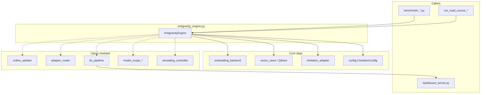
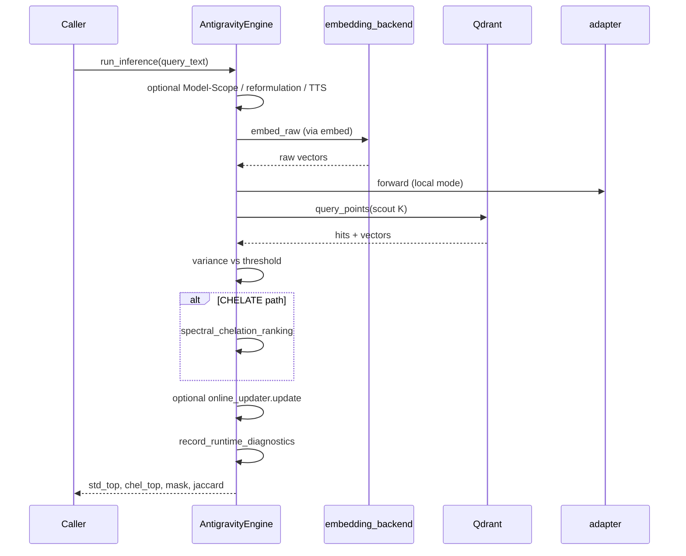

---
brain:
  schema_version: "1.0"
  dossier_type: component
  repo: "CHELATEDAI"
  file_path: "antigravity_engine.py"
  language: "python"
  layer: "backend"
  subsystem: "antigravity_engine"
  stability: "stable"
  trust_tier: "production_critical"
  last_verified: "2026-06-29"
  last_verified_sha: "439b037c"
  verified_by: agent
  ingest_tags: [retrieval, qdrant, chelation, sedimentation, inference, engine]
  related_docs:
    - docs/MODULE_GUIDE.md
    - docs/SYSTEM_BLUEPRINT.md
    - docs/brain/file-map/chelation_adapter/dossier.md
    - docs/brain/file-map/embedding_backend/dossier.md
    - docs/brain/file-map/vector_store/dossier.md
    - docs/brain/file-map/online_updater/dossier.md
    - docs/brain/file-map/adapter_router/dossier.md
  upstream_callers:
    - benchmark_beir.py
    - benchmark_comparative.py
    - benchmark_distillation.py
    - benchmark_multitask.py
    - benchmark_rlm.py
    - run_road_course_campaign.py
    - dashboard_server.py
  downstream_dependencies:
    - chelation_adapter.py
    - embedding_backend.py
    - vector_store.py
    - config.py
    - checkpoint_manager.py
    - teacher_distillation.py
    - sedimentation_trainer.py
    - online_updater.py
    - adapter_router.py
---

# antigravity_engine — File Dossier

> **Source:** `antigravity_engine.py` (~2833 lines)  
> **Template:** `component-dossier` v1.0

---

## §1 Executive summary

`antigravity_engine.py` is the **primary ChelatedAI retrieval runtime**: it embeds documents via `embedding_backend`, stores vectors in Qdrant (via `vector_store`), applies optional chelation adapters on local embeddings, ingests corpora, runs the navigational inference loop (scout → variance gate → spectral chelation rerank), trains adapters in sedimentation/offline distillation cycles, and exposes numerous opt-in subsystems (annealing, online updates, TTS, Model-Scope, adapter routing).

**Invariant:** `run_inference()` always returns a 4-tuple `(std_top_10, chel_top_10, mask, jaccard)` — on any error path it degrades to empty lists, identity mask, and `jaccard=0.0` rather than raising to callers.

---

## §2 Architectural role

### Subsystem context

### Layer table

| Layer | Role of this file |
|---|---|
| Frontend | N/A (dashboard reads TTS state pushed from engine) |
| API | N/A — library class, not HTTP |
| Worker / pipeline | Full RAG retrieval + training orchestration |
| Data / persistence | Qdrant collection, adapter `.pt`, chelation_log, runtime diagnostics |
| Config / ops | `ChelationConfig` presets, checkpoint manager |

### Execution context

| Context | Detail |
|---|---|
| Process | Single-process Python; benchmarks and campaigns construct one engine per run |
| Thread safety | Adaptive threshold uses `Lock`; most state not thread-safe |
| Lifecycle hook | `__init__` → ingest → `run_inference` loop → `run_sedimentation_cycle` → `close()` |

### Feature gates

| Gate | Default | When false / unset |
|---|---|---|
| `model_name` prefix `ollama:` | local ST model | Ollama HTTP embed; adapter skipped at embed |
| `use_quantization` | `False` | No INT8 Qdrant quant config |
| `use_centering` | `False` | Chelate only when variance high (if quant on) |
| `training_mode` | `"baseline"` | No teacher helper unless `offline`/`hybrid` |
| Each `enable_*()` | not called | Subsystem inactive |

---

## §3 Dependency graph

### Inbound (who calls this file)

| Caller | Call pattern | Notes |
|---|---|---|
| `benchmark_beir.py`, `benchmark_comparative.py`, etc. | `AntigravityEngine(...)` + ingest/query | Evaluation stack |
| `run_road_course_campaign.py`, drift recovery harnesses | Campaign drivers | Production-like loops |
| `dashboard_server.py` | `update_tts_dashboard_state` called from engine | Read-only TTS UI state |
| `recursive_decomposer.py`, `model_scope_engine_bridge.py` | Engine as retrieval backend | Extensions |

### Outbound (what this file calls)

| Dependency | Type | Purpose |
|---|---|---|
| `embedding_backend.create_embedding_backend` | import | Text → vectors |
| `vector_store.create_vector_store` | import | Qdrant abstraction |
| `chelation_adapter.create_adapter` | import | Dynamic adapter |
| `checkpoint_manager.CheckpointManager` | import | Safe training rollback |
| `teacher_distillation.create_distillation_helper` | import | Offline/hybrid modes |
| `online_updater.OnlineUpdater` | lazy import | Inference-time SGD |
| `adapter_router.AdapterRouter` | lazy import | Centroid routing |
| `tts_pipeline.TTSPipeline` | lazy import | Translation/transport/steering |
| `qdrant_client` | pip | Vector DB |

### External systems

| System | Protocol | When |
|---|---|---|
| Qdrant | gRPC/HTTP (`QdrantClient`) | All ingest/query/scroll |
| Ollama | HTTP | `model_name` starts with `ollama:` |
| Local SentenceTransformers | in-process | Default local embed |
| `dashboard_server` | Python import | TTS enable + per-inference result push |

### Package pins (file-relevant only)

| Package | Version pin | Why this file cares |
|---|---|---|
| `torch` | `>=2.0` | Adapter, training, telemetry CUDA |
| `sentence-transformers` | `>=2.2` | Local embedding backend |
| `qdrant-client` | (project pin) | Collection CRUD and search |

---

## §4 Interconnection narrative

A typical benchmark constructs `AntigravityEngine(qdrant_location=..., model_name=...)`, which creates the embedding backend, loads or initializes the chelation adapter, and ensures the Qdrant collection exists. `ingest(text_corpus)` batches texts through `embed()` → validates shapes → `upsert` PointStructs. `run_inference(query)` optionally observes Model-Scope, may reformulate into multiple variant queries (RRF merge), embeds the query, optionally applies TTS steering and adapter routing, scouts top-K from Qdrant, computes global variance, and either keeps scout order (FAST) or runs spectral chelation reranking (CHELATE). Online updater may micro-train the adapter from scout halves. Diagnostics land in `_last_runtime_diagnostics`; TTS results optionally update `dashboard_server` state inside try/except guards.

`sleep` training: `run_sedimentation_cycle()` consumes `chelation_log` collapse events to train the adapter (baseline/homeostatic, teacher offline, or hybrid), syncs vectors to Qdrant, saves adapter weights. Annealing controller may scale LR/epochs/temperature when drift triggers correction.

### Sequence (run_inference happy path)

---

## §5 Public surface reference

### `AntigravityEngine.__init__(qdrant_location=":memory:", chelation_p=..., model_name='ollama:nomic-embed-text', use_centering=False, use_quantization=False, training_mode="baseline", teacher_model_name=None, teacher_models=None, teacher_weight=0.5, store_full_text_payload=None)`

| Field | Value |
|---|---|
| **Purpose** | Construct full Stage 8 engine: embed backend, adapter, Qdrant collection, checkpoint manager |
| **Parameters** | See docstring; `training_mode` validated; teacher helper if offline/hybrid |
| **Returns** | Engine instance |
| **Raises / errors** | From backend/vector store on fatal init failures |
| **Side effects** | Creates collection; may load adapter weights; logs initialization events |
| **Thread safety** | Construct before sharing across threads |
| **Feature flags** | All constructor flags |
| **Forensic note** | `self.qdrant` aliases `_vector_store` for backward compatibility |

---

### `embed(texts) -> np.ndarray`

| Field | Value |
|---|---|
| **Purpose** | Batch embed texts; apply adapter in **local** mode only |
| **Parameters** | `texts` str or list[str] |
| **Returns** | `(N, vector_size)` numpy array; empty input → empty array |
| **Raises / errors** | From backend |
| **Side effects** | Sets `_last_embedding_norms`; optional INT8 sim if `_simulate_embedding_quantization` |
| **Thread safety** | Not safe with concurrent training |
| **Feature flags** | `mode` local vs ollama |
| **Forensic note** | Ollama path returns raw embeddings without adapter |

---

### `refresh_corpus_vectors(batch_size=None, quantize_adapter_output=False, quantization_levels=127) -> dict`

| Field | Value |
|---|---|
| **Purpose** | Re-embed all corpus payload texts with current adapter and upsert vectors |
| **Parameters** | Batch size; optional quant simulation during embed |
| **Returns** | `{"updated": int, "failed": int}` |
| **Raises / errors** | `ValueError` missing text payloads; re-raises after partial progress logged |
| **Side effects** | Full collection scroll + upsert; temporarily toggles quant sim flags |
| **Thread safety** | Exclusive access recommended |
| **Feature flags** | Requires `store_full_text_payload` or text in payloads |
| **Forensic note** | Mutates stored retrieval vectors |

---

### `ingest(text_corpus, payloads=None) -> None`

| Field | Value |
|---|---|
| **Purpose** | Batch ingest documents into Qdrant with embed validation per batch |
| **Parameters** | Parallel lists of texts and optional payload dicts |
| **Returns** | None |
| **Raises / errors** | None — skips invalid batches with logged errors |
| **Side effects** | Upserts points; logs ingestion progress |
| **Thread safety** | Not concurrent-safe |
| **Feature flags** | `store_full_text_payload` controls text in payload |
| **Forensic note** | Point IDs are batch-linear integers |

---

### `ingest_streaming(texts_iterable, payloads_iterable=None, batch_size=None, start_id=0) -> dict`

| Field | Value |
|---|---|
| **Purpose** | Memory-efficient ingest from iterables |
| **Parameters** | Iterables; `batch_size` defaults `STREAMING_BATCH_SIZE` |
| **Returns** | `{total_docs, total_batches, start_id, end_id}` |
| **Raises / errors** | None typical |
| **Side effects** | Incremental upsert; progress logs every `STREAMING_PROGRESS_INTERVAL` batches |
| **Thread safety** | Not concurrent-safe |
| **Feature flags** | Same payload flag as `ingest` |
| **Forensic note** | Suitable for large corpora |

---

### `get_chelated_vector(query_text) -> np.ndarray`

| Field | Value |
|---|---|
| **Purpose** | MTEB/benchmark helper: embed + scout + toxicity mask (no full rerank return) |
| **Parameters** | Query string |
| **Returns** | 1D masked query vector; fallback to raw embed on empty index/errors |
| **Raises / errors** | None — Qdrant errors logged, returns `q_vec` |
| **Side effects** | Qdrant scout query |
| **Thread safety** | Read-mostly |
| **Feature flags** | Uses `invert_chelation` if set |
| **Forensic note** | Does not run full `run_inference` policy |

---

### `enable_adaptive_threshold(percentile=None, window=None, min_samples=None, min_bound=None, max_bound=None) -> None`

| Field | Value |
|---|---|
| **Purpose** | Enable variance-percentile driven `chelation_threshold` updates during inference |
| **Parameters** | Override config defaults when provided |
| **Returns** | None |
| **Raises / errors** | From config validators on bad params |
| **Side effects** | Sets `_adaptive_threshold_enabled`; logs enable event |
| **Thread safety** | Uses `_adaptive_threshold_lock` |
| **Feature flags** | Off by default |
| **Forensic note** | Affects FAST vs CHELATE gate when quantization on |

---

### `disable_adaptive_threshold() -> None`

| Field | Value |
|---|---|
| **Purpose** | Disable adaptive tuning; reset threshold to default; clear history |
| **Returns** | None |
| **Side effects** | Clears `_variance_history` |
| **Thread safety** | Lock-protected |
| **Feature flags** | N/A |
| **Forensic note** | Restores `DEFAULT_CHELATION_THRESHOLD` |

---

### `get_threshold_stats() -> dict`

| Field | Value |
|---|---|
| **Purpose** | Snapshot adaptive threshold config and variance history stats |
| **Returns** | Dict with enabled flag, threshold, bounds, sample count, optional variance aggregates |
| **Side effects** | None |
| **Thread safety** | Lock-protected read |
| **Forensic note** | Operator diagnostics |

---

### `enable_convergence_detection(patience=None, rel_threshold=None, min_epochs=None) -> None`

| Field | Value |
|---|---|
| **Purpose** | Flag early stopping for sedimentation/offline training loops |
| **Parameters** | Defaults from `ChelationConfig` |
| **Side effects** | Sets `_convergence_enabled` and params |
| **Forensic note** | Used with `ConvergenceMonitor` in training |

---

### `enable_kalman_lr(process_noise=0.1, min_lr_ratio=0.1, max_lr_ratio=2.0, window_size=10) -> None`

| Field | Value |
|---|---|
| **Purpose** | Enable Kalman-gain adaptive LR during training |
| **Side effects** | Sets `_kalman_lr_enabled` and hyperparameters |
| **Forensic note** | Modulates optimizer LR from loss variance |

---

### `set_temperature(temperature) -> None`

| Field | Value |
|---|---|
| **Purpose** | Set score divisor for spectral chelation ranking |
| **Parameters** | `temperature > 0` |
| **Raises** | `ValueError` if non-positive |
| **Side effects** | Stores `_temperature`; logs event |
| **Forensic note** | Does not change pure top-k order (monotonic cosine transform) |

---

### `enable_annealing_controller(**kwargs) -> AnnealingController`

| Field | Value |
|---|---|
| **Purpose** | Enable drift-triggered annealing for sedimentation |
| **Returns** | Controller instance |
| **Side effects** | Sets `_annealing_controller`; logs thresholds |
| **Forensic note** | Coupled to `observe_annealing_drift` and sedimentation |

---

### `observe_annealing_drift(drift_magnitude=None) -> dict`

| Field | Value |
|---|---|
| **Purpose** | Feed drift signal to annealing controller; may update engine temperature |
| **Parameters** | Optional scalar; else `_compute_annealing_drift_magnitude()` from stability/isomer/runtime |
| **Returns** | `{drift_magnitude, temperature, should_correct}` |
| **Raises** | `RuntimeError` if controller not enabled |
| **Side effects** | `controller.observe_drift`; may `set_temperature` |
| **Forensic note** | Called at sedimentation start when controller present |

---

### `set_static_dimension_mask(mask) -> None`

| Field | Value |
|---|---|
| **Purpose** | Zero selected embedding dims on query before search (ablation) |
| **Parameters** | Length-`vector_size` array-like |
| **Raises** | `ValueError` on length mismatch |
| **Side effects** | Sets `_static_dim_mask` |
| **Forensic note** | Applied in `run_inference` after embed |

---

### `set_sedimentation_loss(loss_type="mse", **kwargs) -> None`

| Field | Value |
|---|---|
| **Purpose** | Configure sedimentation criterion: mse, infonce, hybrid |
| **Side effects** | Sets `_sedimentation_loss_type` and kwargs |
| **Forensic note** | Used in sedimentation training loop |

---

### `set_sedimentation_optimizer(optimizer_type="adam", **kwargs) -> None`

| Field | Value |
|---|---|
| **Purpose** | Select Adam or `eggroll_es` zeroth-order optimizer for sedimentation |
| **Side effects** | Sets `_sedimentation_optimizer_type`, `_es_optimizer_kwargs` |
| **Forensic note** | ES path uses `train_adapter_with_es` |

---

### `enable_online_updates(learning_rate=None, micro_steps=None, momentum=None, max_grad_norm=None, update_interval=None) -> None`

| Field | Value |
|---|---|
| **Purpose** | Attach `OnlineUpdater` for inference-time SGD on adapter |
| **Side effects** | Sets `_online_updater`; logs enable |
| **Forensic note** | Called from `run_inference` when scout len >= 4 |

---

### `enable_evolutionary_online_updates(population_size=None, rank=None, sigma=None, learning_rate=None, generations=None, seed=None, quantization_aware=None, update_interval=None, kalman_sigma=None) -> None`

| Field | Value |
|---|---|
| **Purpose** | Attach `EvolutionaryOnlineUpdater` (EGGROLL ES) instead of SGD online updater |
| **Side effects** | Replaces `_online_updater` with ES variant |
| **Forensic note** | Research-path online adaptation |

---

### `enable_query_reformulation(max_variants=3, policy="always") -> None`

| Field | Value |
|---|---|
| **Purpose** | Enable multi-variant query reformulation with RRF merge in `run_inference` |
| **Raises** | `ValueError` if `max_variants < 1` |
| **Side effects** | Sets `_query_reformulator` and policy snapshot |
| **Forensic note** | Recursive `run_inference` per variant |

---

### `enable_model_scope_observation(model_name=None, *, layer_indices=None, max_input_tokens=None, summary_top_dimensions=None, artifact_dir=None, eager_load=False, runtime=None) -> None`

| Field | Value |
|---|---|
| **Purpose** | Enable observation-only Model-Scope activation capture per query |
| **Side effects** | Sets `_model_scope_runtime`, bridge, config; telemetry flag |
| **Forensic note** | Shadow mode — does not steer retrieval by default |

---

### `enable_tts(tts_config=None, phase_c_results_path=None, transport_state_path=None) -> None`

| Field | Value |
|---|---|
| **Purpose** | Enable Translation→Transport→Steering pipeline before retrieval |
| **Side effects** | Builds `_tts_pipeline`; tries `dashboard_server.update_tts_dashboard_state(enabled=True)` in **try/except** (warnings on failure, inference unaffected) |
| **Forensic note** | Must be called before `run_inference` for TTS intercept |

---

### `get_last_tts_result() -> Optional[TTSResult]`

| Field | Value |
|---|---|
| **Purpose** | Return last `TTSResult` from inference or None |
| **Returns** | Pipeline result object or None |
| **Side effects** | None |
| **Forensic note** | Not updated if TTS apply fails (L11 fallback retains prior) |

---

### `add_tts_transport_target(target_id, centroid, label="") -> None`

| Field | Value |
|---|---|
| **Purpose** | Register transport centroid on active TTS pipeline |
| **Raises** | `RuntimeError` if TTS not enabled |
| **Side effects** | Mutates pipeline transport registry |

---

### `load_tts_transport_state(path) -> None`

| Field | Value |
|---|---|
| **Purpose** | Load JSON transport targets onto active pipeline |
| **Raises** | `RuntimeError` if TTS not enabled |
| **Side effects** | File read + register targets |

---

### `enable_adapter_routing(routes) -> None`

| Field | Value |
|---|---|
| **Purpose** | Register centroid→adapter routes via `AdapterRouter` |
| **Parameters** | Iterable of `(key, centroid, adapter)` tuples |
| **Side effects** | Sets `_adapter_router`; logs route count |
| **Forensic note** | Opt-in; see `adapter_router` dossier |

---

### `get_last_runtime_diagnostics() -> Optional[dict]`

| Field | Value |
|---|---|
| **Purpose** | JSON-safe copy of last inference diagnostics blob |
| **Returns** | Dict or None |
| **Side effects** | None |
| **Forensic note** | Includes query hash, policy, route, telemetry |

---

### `get_last_model_scope_artifact() -> Optional[dict]`

| Field | Value |
|---|---|
| **Purpose** | Last Model-Scope capture as dict (dataclass or bridge summary) |
| **Returns** | Dict or None |
| **Side effects** | None |

---

### `observe_query_with_model_scope(query: str) -> dict`

| Field | Value |
|---|---|
| **Purpose** | Explicit bridge observation API (not automatic inference hook) |
| **Returns** | Dataclass dict or `{"error": "model_scope_not_enabled"}` |
| **Side effects** | Updates `_last_model_scope_artifact`, telemetry count |

---

### `get_runtime_telemetry() -> dict`

| Field | Value |
|---|---|
| **Purpose** | Lightweight counters: inferences, errors, CUDA memory, model scope stats |
| **Returns** | JSON-safe dict |
| **Side effects** | None |
| **Forensic note** | Guards CUDA `device_count()==0` to avoid invalid device id |

---

### `enable_teacher_weight_scheduling(schedule="constant", initial_weight=0.5, **kwargs) -> None`

| Field | Value |
|---|---|
| **Purpose** | Dynamic `teacher_weight` during training via `TeacherWeightScheduler` |
| **Side effects** | Sets `_weight_scheduler` |

---

### `enable_stability_tracking() -> None`

| Field | Value |
|---|---|
| **Purpose** | Attach `StabilityTracker` for structural metrics |
| **Side effects** | Sets `_stability_tracker` |

---

### `enable_topology_analysis(**kwargs) -> None`

| Field | Value |
|---|---|
| **Purpose** | Attach `TopologyAnalyzer` with bond thresholds |
| **Side effects** | Sets `_topology_analyzer` |

---

### `enable_isomer_detection(**kwargs) -> None`

| Field | Value |
|---|---|
| **Purpose** | Attach `IsomerDetector` for retrieval isomer signals |
| **Side effects** | Sets `_isomer_detector` |

---

### `get_structural_health_report() -> dict`

| Field | Value |
|---|---|
| **Purpose** | Unified stability + topology + isomer report with `health_classification` |
| **Returns** | Nested dict including `structural_health_score` |
| **Side effects** | Reads sub-tracker state only |
| **Forensic note** | Used by adaptive gates and ES fitness penalties |

---

### `run_sedimentation_cycle(threshold=..., learning_rate=..., epochs=..., noise_injection=None) -> None`

| Field | Value |
|---|---|
| **Purpose** | "Sleep cycle" adapter training from `chelation_log` collapse events; sync vectors to Qdrant |
| **Parameters** | Collapse count threshold, LR, epochs; optional noise injection |
| **Returns** | None (early return if epochs=0) |
| **Side effects** | Trains adapter; saves weights; clears `chelation_log`; annealing cycle hooks |
| **Thread safety** | Exclusive |
| **Feature flags** | `training_mode`, sedimentation loss/optimizer, annealing controller |
| **Forensic note** | **Mutates adapter and corpus vectors** |

---

### `run_offline_distillation(batch_size=100, learning_rate=None, epochs=None) -> None`

| Field | Value |
|---|---|
| **Purpose** | Teacher-align entire corpus (requires offline/hybrid init) |
| **Returns** | None; early exit if no teacher or empty corpus |
| **Side effects** | Scroll corpus, train adapter, upsert new vectors |
| **Forensic note** | Independent of query-time chelation events |

---

### `run_inference(query_text) -> tuple`

| Field | Value |
|---|---|
| **Purpose** | Full navigational retrieval loop |
| **Returns** | `(std_top_10: list, chel_top_10: list, mask: ndarray, jaccard: float)` |
| **Raises** | None to caller — errors become empty results |
| **Side effects** | Qdrant queries; optional TTS (**L11** try/except dashboard update at ~2568-2578); adapter routing swap; online update; diagnostics; chelation_log on CHELATE; query log |
| **Thread safety** | Not concurrent-safe |
| **Feature flags** | All enable_* subsystems |
| **Forensic note** | Primary retrieval deliverable path |

**TTS/dashboard L11 behavior (`antigravity_engine.py:2564-2588`):**
- Dashboard update wrapped in `try/except` — failure emits `warnings.warn`, inference continues.
- TTS pipeline exception logs error and **retains original** `q_vec` (inference never killed).

**Adapter routing (`antigravity_engine.py:2589-2632`):** Non-default route temporarily swaps `self.adapter`, recurses `run_inference`, records outcome, restores adapter in `finally`.

---

### `close() -> None`

| Field | Value |
|---|---|
| **Purpose** | Idempotent cleanup of Model-Scope runtime and vector store |
| **Side effects** | Closes Qdrant client; nulls `self.qdrant` |
| **Forensic note** | Safe to call multiple times |

---

### `__enter__() / __exit__(...)`

| Field | Value |
|---|---|
| **Purpose** | Context manager — `with AntigravityEngine(...) as e:` auto-closes |
| **Returns** | `__exit__` returns `False` (exceptions propagate) |
| **Side effects** | `close()` on exit |

### Private helpers (one-line)

- `_gravity_sensor`, `_chelate_toxicity`, `_spectral_chelation_ranking` — scout cluster and rerank internals.
- `_update_adaptive_threshold`, `_compute_annealing_drift_magnitude` — threshold and drift scalars.
- `_observe_model_scope_query`, `_build_runtime_diagnostics`, `_record_runtime_diagnostics` — diagnostics pipeline.
- `_fuse_reformulated_rankings`, `_select_retrieval_policy` — reformulation RRF and policy metadata.
- `_sanitize_ollama_text` — delegates to backend sanitizer when present.
- `_runtime_json_safe` — static JSON serialization helper for diagnostics.

---

## §6 Internal control flow

1. **Inference happy path:** embed → optional TTS → optional adapter route → scout → variance → FAST or CHELATE → optional online update → diagnostics.
2. **Reformulation path:** generate variants → recursive inference → RRF fuse → return merged tops.
3. **Error degrade:** embed failure → `embedding_error`; Qdrant failure → `qdrant_error`; empty scout → `empty_results` — all return empty lists.
4. **Sedimentation:** filter chelation_log → train (Adam or ES) → upsert vectors → clear log → annealing end hook.

---

## §7 Data contracts

| Method | Output contract |
|---|---|
| `embed` | `(N, vector_size)` float numpy |
| `ingest` / streaming | Point IDs int; vectors match `vector_size` |
| `run_inference` | 4-tuple: two ID lists (len ≤10), mask `(vector_size,)`, jaccard `[0,1]` |
| `get_last_runtime_diagnostics` | JSON-serializable nested dict with `runtime`, `query_summary`, `retrieval_policy` |
| Adapter weights | `ChelationConfig.ADAPTER_WEIGHTS_PATH` PyTorch state dict |

---

## §8 Configuration & environment

| Variable / config | Default | Effect on this file |
|---|---|---|
| `ChelationConfig.DEFAULT_COLLECTION_NAME` | `antigravity_stage8` | Qdrant collection |
| `ChelationConfig.OLLAMA_URL` | env-driven | Ollama embed endpoint |
| `ChelationConfig.BATCH_SIZE` | config | Ingest batching |
| `ChelationConfig.ADAPTER_TYPE` | `mlp` | `create_adapter` selection |
| `ChelationConfig.FETCH_PAYLOAD_ON_QUERY` | config | Scout payload fetch |
| `ChelationConfig.STORE_FULL_TEXT_PAYLOAD` | config | Text stored for refresh/distillation |

---

## §9 Failure modes & observability

| Symptom | Cause | Behavior |
|---|---|---|
| Empty retrieval results | Empty collection or embed error | Tuple with `[]`, logged diagnostics |
| Adapter not applied | Ollama mode | Raw remote embeddings |
| TTS silently skipped | Pipeline exception | Original embedding used (L11) |
| Dashboard stale | `dashboard_server` import fails | Warning only at enable/inference |
| Batch ingest skip | Embed shape mismatch | Batch skipped, error logged |
| Qdrant down | Network/local error | Degraded empty results, `qdrant_error_count++` |

**Logs:** `initialization`, `ingestion_*`, `runtime_diagnostics`, `query`, `sedimentation_*`, `tts_*`, `adapter_route_*` via `chelation_logger`.

---

## §10 Security & trust boundary

- Qdrant location string controls data residency (`:memory:` vs path).
- Ollama mode sends document text to HTTP service.
- Adapter save/load paths validated in `chelation_adapter`.
- Model-Scope captures query text to artifact dir — PII risk if enabled.
- No auth on engine itself — caller must sandbox.

---

## §11 Tests & verification

| Test file | What it proves |
|---|---|
| `test_unit_core.py` | Adapter/chelation algorithms without external services |
| `test_antigravity_engine.py` | Embed shapes, ingest validation, inference paths, TTS/dashboard mocks, adapter routing |
| `test_adaptive_threshold.py` | Adaptive threshold enable/disable/stats |
| `test_online_updater.py` | Online update wiring (indirect) |
| `test_safety_instrumentation.py` | Adapter router + engine instrumentation |

**Smoke tier:**

| Tier | Command | Proof level |
|---|---|---|
| **Floor** | `python -m unittest test_unit_core.TestChelationAdapter test_unit_core.TestBoundedAdapter test_unit_core.TestAdapterVariants -v` | Adapter/chelation algorithms; `torch` only; no Qdrant/Ollama |
| **Mid** | `python -m unittest test_antigravity_engine.TestAntigravityEngine -v` | **Requires** `torch` + `sentence-transformers` + `requests` (`@unittest.skipUnless(HAS_TORCH)`) — Qdrant/Ollama mocked |
| **Ceiling** | `python scripts/smoke_pipeline.py` + live Qdrant/Ollama | Full embed + retrieval stack — **not executed** in this dossier verification |

**Honest floor vs ceiling:** Floor tests prove chelation **algorithms** in isolation. `test_antigravity_engine.py` is the honest production-path floor for **this file** but still mocks `QdrantClient` and `SentenceTransformer` — it does **not** prove real embedding model quality or Qdrant persistence without `torch>=2.0` and `sentence-transformers>=2.2` installed and ceiling integration runs. CI skip when imports missing is explicit at `test_antigravity_engine.py:11-19`.

---

## §12 Related documentation

- `docs/MODULE_GUIDE.md` — Core Retrieval Runtime
- `docs/SYSTEM_BLUEPRINT.md` — Architecture flows
- `../embedding_backend/dossier.md` — Embed routing
- `../vector_store/dossier.md` — Qdrant abstraction
- `../chelation_adapter/dossier.md` — Adapter variants
- `../online_updater/dossier.md` — Online SGD
- `../adapter_router/dossier.md` — Centroid routing

---

## §13 Drift watch / known gaps

- **Dashboard try/except L11** (`antigravity_engine.py:1129-1140`, `2568-2578`): TTS dashboard updates intentionally swallowed with `warnings.warn` — dashboard may be stale while inference succeeds.
- **TTS failure fallback** (`antigravity_engine.py:2580-2588`): Documented L11 — pipeline errors keep original embedding; `_last_tts_result` not updated on failure.
- **Ollama mode skips adapter at embed** (`antigravity_engine.py:196-212`): Production Ollama deployments do not apply chelation adapter during embed unless corpus refreshed separately.
- **Temperature does not change top-k NDCG** (`antigravity_engine.py:808-813`): Documented in `set_temperature` — score calibration only.
- **Adapter routing double inference** (`antigravity_engine.py:2609`): Latency cost when routed adapter differs from default.
- **Online updater pseudo-labels** (`antigravity_engine.py:2741-2744`): Scout half split — not relevance judgments.

---

## §14 Changelog (dossier)

| Date | SHA | Change |
|---|---|---|
| 2026-06-29 | fe72fb6 | Initial enriched dossier (B1 batch); 41 public symbols in §5 |