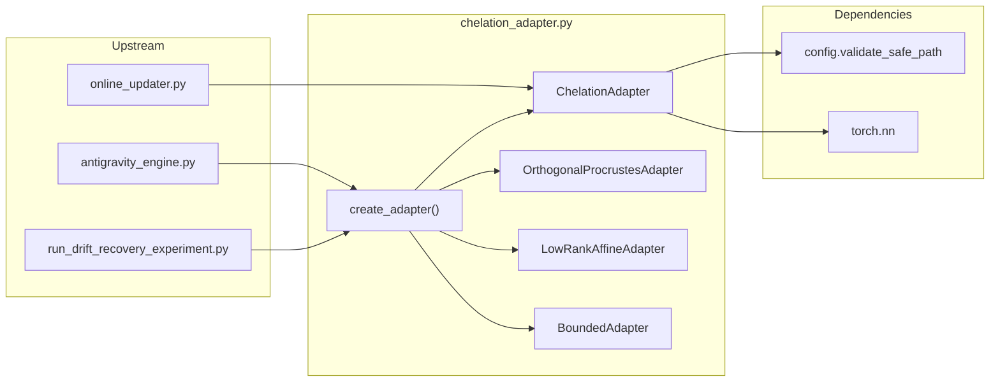
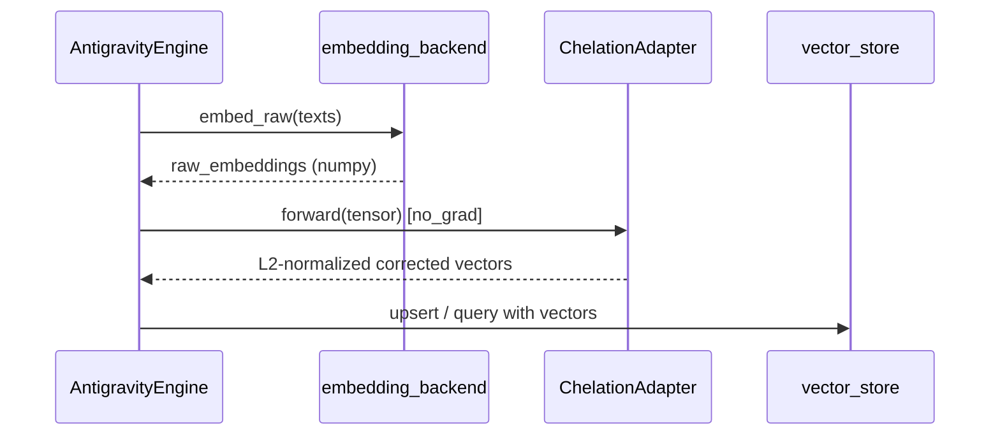

---
brain:
  schema_version: "1.0"
  dossier_type: component
  repo: "CHELATEDAI"
  file_path: "chelation_adapter.py"
  language: "python"
  layer: "backend"
  subsystem: "chelation_adapter"
  stability: "stable"
  trust_tier: "production_critical"
  last_verified: "2026-06-29"
  last_verified_sha: "439b037c"
  verified_by: agent
  ingest_tags: [adapter, chelation, embedding, pytorch, identity]
  related_docs:
    - docs/MODULE_GUIDE.md
    - docs/brain/file-map/antigravity_engine/dossier.md
    - docs/brain/file-map/online_updater/dossier.md
  upstream_callers:
    - antigravity_engine.py
    - online_updater.py
    - run_drift_recovery_experiment.py
    - run_sweep.py
  downstream_dependencies:
    - config.py
---

# chelation_adapter — File Dossier

> **Source:** `chelation_adapter.py`  
> **Template:** `component-dossier` v1.0

---

## §1 Executive summary

`chelation_adapter.py` defines **near-identity PyTorch adapters** that post-hoc correct embedding vectors while preserving cosine-retrieval geometry. All variants apply L2 normalization on output; initialization is intentionally small so untrained adapters behave like identity maps. `create_adapter()` is the factory used by `AntigravityEngine` to instantiate the configured adapter type (MLP, Procrustes, low-rank, quant-aware low-rank, AttnRes, optionally `BoundedAdapter`-wrapped).

**Invariant:** At initialization, correction magnitude is near zero — baseline retrieval quality of the base encoder is preserved until sedimentation or online training moves weights.

---

## §2 Architectural role

### Subsystem context

### Layer table

| Layer | Role of this file |
|---|---|
| Frontend | N/A |
| API | N/A |
| Worker / pipeline | Transforms embeddings in `embed()` (local mode) and sedimentation training |
| Data / persistence | `save()`/`load()` `.pt` state dicts via validated paths |
| Config / ops | `ChelationConfig.ADAPTER_TYPE`, ranks, block counts |

### Execution context

| Context | Detail |
|---|---|
| Process | Synchronous forward in embedding and training loops |
| Thread safety | Standard `nn.Module` — not thread-safe for concurrent forward+backward |
| Lifecycle hook | Created at engine init; weights updated in sedimentation / online update |

### Feature gates

| Gate | Default | When false / unset |
|---|---|---|
| `ChelationConfig.ADAPTER_TYPE` | `"mlp"` | Factory selects different architecture |
| `bounded=True` in `create_adapter` | `False` | Skips `BoundedAdapter` wrapper |
| Ollama embedding mode | engine `mode=="ollama"` | Adapter not applied at embed time |

---

## §3 Dependency graph

### Inbound (who calls this file)

| Caller | Call pattern | Notes |
|---|---|---|
| `antigravity_engine.py` | `create_adapter(...)` at init; `adapter(tensor)` in `embed()` local mode | Primary production path |
| `online_updater.py` | `OnlineUpdater(adapter=...)` | Inference-time fine-tuning |
| `run_drift_recovery_experiment.py` | `create_adapter` for condition-specific adapters | Research harness |
| `run_sweep.py`, `run_large_sweep.py` | Swap adapter type in sweeps | Experiment drivers |
| `sedimentation_trainer.py`, ES optimizers | Forward + `regularization_loss()` | Training loops |

### Outbound (what this file calls)

| Dependency | Type | Purpose |
|---|---|---|
| `config.validate_safe_path` | import | Path traversal guard on save/load |
| `evolution_strategies_optimizer.simulate_int8_quantization` | lazy import | `QuantizationAwareLowRankAdapter` inference quant path |
| `torch`, `torch.nn`, `torch.nn.functional` | pip | Module implementation |

### External systems

None — in-process tensor transforms only.

### Package pins (file-relevant only)

| Package | Version pin | Why this file cares |
|---|---|---|
| `torch` | `>=2.0` | `nn.Module`, `linalg.solve`, normalization |

---

## §4 Interconnection narrative

`AntigravityEngine.__init__` calls `create_adapter(adapter_type=ChelationConfig.ADAPTER_TYPE, input_dim=vector_size, ...)`, attempts `adapter.load(ADAPTER_WEIGHTS_PATH)`, and uses the module for all local embedding correction. In Ollama mode, raw HTTP embeddings bypass the adapter at ingest/query embed time (adapter still used in sedimentation if training runs).

Sedimentation and offline distillation train adapter parameters; `BoundedAdapter` and `QuantizationAwareLowRankAdapter` target INT8 storage noise floors in Qdrant. `LayerAttentionAggregator` is a separate transformer-layer combiner (not selected by `create_adapter` factory) for Model-Scope multi-layer embeddings.

### Sequence (local embed path)

---

## §5 Public surface reference

### `ChelationAdapter.__init__(input_dim, hidden_dim=None)`

| Field | Value |
|---|---|
| **Purpose** | Residual MLP adapter: `out = normalize(x + MLP(x))` |
| **Parameters** | `input_dim`; `hidden_dim` defaults to `input_dim // 2` |
| **Returns** | Module instance |
| **Raises / errors** | None |
| **Side effects** | Tiny random init on correction net (std 0.001) |
| **Thread safety** | Standard module |
| **Feature flags** | `adapter_type="mlp"` |
| **Forensic note** | Default production adapter |

#### `ChelationAdapter.forward(x) -> Tensor`

| Field | Value |
|---|---|
| **Purpose** | Apply residual correction with L2 normalize |
| **Parameters** | `x` — 1D `(dim,)` or 2D `(batch, dim)` |
| **Returns** | Same rank as input |
| **Raises / errors** | `ValueError` if rank not 1 or 2 |
| **Side effects** | None |
| **Thread safety** | Not concurrent train+infer safe |
| **Feature flags** | N/A |
| **Forensic note** | Output on unit hypersphere |

#### `ChelationAdapter.regularization_loss() -> float`

Returns `0.0` — no extra reg term.

#### `ChelationAdapter.save(path)` / `load(path) -> bool`

| Field | Value |
|---|---|
| **Purpose** | Persist / restore `state_dict` with path validation |
| **Parameters** | `path` — filesystem path string |
| **Returns** | `load`: `True` on success, `False` on missing file or `RuntimeError` |
| **Raises / errors** | `ValueError` on path traversal |
| **Side effects** | Writes `.pt` file on save |
| **Thread safety** | Caller should not forward during load |
| **Feature flags** | N/A |
| **Forensic note** | Dimension mismatch fails load gracefully |

---

### `OrthogonalProcrustesAdapter.__init__(input_dim)`

| Field | Value |
|---|---|
| **Purpose** | Cayley orthogonal transform + diagonal scaling matrix (DSM) |
| **Parameters** | `input_dim` |
| **Returns** | Module |
| **Raises / errors** | None |
| **Side effects** | Near-zero skew param; `_scale` ones |
| **Thread safety** | Standard module |
| **Feature flags** | `adapter_type="procrustes"` |
| **Forensic note** | Preserves norms before DSM; inspired by Drift-Adapter |

#### `OrthogonalProcrustesAdapter.forward(x) -> Tensor`

`out = normalize((x @ W.T) * scale)` with 1D/2D handling.

#### `OrthogonalProcrustesAdapter.regularization_loss() -> Tensor`

Frobenius penalty `||A||_F^2` on skew-symmetric `A = P - P.T`.

#### `save` / `load`

Same contract as `ChelationAdapter` (no print on mismatch).

---

### `LowRankAffineAdapter.__init__(input_dim, rank=16)`

| Field | Value |
|---|---|
| **Purpose** | LoRA-style low-rank affine: `x + x@U@V.T + b` |
| **Parameters** | `rank` decomposition rank |
| **Returns** | Module |
| **Raises / errors** | None |
| **Side effects** | `V=0`, `U` small random — zero initial delta |
| **Thread safety** | Standard module |
| **Feature flags** | `adapter_type="low_rank"` |
| **Forensic note** | Fewer params than MLP |

#### `LowRankAffineAdapter.forward(x) -> Tensor`

Residual low-rank delta + normalize.

#### `regularization_loss() -> float`

Returns `0.0`.

#### `save` / `load`

Same as MLP adapters.

---

### `QuantizationAwareLowRankAdapter.__init__(input_dim, rank=16, quant_levels=127, quant_quantile=0.99, apply_quant_to="output", ste_scale=False)`

| Field | Value |
|---|---|
| **Purpose** | Low-rank adapter with differentiable INT8 fake-quant (STE) |
| **Parameters** | Quant simulation knobs; `apply_quant_to` `"output"` or `"delta"` |
| **Returns** | Module extending `LowRankAffineAdapter` |
| **Raises / errors** | None at init |
| **Side effects** | Optional `quant_scale_param` |
| **Thread safety** | Standard module |
| **Feature flags** | `adapter_type="quant_low_rank"` |
| **Forensic note** | Training uses STE; eval may call `simulate_int8_quantization` |

#### `QuantizationAwareLowRankAdapter.forward(x) -> Tensor`

Base low-rank forward then quant simulation on output or delta path.

#### `QuantizationAwareLowRankAdapter.regularization_loss() -> Tensor`

Base reg plus optional `0.0005 * scale_reg` if `ste_scale`.

---

### `BoundedAdapter.__init__(base_adapter, min_correction=0.01, max_correction=0.5)`

| Field | Value |
|---|---|
| **Purpose** | Wrap any adapter; clamp correction L2 norm between min/max; per-dim `dim_scale` |
| **Parameters** | `base_adapter` with `.input_dim`; bounds above INT8 noise ~0.0078 |
| **Returns** | Wrapper module |
| **Raises / errors** | None |
| **Side effects** | `dim_scale` initialized to ones |
| **Thread safety** | Standard module |
| **Feature flags** | `bounded=True` in factory |
| **Forensic note** | Prevents invisible micro-corrections lost in INT8 |

#### `BoundedAdapter.forward(x) -> Tensor`

Computes delta in normalized space, scales, clamps norm, re-normalizes output.

#### `BoundedAdapter.regularization_loss() -> Tensor`

Delegates base reg + `0.001 * mean((dim_scale-1)^2)`.

#### `save` / `load`

Saves wrapper `state_dict` (includes nested base if in dict).

---

### `BlockAttnResAdapter.__init__(input_dim, num_blocks=4, proj_dim=None)`

| Field | Value |
|---|---|
| **Purpose** | Multi-block residual corrections + cross-block softmax attention (AttnRes) |
| **Parameters** | `num_blocks`; `proj_dim` default `max(input_dim//4, 32)` |
| **Returns** | Module |
| **Raises / errors** | None |
| **Side effects** | Small init on blocks and projections |
| **Thread safety** | Standard module |
| **Feature flags** | `adapter_type="attnres"` |
| **Forensic note** | MoonshotAI Attention Residuals inspired |

#### `BlockAttnResAdapter.forward(x) -> Tensor`

Sequential within-block residuals; query from final block attends over all block states.

#### `regularization_loss() -> float`

Returns `0.0`.

#### `save` / `load`

Standard validated paths.

---

### `LayerAttentionAggregator.__init__(hidden_size, proj_dim=None)`

| Field | Value |
|---|---|
| **Purpose** | Cross-layer attention over transformer layer embeddings `[B, L, H]` |
| **Parameters** | `hidden_size`; `proj_dim` default `max(hidden_size//8, 32)` |
| **Returns** | Module |
| **Raises / errors** | None |
| **Side effects** | Small init on projections |
| **Thread safety** | Standard module |
| **Feature flags** | Not in `create_adapter` factory |
| **Forensic note** | For Model-Scope layer stacks, not single-vector chelation |

#### `LayerAttentionAggregator.forward(layer_embeddings) -> Tensor`

| Field | Value |
|---|---|
| **Purpose** | Attention-weighted mean over layers, L2 normalized |
| **Parameters** | `layer_embeddings` shape `[batch, num_layers, hidden_size]` |
| **Returns** | `[batch, hidden_size]` |
| **Raises / errors** | `ValueError` on wrong shape |
| **Side effects** | None |
| **Thread safety** | Standard module |
| **Feature flags** | N/A |
| **Forensic note** | Separate from engine default adapter |

---

### `create_adapter(adapter_type="mlp", input_dim=768, bounded=False, min_correction=0.01, max_correction=0.5, **kwargs) -> nn.Module`

| Field | Value |
|---|---|
| **Purpose** | Factory for all chelation adapter variants with optional bounding wrapper |
| **Parameters** | `adapter_type` in `mlp`, `procrustes`, `low_rank`, `quant_low_rank`, `attnres`; type-specific kwargs stripped per branch |
| **Returns** | `nn.Module` (possibly `BoundedAdapter`) |
| **Raises / errors** | `ValueError` on unknown type |
| **Side effects** | None |
| **Thread safety** | Safe |
| **Feature flags** | `bounded`, `ChelationConfig.ADAPTER_TYPE` |
| **Forensic note** | Single entry point for engine and experiments |

**Kwarg routing:**

| Type | Accepted kwargs |
|---|---|
| `mlp` | `hidden_dim` |
| `low_rank` | `rank` |
| `quant_low_rank` | `rank`, `quant_levels`, `quant_quantile`, `apply_quant_to`, `ste_scale` |
| `attnres` | `num_blocks`, `proj_dim` |
| `procrustes` | none (extras popped) |

### Private helpers (one-line)

- `QuantizationAwareLowRankAdapter._simulate_quant_ste` — STE fake INT8 quant with optional eval fallback to `simulate_int8_quantization`.
- `OrthogonalProcrustesAdapter._get_orthogonal_matrix` — Cayley transform `W = (I-A)(I+A)^{-1}`.

---

## §6 Internal control flow

1. **Forward happy path:** promote 1D→2D if needed → compute correction/transform → L2 normalize dim=1 → squeeze if 1D input.
2. **Bounded path:** base forward → delta in normalized space → scale → norm clamp → add → normalize.
3. **Quant-aware path:** low-rank forward → STE quant on output (train) or hard quant sim (eval).

---

## §7 Data contracts

| Tensor | Shape | Dtype |
|---|---|---|
| Input | `(dim,)` or `(B, dim)` | `float32` typical |
| Output | Same rank as input | L2 unit norm per row |
| `state_dict` | PyTorch default | Saved via `torch.save` |

---

## §8 Configuration & environment

| Variable / config | Default | Effect |
|---|---|---|
| `ChelationConfig.ADAPTER_TYPE` | `"mlp"` | Engine factory selection |
| `ChelationConfig.ADAPTER_WEIGHTS_PATH` | config path | `load()` target at engine init |
| `ChelationConfig.LOW_RANK_ADAPTER_RANK` | config | Passed to low-rank types |
| `ChelationConfig.ATTNRES_*` | config | Block/projection dims |

---

## §9 Failure modes & observability

| Symptom | Cause | Behavior |
|---|---|---|
| Load returns False | Missing file or dim mismatch | Engine keeps identity-init adapter |
| Path traversal error | Malicious save path | `ValueError` from `validate_safe_path` |
| Forward ValueError | 0D or >2D input | Raised before compute |

No dedicated logger in this file — engine logs `adapter_init` / checkpoint events.

---

## §10 Security & trust boundary

- `save`/`load` use `validate_safe_path` — blocks `..` traversal (`test_unit_core.py`).
- `torch.load(..., weights_only=True)` on load — reduces arbitrary code execution risk.
- Adapter weights are trust-sensitive — tampered `.pt` changes retrieval deliverables.

---

## §11 Tests & verification

| Test file | What it proves |
|---|---|
| `test_unit_core.py` | Identity init, normalization, save/load, traversal block, all factory types |
| `test_attnres_adapter.py` | `BlockAttnResAdapter`, `create_adapter("attnres")` |
| `test_antigravity_engine.py` | Factory kwargs forwarded from config |
| `test_online_updater.py` | Adapter compatibility with online SGD |

**Smoke tier:**

| Tier | Command | Proof level |
|---|---|---|
| **Floor** | `python -m unittest test_unit_core.TestChelationAdapter test_unit_core.TestBoundedAdapter test_unit_core.TestAdapterVariants -v` | Pure torch/numpy; no Qdrant/Ollama |
| **Ceiling** | `python -m unittest test_antigravity_engine.TestAntigravityEngine test_attnres_adapter.py -v` | Requires `torch` (+ ST import gate for engine tests) |

Honest ceiling: **quant-aware STE parity** with production Qdrant INT8 is proven only in combination with ES/simulator tests, not in isolation here.

---

## §12 Related documentation

- `docs/MODULE_GUIDE.md` — Core Retrieval Runtime
- `../antigravity_engine/dossier.md` — When adapter is applied (local vs Ollama)
- `../online_updater/dossier.md` — Inference-time weight updates

---

## §13 Drift watch / known gaps

**None known** with evidence — adapter variants are implemented and covered by `test_unit_core.py` and type-specific tests. Optional note: `LayerAttentionAggregator` is exported but not wired through `create_adapter()` or engine init (intentional separate Model-Scope path).

---

## §14 Changelog (dossier)

| Date | SHA | Change |
|---|---|---|
| 2026-06-29 | fe72fb6 | Initial enriched dossier (B1 batch) |