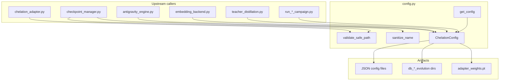
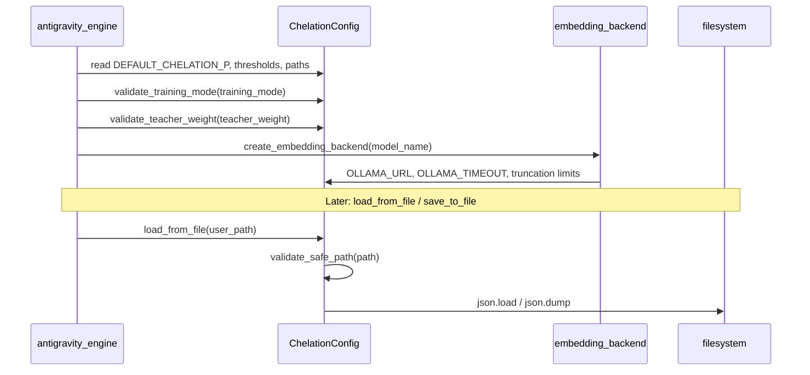

---
brain:
  schema_version: "1.0"
  dossier_type: config
  repo: "CHELATEDAI"
  file_path: "config.py"
  language: python
  layer: backend
  subsystem: config
  stability: stable
  trust_tier: production_critical
  last_verified: "2026-06-29"
  last_verified_sha: "9473e9f7"
  verified_by: agent
  ingest_tags: [config, presets, validation, security, hyperparameters, foundation]
  related_docs:
    - docs/MODULE_GUIDE.md
  upstream_callers:
    - antigravity_engine.py
    - embedding_backend.py
    - chelation_adapter.py
    - checkpoint_manager.py
    - teacher_distillation.py
    - benchmark_utils.py
    - run_road_course_campaign.py
  downstream_dependencies:
    - stdlib:os
    - stdlib:pathlib
    - stdlib:re
    - stdlib:json
    - stdlib:typing
---

# config — File Dossier

> **Source:** `config.py`  
> **Template:** `config-module` v1.0 — central preset and validation surface for ChelatedAI.

---

## §1 Executive summary

`config.py` is the single source of truth for ChelatedAI hyperparameters, filesystem paths, preset dictionaries, and input validation. Every production module reads constants or calls `ChelationConfig` classmethods rather than hard-coding magic numbers. Security helpers `validate_safe_path` and `sanitize_name` guard checkpoint and config I/O against path traversal and unsafe identifiers.

**Invariant:** Runtime behavior must be derivable from `ChelationConfig` class attributes and named presets; callers that bypass this module risk drift from road-course-validated defaults (e.g. `DEFAULT_CHELATION_THRESHOLD = 0.01`).

---

## §2 Architectural role

### Subsystem context



### Layer table

| Layer | Role of this file |
|---|---|
| Frontend | N/A — no UI coupling |
| API | N/A — not an HTTP surface |
| Worker / pipeline | Supplies hyperparameters consumed by `AntigravityEngine` ingestion, retrieval, sedimentation, and training loops |
| Data / persistence | Defines default DB paths, adapter weight path, event log path, and JSON load/save helpers |
| Config / ops | **Primary role** — presets, validation clamps, security utilities |

### Execution context

| Context | Detail |
|---|---|
| Process | Imported at module load; class attributes are read synchronously across the main Python process |
| Thread safety | Class-level constants are immutable after import; `load_from_file` / `save_to_file` perform filesystem I/O and are not internally locked |
| Lifecycle hook | Read during `AntigravityEngine.__init__`, campaign drivers, benchmark harnesses, and checkpoint save/load |

### Feature gates

| Gate | Default | When false / unset |
|---|---|---|
| `ADAPTIVE_THRESHOLD_ENABLED` | `False` | Engine uses fixed `DEFAULT_CHELATION_THRESHOLD` only |
| `MODEL_SCOPE_ENABLED` | `False` | Model-scope pilot hooks in engine are observation-only / not activated |
| `ONLINE_UPDATE_ENABLED` | `False` | Inference-time adapter updates disabled |
| `CONVERGENCE_ENABLED` | `False` | Training loops run full epoch count without early stopping |
| `NOISE_INJECTION_ENABLED` | `False` | Sedimentation runs without experimental noise injection |

*No environment variables are read directly in `config.py`; overrides happen via constructor args, JSON files, or caller-side preset application.*

---

## §3 Dependency graph

### Inbound (who calls this file)

| Caller | Call pattern | Notes |
|---|---|---|
| `antigravity_engine.py` | `ChelationConfig.*` constants and validators | Primary consumer — retrieval, chelation, sedimentation, model-scope |
| `embedding_backend.py` | `ChelationConfig.OLLAMA_*`, `DEFAULT_VECTOR_SIZE` | Ollama HTTP timeouts, truncation, concurrency |
| `chelation_adapter.py` | `validate_safe_path(Path(path))` | Adapter weight load/save path hardening |
| `checkpoint_manager.py` | `sanitize_name`, `validate_safe_path` | Checkpoint naming and path safety |
| `teacher_distillation.py` | `ChelationConfig` teacher/encoding presets | Distillation batch sizes and model defaults |
| `benchmark_*.py`, `run_*_campaign.py` | `get_preset`, path helpers | Evaluation and campaign orchestration |
| `test_unit_core.py` | `TestChelationConfig`, `get_config` | Unit proof for validation and presets |

### Outbound (what this file calls)

| Dependency | Type | Purpose |
|---|---|---|
| `os` | stdlib | Platform name in `__main__` demo |
| `pathlib.Path` | stdlib | Cross-platform path resolution |
| `re` | stdlib | `sanitize_name` allowlist matching |
| `json` | stdlib | `load_from_file` / `save_to_file` |
| `typing` | stdlib | `Optional`, `Dict`, `Any` annotations |

### External systems

| System | Protocol | When |
|---|---|---|
| Local filesystem | POSIX/Windows paths | `load_from_file`, `save_to_file`, `ensure_directories`, `get_db_path` |

### Package pins (file-relevant only)

| Package | Version pin | Why this file cares |
|---|---|---|
| *(none)* | — | Pure stdlib; no third-party imports |

---

## §4 Interconnection narrative

When `AntigravityEngine` starts, it reads dozens of `ChelationConfig` defaults: chelation percentile (`DEFAULT_CHELATION_P`), threshold guardrail (`DEFAULT_CHELATION_THRESHOLD`), Ollama URL, adapter type, collection name, batch sizes, and feature flags. `embedding_backend.py` reads the same Ollama constants so HTTP embedding behavior stays aligned with engine expectations. Checkpoint and adapter I/O flows through `chelation_adapter.py` and `checkpoint_manager.py`, which call `validate_safe_path` before touching disk so traversal components (`..`) cannot escape intended directories.

`get_config()` offers a lightweight dict for scripts that need a chelation preset or a small default bundle without importing the full engine. Campaign runners and benchmarks call `ChelationConfig.get_preset(name, preset_type)` to pull tuned parameter bundles (chelation, adapter, BEIR, sedimentation, etc.) validated on road-course evidence.

Sibling foundation modules: [`../embedding_backend/dossier.md`](../embedding_backend/dossier.md), [`../vector_store/dossier.md`](../vector_store/dossier.md).

### Sequence (config load on engine startup)



---

## §5 Public surface reference

### `validate_safe_path(path: Path, base_dir: Optional[Path] = None, allow_absolute: bool = True) -> Path`

| Field | Value |
|---|---|
| **Purpose** | Resolve and validate a filesystem path, rejecting traversal attacks |
| **Parameters** | `path` — input `Path` or path-like; `base_dir` — optional jail root (resolved path must be `relative_to` it); `allow_absolute` — reserved for backwards compatibility (absolute paths currently allowed when `base_dir` is None) |
| **Returns** | Resolved absolute `Path` |
| **Raises / errors** | `ValueError` if `..` in parts, resolve fails, or path escapes `base_dir` |
| **Side effects** | Filesystem resolve only; no read/write |
| **Thread safety** | Safe for concurrent calls on distinct paths |
| **Feature flags** | None |
| **Forensic note** | Used before adapter/checkpoint/config JSON I/O — incorrect bypass would allow arbitrary file write |

### `sanitize_name(name: str, pattern: str = r'^[a-zA-Z0-9_-]+$') -> str`

| Field | Value |
|---|---|
| **Purpose** | Enforce allowlist naming for checkpoint and collection identifiers |
| **Parameters** | `name` — string to validate; `pattern` — regex for permitted characters (default: alphanumeric, underscore, hyphen) |
| **Returns** | The same `name` if valid |
| **Raises / errors** | `ValueError` on empty name or pattern mismatch |
| **Side effects** | None |
| **Thread safety** | Safe |
| **Feature flags** | None |
| **Forensic note** | Prevents injection of path separators or shell metacharacters into checkpoint names |

### `ChelationConfig` — class attribute groups

All attributes are class-level constants (not instance fields). Values below are defaults at `fe72fb6`.

#### Paths and storage

| Attribute | Default | Semantics |
|---|---|---|
| `PROJECT_ROOT` | `Path(__file__).parent.resolve()` | Repository root anchor |
| `DEFAULT_DB_PATH` | `PROJECT_ROOT / "db_default"` | Default Qdrant on-disk location |
| `ADAPTER_WEIGHTS_PATH` | `PROJECT_ROOT / "adapter_weights.pt"` | Global adapter checkpoint |
| `EVENT_LOG_PATH` | `PROJECT_ROOT / "chelation_events.jsonl"` | Structured event log |
| `MODEL_SCOPE_ARTIFACT_ROOT` | `PROJECT_ROOT / "experiment_runs" / "model_scope"` | Model-scope experiment output |

#### Embedding and Ollama

| Attribute | Default | Semantics |
|---|---|---|
| `DEFAULT_VECTOR_SIZE` | `768` | Fallback embedding dimension |
| `DEFAULT_MODEL_NAME` | `"ollama:nomic-embed-text"` | Default engine model specifier |
| `OLLAMA_URL` | `"http://localhost:11434/api/embeddings"` | Ollama embeddings HTTP endpoint |
| `OLLAMA_TIMEOUT` | `30` | Per-request timeout (seconds) |
| `OLLAMA_MAX_WORKERS` | `2` | Concurrent Ollama embedding threads |
| `OLLAMA_INPUT_MAX_CHARS` | `10000` | Hard input cap before truncation |
| `OLLAMA_TRUNCATION_LIMITS` | `[6000, 2000, 500]` | Retry char limits on Ollama 500 errors |
| `OLLAMA_NUM_CTX` | `4096` | Context window hint in Ollama JSON options |

#### Chelation and retrieval

| Attribute | Default | Semantics |
|---|---|---|
| `DEFAULT_CHELATION_P` | `85` | Percentile for dimension masking (0–100) |
| `DEFAULT_CHELATION_THRESHOLD` | `0.01` | Road-course guardrail against over-chelation |
| `DEFAULT_COLLECTION_NAME` | `"antigravity_stage8"` | Default Qdrant collection |
| `SCOUT_K` | `50` | Neighborhood size for variance / scout queries |
| `TOP_K` | `10` | Results returned to caller |
| `BATCH_SIZE` | `100` | Ingestion batch size |
| `STORE_FULL_TEXT_PAYLOAD` | `True` | Store document text in Qdrant payload |
| `FETCH_PAYLOAD_ON_QUERY` | `False` | Skip payload fetch on scout queries when False |

#### Adaptive threshold (opt-in)

| Attribute | Default | Semantics |
|---|---|---|
| `ADAPTIVE_THRESHOLD_ENABLED` | `False` | Master switch |
| `ADAPTIVE_THRESHOLD_PERCENTILE` | `75` | Target variance percentile |
| `ADAPTIVE_THRESHOLD_WINDOW` | `100` | Rolling sample window |
| `ADAPTIVE_THRESHOLD_MIN_SAMPLES` | `20` | Min samples before adjustment |
| `ADAPTIVE_THRESHOLD_MIN` / `MAX` | `0.0001` / `0.01` | Clamp bounds |

#### Adapter, training, and sedimentation (selected)

| Attribute | Default | Semantics |
|---|---|---|
| `ADAPTER_TYPE` | `"mlp"` | Active adapter architecture |
| `LOW_RANK_ADAPTER_RANK` | `16` | Low-rank adapter rank |
| `ATTNRES_ADAPTER_NUM_BLOCKS` | `4` | AttnRes block count |
| `DEFAULT_LEARNING_RATE` | `0.001` | Sedimentation default LR |
| `DEFAULT_EPOCHS` | `10` | Sedimentation default epochs |
| `DEFAULT_COLLAPSE_THRESHOLD` | `3` | Sedimentation frequency trigger |
| `SEDIMENTATION_OPTIMIZER` | `"adam"` | `"adam"` or `"eggroll_es"` |
| `DEFAULT_TRAINING_MODE` | `"baseline"` | `baseline` / `offline` / `hybrid` |
| `DEFAULT_TEACHER_MODEL` | `"sentence-transformers/all-MiniLM-L6-v2"` | Distillation teacher |
| `SWEEP_LR_COLLAPSE_THRESHOLD` | `0.1` | LR above this warns catastrophic collapse |

#### Quantization and memory

| Attribute | Default | Semantics |
|---|---|---|
| `QUANTIZATION_TYPE` | `"INT8"` | Qdrant scalar quantization |
| `QUANTIZATION_QUANTILE` | `0.99` | Quantile for quantizer calibration |
| `MAX_BATCH_MEMORY_MB` | `512` | Target batch memory budget |
| `CHUNK_SIZE` | `100` | Qdrant update chunk size |

#### Validation bounds

| Attribute | Default | Semantics |
|---|---|---|
| `MIN_CHELATION_P` / `MAX_CHELATION_P` | `0` / `100` | `validate_chelation_p` bounds |
| `MIN_LEARNING_RATE` / `MAX_LEARNING_RATE` | `0.0001` / `1.0` | `validate_learning_rate` bounds |
| `MIN_EPOCHS` / `MAX_EPOCHS` | `1` / `100` | `validate_epochs` bounds (note: `0` epochs allowed via special case) |
| `MIN_MAX_DEPTH` / `MAX_MAX_DEPTH` | `1` / `10` | RLM depth bounds |

#### Preset dictionaries (read-only templates)

| Attribute | Keys | Used by `get_preset` type |
|---|---|---|
| `CHELATION_PRESETS` | conservative, balanced, aggressive | `chelation` |
| `ADAPTER_PRESETS` | small, medium, large | `adapter` |
| `RLM_PRESETS` | balanced, shallow, deep | `rlm` |
| `SEDIMENTATION_PRESETS` | balanced, conservative, aggressive | `sedimentation` |
| `SEDIMENTATION_TUNED_PRESETS` | conservative, balanced, aggressive | `sedimentation_tuned` |
| `CONVERGENCE_PRESETS` | patient, balanced, aggressive | `convergence` |
| `ADAPTER_TYPE_PRESETS` | mlp, procrustes, low_rank, quant_low_rank, attnres | `adapter_type` |
| `ATTNRES_ADAPTER_PRESETS` | shallow, balanced, deep | `attnres_adapter` |
| `BOUNDED_ADAPTER_PRESETS` | conservative, balanced, aggressive | `bounded_adapter` |
| `ENSEMBLE_PRESETS` | diverse, multilingual | `ensemble` |
| `CROSS_LINGUAL_PRESETS` | en_de, en_zh, en_ja, multilingual_* | `cross_lingual` |
| `TEACHER_WEIGHT_SCHEDULE_PRESETS` | constant, gradual_decay, cosine, … | `teacher_weight_schedule` |
| `TEACHER_ENCODING_PRESETS` | default, large_corpus, memory_constrained, gpu_optimized | `teacher_encoding` |
| `ONLINE_UPDATE_PRESETS` | conservative, balanced, aggressive | `online_update` |
| `BEIR_PRESETS` | quick, small, medium, research, full | `beir` |
| `TOPOLOGY_PRESETS` | tight, balanced, loose | `topology` |
| `ISOMER_PRESETS` | sensitive, balanced, strict | `isomer` |
| `SEDIMENTATION_LOSS_PRESETS` | mse, contrastive, hybrid | `sedimentation_loss` |
| `KALMAN_LR_PRESETS` | conservative, balanced, aggressive | `kalman_lr` |
| `ES_OPTIMIZER_PRESETS` | conservative, balanced, aggressive | `es_optimizer` |

*Additional phase-4 / structural-health constants exist on the class; see `config.py:289–787` for full list.*

---

### `ChelationConfig.validate_chelation_p(value: float) -> float`

| Field | Value |
|---|---|
| **Purpose** | Clamp chelation percentile to `[MIN_CHELATION_P, MAX_CHELATION_P]` |
| **Parameters** | `value` — requested percentile |
| **Returns** | Clamped float |
| **Raises / errors** | None — prints WARNING and clamps |
| **Side effects** | stdout WARNING on clamp |
| **Thread safety** | Safe |
| **Forensic note** | Directly affects which embedding dimensions are masked during retrieval |

### `ChelationConfig.validate_learning_rate(value: float) -> float`

| Field | Value |
|---|---|
| **Purpose** | Clamp learning rate to `[MIN_LEARNING_RATE, MAX_LEARNING_RATE]` |
| **Returns** | Clamped float; WARNING on out-of-range |

### `ChelationConfig.validate_epochs(value: int) -> int`

| Field | Value |
|---|---|
| **Purpose** | Validate epoch count; negative → `0` (skip training); otherwise clamp to `[MIN_EPOCHS, MAX_EPOCHS]` |
| **Returns** | Validated int |

### `ChelationConfig.validate_training_mode(value: str) -> str`

| Field | Value |
|---|---|
| **Purpose** | Restrict training mode to `baseline`, `offline`, or `hybrid` |
| **Returns** | Valid mode or `"baseline"` with WARNING |

### `ChelationConfig.validate_teacher_weight(value: float) -> float`

| Field | Value |
|---|---|
| **Purpose** | Clamp teacher weight to `[0.0, 1.0]` |
| **Returns** | Clamped float |

### `ChelationConfig.validate_adaptive_percentile(value: float) -> float`

| Field | Value |
|---|---|
| **Purpose** | Clamp adaptive threshold percentile to `[0.0, 100.0]` |

### `ChelationConfig.validate_adaptive_window(value: int) -> int`

| Field | Value |
|---|---|
| **Purpose** | Ensure adaptive window ≥ 1 |

### `ChelationConfig.validate_adaptive_min_samples(value: int) -> int`

| Field | Value |
|---|---|
| **Purpose** | Ensure minimum sample count ≥ 1 |

### `ChelationConfig.validate_sedimentation_learning_rate(value: float) -> float`

| Field | Value |
|---|---|
| **Purpose** | Validate LR with extra WARNING when `value >= SWEEP_LR_COLLAPSE_THRESHOLD` (0.1) citing SciFact sweep collapse risk |
| **Returns** | Result of `validate_learning_rate(value)` |

### `ChelationConfig.validate_max_depth(value: int) -> int`

| Field | Value |
|---|---|
| **Purpose** | Clamp RLM `max_depth` to `[MIN_MAX_DEPTH, MAX_MAX_DEPTH]` |

### `ChelationConfig.get_preset(preset_name: str, preset_type: str = "chelation") -> Dict[str, Any]`

| Field | Value |
|---|---|
| **Purpose** | Return a deep-copied preset dict by name and category |
| **Parameters** | `preset_name` — key inside preset dict; `preset_type` — one of 20 mapped types (see preset table above) |
| **Returns** | `dict` copy of preset entry (includes `description` where defined) |
| **Raises / errors** | `ValueError` for unknown `preset_type` or `preset_name` |
| **Side effects** | None |
| **Forensic note** | Campaigns and CLI tools use this to align with road-course-tuned bundles |

### `ChelationConfig.load_from_file(config_path: Path) -> Dict[str, Any]`

| Field | Value |
|---|---|
| **Purpose** | Load JSON configuration from disk |
| **Parameters** | `config_path` — path passed through `validate_safe_path` first |
| **Returns** | Parsed `dict` |
| **Raises / errors** | `ValueError` on traversal; `FileNotFoundError` if missing |
| **Side effects** | Reads file with UTF-8 encoding |

### `ChelationConfig.save_to_file(config: Dict[str, Any], config_path: Path) -> None`

| Field | Value |
|---|---|
| **Purpose** | Persist configuration dict as indented JSON |
| **Side effects** | Creates parent directories; writes UTF-8 JSON |

### `ChelationConfig.get_db_path(task_name: str) -> Path`

| Field | Value |
|---|---|
| **Purpose** | Build per-task evolution DB path: `PROJECT_ROOT / f"db_{task_name.lower()}_evolution"` |
| **Returns** | `Path` object (platform-independent) |

### `ChelationConfig.ensure_directories() -> None`

| Field | Value |
|---|---|
| **Purpose** | `mkdir(parents=True, exist_ok=True)` for default DB, adapter weights parent, and event log parent |
| **Side effects** | Filesystem directory creation |

### `get_config(preset: Optional[str] = None) -> Dict[str, Any]`

| Field | Value |
|---|---|
| **Purpose** | Convenience accessor for chelation defaults or a named chelation preset |
| **Parameters** | `preset` — if set, delegates to `ChelationConfig.get_preset(preset, "chelation")` |
| **Returns** | Preset dict, or default bundle: `chelation_p`, `chelation_threshold`, `learning_rate`, `epochs`, `scout_k` |
| **Raises / errors** | Propagates `ValueError` from invalid preset name |
| **Forensic note** | Lightweight entry point for scripts; does not instantiate engine |

#### Private / module `__main__` demo

- `if __name__ == "__main__"` block prints preset summaries and paths — dev-only, not production path.

---

## §6 Internal control flow

### `validate_safe_path`

1. Coerce to `Path`; reject if `'..'` in `path.parts`.
2. `path.resolve()`; catch `OSError`/`RuntimeError` → `ValueError`.
3. If `base_dir` set, require `resolved_path.relative_to(base_dir.resolve())`.
4. Return resolved path.

### `get_preset`

1. Lookup `preset_type` in internal `preset_map`.
2. Raise if type unknown (message lists valid types).
3. Raise if `preset_name` not in dict.
4. Return `.copy()` of nested dict.

### Validator classmethods (common pattern)

1. Check bounds or membership.
2. If invalid, `print` WARNING to stdout.
3. Return clamped/default value (never raise for soft validators).

---

## §7 Data contracts

| Artifact | Shape | Notes |
|---|---|---|
| Preset dict | `Dict[str, Any]` | Always includes human `description` where defined; numeric keys vary by preset type |
| `get_config()` default | 5-key dict | `chelation_p`, `chelation_threshold`, `learning_rate`, `epochs`, `scout_k` |
| JSON config file | UTF-8 JSON object | Schema is caller-defined; this module does not validate keys after load |
| `get_db_path` output | `Path` | Lowercases task name in directory segment |

---

## §8 Configuration & environment

| Variable | Default | Effect on this file |
|---|---|---|
| *(none read directly)* | — | `config.py` does not call `os.environ`; all defaults are class attributes |

Callers may override behavior by:

- Passing constructor parameters to `AntigravityEngine`
- Loading JSON via `load_from_file` and applying values manually
- Mutating `ChelationConfig` class attributes in tests (e.g. `ADAPTER_TYPE` patches in `test_antigravity_engine.py`)

---

## §9 Failure modes & observability

| Symptom | Cause | Behavior |
|---|---|---|
| `ValueError: Path traversal detected` | `..` in config/checkpoint path | Load/save aborted |
| `FileNotFoundError` on load | Missing JSON path after validation | Raised to caller |
| stdout WARNING lines | Out-of-range hyperparameters | Soft clamp; execution continues |
| LR collapse WARNING | `validate_sedimentation_learning_rate` ≥ 0.1 | Warns but still clamps via `validate_learning_rate` |
| Invalid preset | Wrong name or type | `ValueError` with available options in message |

No structured logger in this module — warnings use `print()`.

---

## §10 Security & trust boundary

- **Path traversal:** `validate_safe_path` blocks `..` components before JSON and adapter I/O (`config.py:36–37`, used at `980`, `1000`).
- **Name injection:** `sanitize_name` restricts checkpoint identifiers to allowlist charset (`config.py:56–79`).
- **Network:** This file defines `OLLAMA_URL` but does not perform HTTP — egress happens in `embedding_backend.py`.
- **Secrets:** No API keys stored; Ollama assumed local by default.
- **Trust tier:** `production_critical` — incorrect constants propagate to every retrieval and training run.

---

## §11 Tests & verification

| Test file | What it proves |
|---|---|
| `test_unit_core.py` → `TestChelationConfig` | Path portability, validators, presets, JSON round-trip, path traversal blocked on load/save, `get_config` default and preset |
| `test_unit_core.py` → bounded_adapter preset tests | `get_preset(..., "bounded_adapter")` accessibility |
| `chelation_adapter.py` / `checkpoint_manager.py` | Integration use of `validate_safe_path` / `sanitize_name` (no dedicated unit tests for standalone helpers) |

**Smoke tier:** **floor** — unit tests mock or use temp dirs; no live Qdrant/Ollama required for `TestChelationConfig`.

```bash
# Primary B0 proof (config surface)
python -m unittest test_unit_core.TestChelationConfig -v

# Full test_unit_core module (includes algorithm tests beyond config)
python -m unittest test_unit_core.py -v
```

---

## §12 Related documentation

- [`docs/MODULE_GUIDE.md`](../../../MODULE_GUIDE.md) — Core Retrieval Runtime table lists `config.py` responsibilities
- [`../embedding_backend/dossier.md`](../embedding_backend/dossier.md) — Consumes Ollama/vector defaults
- [`../vector_store/dossier.md`](../vector_store/dossier.md) — Collection and quantization settings consumed by engine
- [`../antigravity_engine/dossier.md`](../antigravity_engine/dossier.md) — Primary consumer of `ChelationConfig`

---

## §13 Drift watch / known gaps

- **None known for B0 config constants at `fe72fb6`** — `TestChelationConfig` covers validators, presets, JSON I/O, and traversal blocking.
- **`validate_safe_path` / `sanitize_name` lack dedicated unit tests** — behavior is indirectly proven via `test_config_load_path_traversal_blocked` and `test_config_save_path_traversal_blocked`; standalone edge cases (`base_dir` jail, custom `pattern`) are undocumented in tests.
- **Soft validators use `print` not logger** — operational log aggregation may miss clamp events (`config.py:823–914`).
- **`validate_epochs(0)` returns `1`** per `test_unit_core.py:239` — negative values return `0` (skip training); document this when wiring training pipelines.

---

## §14 Changelog (dossier)

| Date | SHA | Change |
|---|---|---|
| 2026-06-29 | fe72fb6 | B0 full enrichment — §1–§14, grouped `ChelationConfig` tables, security helpers, sibling links |