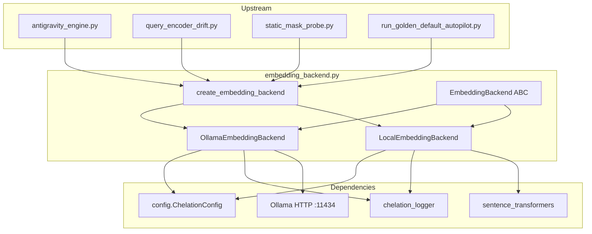
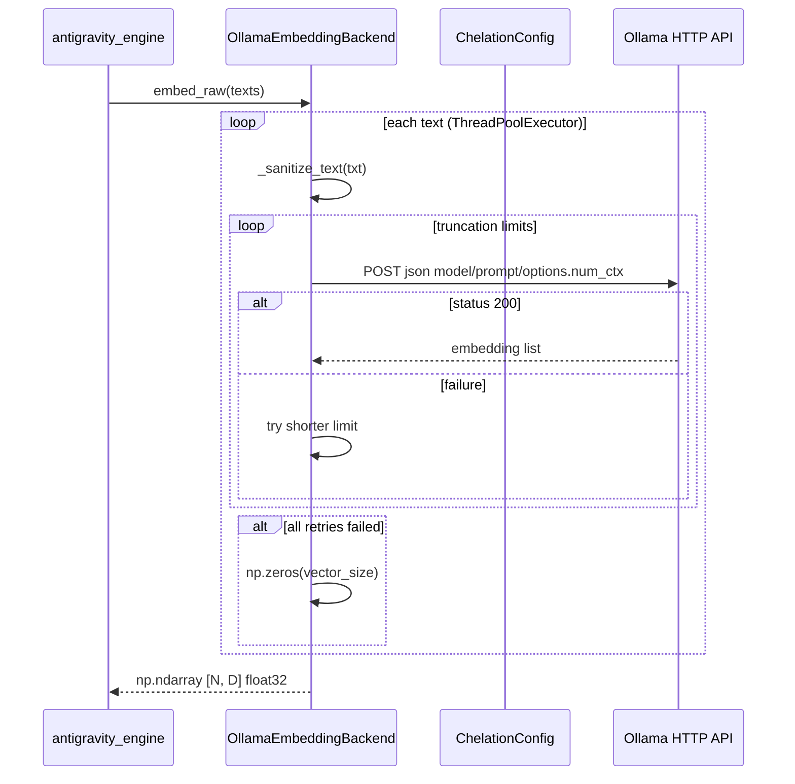

---
brain:
  schema_version: "1.0"
  dossier_type: component
  repo: "CHELATEDAI"
  file_path: "embedding_backend.py"
  language: python
  layer: backend
  subsystem: embedding
  stability: stable
  trust_tier: production_critical
  last_verified: "2026-06-29"
  last_verified_sha: "a1f88c77"
  verified_by: agent
  ingest_tags: [embedding, ollama, sentence-transformers, F-045, foundation]
  related_docs:
    - docs/MODULE_GUIDE.md
  upstream_callers:
    - antigravity_engine.py
    - query_encoder_drift.py
    - static_mask_probe.py
    - run_golden_default_autopilot.py
  downstream_dependencies:
    - config.py
    - chelation_logger.py
    - numpy
    - torch
    - requests
    - sentence_transformers
---

# embedding_backend — File Dossier

> **Source:** `embedding_backend.py`  
> **Template:** `component-dossier` v1.0 — F-045 embedding provider abstraction (Ollama HTTP vs local SentenceTransformers).

---

## §1 Executive summary

`embedding_backend.py` extracts embedding provider branching from `AntigravityEngine` into a pluggable backend layer. `create_embedding_backend(model_name)` selects `OllamaEmbeddingBackend` when `model_name` starts with `ollama:`, otherwise `LocalEmbeddingBackend` loads a `sentence-transformers` model. Both implementations expose `embed_raw(texts) -> np.ndarray` with shape `[N, vector_size]` and dtype `float32`.

**Invariant:** Every embedding row returned to the engine must be `np.float32` with consistent `vector_size` across batch elements — Ollama failures degrade to zero vectors rather than breaking batch shape (see §13).

---

## §2 Architectural role

### Subsystem context



### Layer table

| Layer | Role of this file |
|---|---|
| Frontend | N/A |
| API | N/A — internal Python boundary, not HTTP |
| Worker / pipeline | **Primary** — raw text → float32 embedding matrix for ingestion, query encoding, drift swap |
| Data / persistence | N/A — stateless except cached `vector_size` and loaded local model |
| Config / ops | Reads Ollama timeouts/truncation from `ChelationConfig` |

### Execution context

| Context | Detail |
|---|---|
| Process | Instantiated once per `AntigravityEngine` (or drift probe); lives for engine lifetime |
| Thread safety | Ollama path uses `ThreadPoolExecutor` with `OLLAMA_MAX_WORKERS=2`; local path uses underlying `SentenceTransformer` encode (generally safe for batch encode per process) |
| Lifecycle hook | `AntigravityEngine.__init__` → `create_embedding_backend(model_name, logger)` |

### Feature gates

| Gate | Default | When false / unset |
|---|---|---|
| `model_name.startswith("ollama:")` | default model is `ollama:nomic-embed-text` | Local SentenceTransformers path selected |
| `REQUESTS_AVAILABLE` | `True` if `requests` installed | `OllamaEmbeddingBackend.__init__` raises `ImportError` |
| `torch.cuda.is_available()` | hardware-dependent | Local backend uses CPU |

---

## §3 Dependency graph

### Inbound (who calls this file)

| Caller | Call pattern | Notes |
|---|---|---|
| `antigravity_engine.py` | `create_embedding_backend(model_name, self.logger)` | Production path — all `embed()` / ingestion |
| `query_encoder_drift.py` | `create_embedding_backend(self.swap_model_name)` | Swap-encoder drift experiments |
| `static_mask_probe.py` | `create_embedding_backend(model)` | Mask probing utility |
| `run_golden_default_autopilot.py` | `create_embedding_backend(model)` | Autopilot golden runs |
| `test_antigravity_engine.py` | Patches `embedding_backend.requests` | Ollama timeout, dtype, mixed batch tests |

### Outbound (what this file calls)

| Dependency | Type | Purpose |
|---|---|---|
| `config.ChelationConfig` | import | Ollama URL, timeouts, truncation, vector size default |
| `chelation_logger.get_logger` | import | Structured events and errors |
| `numpy` | pip | Embedding arrays |
| `torch` | pip | CUDA detection for local backend |
| `requests` | pip (optional) | Ollama HTTP POST |
| `sentence_transformers.SentenceTransformer` | pip (local path) | On-disk model load |
| `concurrent.futures.ThreadPoolExecutor` | stdlib | Ollama parallel embed |

### External systems

| System | Protocol | When |
|---|---|---|
| Ollama server | HTTP POST `ChelationConfig.OLLAMA_URL` | `OllamaEmbeddingBackend.embed_raw` |
| HuggingFace / local cache | filesystem | `LocalEmbeddingBackend` model weights |

### Package pins (file-relevant only)

| Package | Version pin | Why this file cares |
|---|---|---|
| `requests` | repo `requirements.txt` | Required for Ollama mode |
| `sentence-transformers` | repo `requirements.txt` | Local embedding path |
| `torch` | repo `requirements.txt` | Device selection |
| `numpy` | repo `requirements.txt` | Output dtype contract |

---

## §4 Interconnection narrative

`AntigravityEngine` no longer branches on Ollama vs local inside `embed()` — it delegates to `self.embedding_backend.embed_raw(texts)`. Model selection is encoded in the `model_name` string: `ollama:nomic-embed-text` strips the prefix and talks to Docker-hosted Ollama; `all-MiniLM-L6-v2` loads SentenceTransformers on CUDA if available.

On Ollama init, the backend probes connectivity with `embed_raw(["test"])` to learn true `vector_size`; connection failures raise `ConnectionError` for hard outages, while malformed responses fall back to `DEFAULT_VECTOR_SIZE` with a WARNING log. During batch embed, per-document failures (timeout, 500, missing JSON key) retry with progressively shorter text per `OLLAMA_TRUNCATION_LIMITS`, then substitute a **zero vector** so upstream batching never receives ragged shapes.

Sibling foundation: [`../config/dossier.md`](../config/dossier.md) (Ollama constants), [`../vector_store/dossier.md`](../vector_store/dossier.md) (stores vectors produced here).

### Sequence (Ollama embed batch)



---

## §5 Public surface reference

### `EmbeddingBackend` (ABC)

Abstract base for all embedding providers.

#### `EmbeddingBackend.__init__(model_name: str, logger=None)`

| Field | Value |
|---|---|
| **Purpose** | Store model identifier and logger reference |
| **Parameters** | `model_name` — provider-specific model id; `logger` — optional `ChelationLogger`, else `get_logger()` |
| **Side effects** | Sets `self._vector_size = None` |

#### `EmbeddingBackend.get_vector_size() -> int` *(abstract)*

| Field | Value |
|---|---|
| **Purpose** | Return embedding dimension `D` |
| **Returns** | Positive integer |

#### `EmbeddingBackend.embed_raw(texts: List[str]) -> np.ndarray` *(abstract)*

| Field | Value |
|---|---|
| **Purpose** | Embed a batch of raw strings without chelation/adapter |
| **Parameters** | `texts` — list of document/query strings |
| **Returns** | `np.ndarray` shape `[len(texts), vector_size]`, dtype `float32`; empty input → `np.array([])` |
| **Forensic note** | Output feeds chelation mask and Qdrant upsert — dtype must not be `object` |

#### `EmbeddingBackend.vector_size` *(property)*

| Field | Value |
|---|---|
| **Purpose** | Lazy-cache `get_vector_size()` result in `self._vector_size` |
| **Returns** | `int` dimension |

---

### `OllamaEmbeddingBackend(EmbeddingBackend)`

HTTP client for Ollama `/api/embeddings`.

#### `OllamaEmbeddingBackend.__init__(model_name: str, logger=None)`

| Field | Value |
|---|---|
| **Purpose** | Wire Ollama URL from config and probe vector size |
| **Parameters** | `model_name` — Ollama model tag (no `ollama:` prefix) |
| **Raises / errors** | `ImportError` if `requests` missing; `ConnectionError` on connect timeout to Ollama |
| **Side effects** | Logs `embedding_backend_init`; sets `_vector_size` from probe or `DEFAULT_VECTOR_SIZE` fallback |
| **Feature flags** | Requires running Ollama at `ChelationConfig.OLLAMA_URL` |

#### `OllamaEmbeddingBackend.get_vector_size() -> int`

| Field | Value |
|---|---|
| **Purpose** | Return cached/probed dimension |
| **Returns** | `self._vector_size` |

#### `OllamaEmbeddingBackend.embed_raw(texts: List[str]) -> np.ndarray`

| Field | Value |
|---|---|
| **Purpose** | Parallel Ollama embedding with truncation retries and zero-vector fallback |
| **Parameters** | `texts` — batch of strings |
| **Returns** | `float32` ndarray `[N, vector_size]` |
| **Side effects** | HTTP POST per document; logs timeouts, connection loss, API errors |
| **Thread safety** | `ThreadPoolExecutor(max_workers=OLLAMA_MAX_WORKERS)` |
| **Forensic note** | Failed documents become zero vectors — retrieval quality degrades silently (§13) |

#### Private helpers (summary)

- `_sanitize_text(text, doc_index)` — coerce non-str, cap at `OLLAMA_INPUT_MAX_CHARS`, strip non-printable control chars (`embedding_backend.py:122–139`).

---

### `LocalEmbeddingBackend(EmbeddingBackend)`

SentenceTransformers on CUDA or CPU.

#### `LocalEmbeddingBackend.__init__(model_name: str, logger=None)`

| Field | Value |
|---|---|
| **Purpose** | Load `SentenceTransformer` and record embedding dimension |
| **Parameters** | `model_name` — HuggingFace model id (e.g. `all-MiniLM-L6-v2`) |
| **Side effects** | Downloads/loads weights; logs device and `vector_size` |
| **Raises / errors** | Propagates model load failures from `sentence_transformers` |

#### `LocalEmbeddingBackend.get_vector_size() -> int`

| Field | Value |
|---|---|
| **Returns** | `self.model.get_sentence_embedding_dimension()` |

#### `LocalEmbeddingBackend.embed_raw(texts: List[str]) -> np.ndarray`

| Field | Value |
|---|---|
| **Purpose** | Batch encode via `model.encode(..., convert_to_numpy=True)` |
| **Returns** | `float32` ndarray `[N, vector_size]` |
| **Side effects** | GPU/CPU compute; no network |

---

### `create_embedding_backend(model_name: str, logger=None) -> EmbeddingBackend`

| Field | Value |
|---|---|
| **Purpose** | Factory selecting Ollama vs local implementation |
| **Parameters** | `model_name` — `ollama:<tag>` or SentenceTransformers id; `logger` — optional |
| **Returns** | `OllamaEmbeddingBackend` or `LocalEmbeddingBackend` instance |
| **Raises / errors** | `ImportError`, `ConnectionError` from Ollama init; model errors from local path |
| **Examples** | `create_embedding_backend("ollama:nomic-embed-text")`; `create_embedding_backend("all-MiniLM-L6-v2")` |

---

## §6 Internal control flow

### Factory (`create_embedding_backend`)

1. If `model_name.startswith("ollama:")` → strip prefix → `OllamaEmbeddingBackend`.
2. Else → `LocalEmbeddingBackend`.

### Ollama `embed_raw` happy path

1. Return empty array if `texts` empty.
2. For each text, submit `_get_embedding` to thread pool.
3. Sanitize text → try `OLLAMA_TRUNCATION_LIMITS` in order → POST to Ollama.
4. On 200 + valid JSON `embedding` key → `float32` vector.
5. Collect futures with per-future timeout `OLLAMA_TIMEOUT`.

### Ollama degrade path

1. POST timeout/connection error → log → `None` from attempt.
2. All truncation levels fail → log `embedding_failed` → **zero vector** (`embedding_backend.py:206–212`).
3. Future `TimeoutError` or other exception → zero vector (`embedding_backend.py:223–237`).

### Local `embed_raw`

1. Empty → `np.array([])`.
2. `model.encode` → `astype(np.float32)`.

### Ollama init probe

1. Set `_vector_size = DEFAULT_VECTOR_SIZE`.
2. Try `embed_raw(["test"])` → update size from response length.
3. `ConnectionError`/`Timeout` → re-raise `ConnectionError` with Docker hint.
4. Other errors → log, keep default size for lazy validation on first real call.

---

## §7 Data contracts

| Contract | Shape / type | Notes |
|---|---|---|
| `embed_raw` output | `np.ndarray`, `(N, D)`, `dtype=float32` | `D = vector_size` |
| Empty input | `np.array([])` | Zero rows, not `(0, D)` |
| Ollama request JSON | `{"model", "prompt", "options": {"num_ctx"}}` | `num_ctx` from `OLLAMA_NUM_CTX` |
| Ollama response | `{"embedding": [float, ...]}` | Missing key → retry/fallback |
| Logger events | `embedding_backend_init`, `embedding_backend_ready`, `embedding_input_truncated`, errors | Via `chelation_logger` |

---

## §8 Configuration & environment

| Variable / constant | Default | Effect on this file |
|---|---|---|
| `ChelationConfig.OLLAMA_URL` | `http://localhost:11434/api/embeddings` | POST target |
| `ChelationConfig.OLLAMA_TIMEOUT` | `30` | HTTP and future result timeout |
| `ChelationConfig.OLLAMA_MAX_WORKERS` | `2` | Thread pool size |
| `ChelationConfig.OLLAMA_INPUT_MAX_CHARS` | `10000` | Pre-truncation cap |
| `ChelationConfig.OLLAMA_TRUNCATION_LIMITS` | `[6000, 2000, 500]` | Retry sequence |
| `ChelationConfig.OLLAMA_NUM_CTX` | `4096` | Passed in Ollama options |
| `ChelationConfig.DEFAULT_VECTOR_SIZE` | `768` | Fallback dimension |

---

## §9 Failure modes & observability

| Symptom | Cause | Behavior |
|---|---|---|
| `ImportError: requests library required` | Ollama mode without `requests` | Init fails hard |
| `ConnectionError: Failed to connect to Ollama` | Docker/Ollama down at init | Engine cannot start in Ollama mode |
| Zero vectors in batch | Timeout, 500, bad JSON, executor timeout | Shape preserved; similarity search poisoned for those docs |
| WARNING at init | Probe failed non-connection error | Uses `DEFAULT_VECTOR_SIZE` until first successful embed |
| Local OOM | Model too large for GPU | Propagates from `sentence_transformers` |

Log channels: `log_event` (init, truncation DEBUG), `log_error` (timeout, connection, api_response, embedding_failed).

---

## §10 Security & trust boundary

- **Network egress:** Ollama backend POSTs user text to `OLLAMA_URL` — default localhost; production must trust Ollama host.
- **Input sanitization:** Non-printable control chars replaced; length capped — mitigates malformed prompts, not semantic injection.
- **No auth:** Ollama API assumed open on local Docker — no API key handling in this module.
- **Trust tier:** `production_critical` — embeddings directly determine retrieval ranking.

---

## §11 Tests & verification

| Test file | What it proves |
|---|---|
| `test_antigravity_engine.py` | `test_embed_ollama_mode_timeout_fallback` — all-zero row on timeout; `test_embed_ollama_mode_returns_float32` — dtype contract (F-035); `test_embed_ollama_mode_mixed_success_failure_consistent_dtype` — mixed success/zero batch |
| `test_antigravity_engine.py` | Engine init patches `create_embedding_backend` in many tests |
| `test_query_encoder_drift.py` | Comment references `embedding_backend.create_embedding_backend` swap path |

**Smoke tier:** **floor** — Ollama tests patch `embedding_backend.requests`; no live Ollama required. Ceiling tier would need Docker Ollama + real `nomic-embed-text`.

```bash
# Primary B0 proof (Ollama fallback + float32 contract via engine)
python -m unittest test_antigravity_engine.TestAntigravityEngine.test_embed_ollama_mode_timeout_fallback test_antigravity_engine.TestAntigravityEngine.test_embed_ollama_mode_returns_float32 test_antigravity_engine.TestAntigravityEngine.test_embed_ollama_mode_mixed_success_failure_consistent_dtype -v

# Broader engine regression (includes embedding path)
python -m unittest test_antigravity_engine.py -v
```

---

## §12 Related documentation

- [`docs/MODULE_GUIDE.md`](../../../MODULE_GUIDE.md) — "Backend routing between local SentenceTransformers and Ollama HTTP embeddings"
- [`../config/dossier.md`](../config/dossier.md) — Ollama hyperparameters and `DEFAULT_MODEL_NAME`
- [`../vector_store/dossier.md`](../vector_store/dossier.md) — Persists vectors from this module
- [`../antigravity_engine/dossier.md`](../antigravity_engine/dossier.md) — Primary caller of `create_embedding_backend`

---

## §13 Drift watch / known gaps

- **Ollama zero-vector fallback is intentional degrade, not test-only** (`embedding_backend.py:212, 229, 237`) — documents with failed embeds are indistinguishable from null vectors in similarity search; `test_embed_ollama_mode_timeout_fallback` asserts `np.allclose(result, zeros)`. Operators must monitor `embedding_failed` / `timeout` log errors.
- **No dedicated `test_embedding_backend.py`** — behavior proven indirectly through `test_antigravity_engine.py` patches.
- **Init soft-failure path** — non-connection probe errors keep `DEFAULT_VECTOR_SIZE` (768) which may mismatch actual model (e.g. 384 for MiniLM) until first successful embed (`embedding_backend.py:105–116`).
- **B0 foundation otherwise aligned with `fe72fb6`** — factory split and F-045 extraction match `MODULE_GUIDE.md`.

---

## §14 Changelog (dossier)

| Date | SHA | Change |
|---|---|---|
| 2026-06-29 | fe72fb6 | B0 full enrichment — §1–§14, Ollama zero-vector drift disclosed, sibling links |