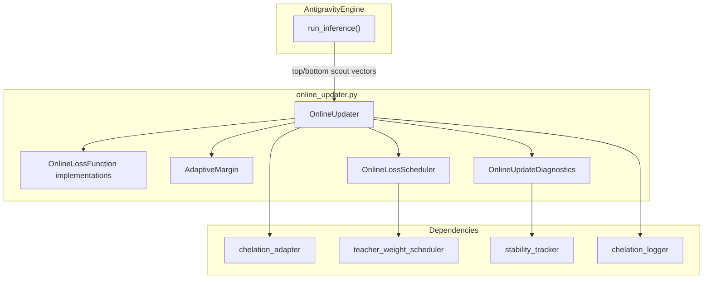

---
brain:
  schema_version: "1.0"
  dossier_type: component
  repo: "CHELATEDAI"
  file_path: "online_updater.py"
  language: "python"
  layer: "backend"
  subsystem: "online_adaptation"
  stability: "beta"
  trust_tier: "research_path"
  last_verified: "2026-06-29"
  last_verified_sha: "9473e9f7"
  verified_by: agent
  ingest_tags: [online, inference, triplet, infonce, adapter, research]
  related_docs:
    - docs/MODULE_GUIDE.md
    - docs/brain/file-map/antigravity_engine/dossier.md
    - docs/brain/file-map/chelation_adapter/dossier.md
  upstream_callers:
    - antigravity_engine.py
    - run_weight_refinement_campaign.py
  downstream_dependencies:
    - chelation_adapter.py
    - chelation_logger.py
    - teacher_weight_scheduler.py
    - stability_tracker.py
---

# online_updater — File Dossier

> **Source:** `online_updater.py`  
> **Template:** `component-dossier` v1.0

---

## §1 Executive summary

`online_updater.py` implements **inference-time micro-gradient updates** on a chelation adapter using contrastive signals from retrieval results (top-k positives vs bottom-k negatives). It provides pluggable loss functions (triplet margin, InfoNCE, cosine similarity), optional adaptive triplet margin, loss-weight scheduling, and gradient diagnostics with optional `StabilityTracker` bridge.

**Invariant:** Updates never run without at least one positive and one negative vector; `update_interval` gates how often SGD steps apply. Adapter weights persist across queries until explicitly reset elsewhere — this module does not checkpoint adapters.

---

## §2 Architectural role

### Subsystem context



### Layer table

| Layer | Role of this file |
|---|---|
| Frontend | N/A |
| API | N/A |
| Worker / pipeline | Optional per-query adapter fine-tuning inside `run_inference()` when `enable_online_updates()` |
| Data / persistence | In-memory optimizer state, diagnostic rolling windows |
| Config / ops | Hyperparameters from `ChelationConfig` via engine |

### Execution context

| Context | Detail |
|---|---|
| Process | Synchronous; runs in inference thread during `run_inference()` after scout retrieval |
| Thread safety | **Not thread-safe** — single engine instance assumed |
| Lifecycle hook | Created by `enable_online_updates()`; `update()` called when `len(local_vectors) >= 4` |

### Feature gates

| Gate | Default | When false / unset |
|---|---|---|
| `enable_online_updates()` | not called | No online gradient steps |
| `update_interval` | `1` (config) | Skips SGD on non-multiple query counts |
| Empty pos/neg batches | — | Returns `{"updated": False, "loss": None}` |

---

## §3 Dependency graph

### Inbound (who calls this file)

| Caller | Call pattern | Notes |
|---|---|---|
| `antigravity_engine.py` | `enable_online_updates()` → `OnlineUpdater.update()` | Splits scout vectors half top / half bottom |
| `run_weight_refinement_campaign.py` | Direct `OnlineUpdater` assignment on `engine._online_updater` | Campaign-specific LR/interval |
| `test_online_updater.py`, `test_online_correction.py` | Unit tests | Loss classes + updater behavior |

### Outbound (what this file calls)

| Dependency | Type | Purpose |
|---|---|---|
| `chelation_adapter` | import (via caller) | `nn.Module` adapter passed to constructor |
| `chelation_logger.get_logger` | import | `online_update` DEBUG events |
| `teacher_weight_scheduler.TeacherWeightScheduler` | lazy import | `OnlineLossScheduler` delegation |
| `stability_tracker.StabilityTracker` | optional bridge | `OnlineUpdateDiagnostics.record_*` |
| `torch`, `torch.nn`, `numpy` | pip | Loss computation and SGD |

### External systems

None — in-process only.

### Package pins (file-relevant only)

| Package | Version pin | Why this file cares |
|---|---|---|
| `torch` | `>=2.0` | SGD, autograd, `TripletMarginLoss` |
| `numpy` | (project pin) | Input embedding arrays, diagnostic stats |

---

## §4 Interconnection narrative

After `AntigravityEngine.enable_online_updates()`, each `run_inference()` query that retrieves at least four scout vectors splits them: first half as pseudo-positives, second half as pseudo-negatives. `OnlineUpdater.update()` converts numpy embeddings to tensors, runs the adapter in `train()` mode for `micro_steps` SGD iterations with gradient clipping, optionally scales loss by `OnlineLossScheduler.current_weight`, records diagnostics, then restores prior `eval()` mode.

Loss type defaults to triplet margin (original inline behavior refactored). `AdaptiveMargin` can dynamically adjust triplet margin from retrieval score gaps when `pos_scores`/`neg_scores` are supplied (engine currently passes vectors only, not scores — margin adaptation available but not wired from engine).

### Sequence (update step)

```mermaid
sequenceDiagram
  participant Engine as AntigravityEngine
  participant OU as OnlineUpdater
  participant Adp as ChelationAdapter
  participant Loss as OnlineLossFunction

  Engine->>OU: update(q_vec, top_k_vecs, bottom_k_vecs)
  alt query_count % interval != 0
    OU-->>Engine: {updated: false}
  else empty pos or neg
    OU-->>Engine: {updated: false}
  else
    OU->>Adp: train(); forward query/pos/neg
    OU->>Loss: compute(adapted_q, adapted_pos, adapted_neg)
    OU->>OU: backward + clip_grad + optimizer.step()
    OU->>OU: diagnostics / scheduler.step
    OU-->>Engine: {updated: true, loss: float}
  end
```

---

## §5 Public surface reference

### `OnlineLossFunction` (ABC)

| Field | Value |
|---|---|
| **Purpose** | Abstract contract for pluggable online contrastive losses |
| **Parameters** | N/A (subclass `compute`, `get_state`) |
| **Returns** | N/A |
| **Raises / errors** | `NotImplementedError` on abstract methods |
| **Side effects** | None at ABC level |
| **Thread safety** | N/A |
| **Feature flags** | N/A |
| **Forensic note** | Subclasses increment internal call counters |

#### `OnlineLossFunction.compute(adapted_query, adapted_pos, adapted_neg) -> torch.Tensor`

| Field | Value |
|---|---|
| **Purpose** | Scalar loss from adapted embeddings |
| **Parameters** | `adapted_query` `(1, dim)`; `adapted_pos` `(N, dim)`; `adapted_neg` `(M, dim)` |
| **Returns** | Scalar `torch.Tensor` |
| **Raises / errors** | Implementation-specific |
| **Side effects** | Typically increments `_call_count` |
| **Thread safety** | Not safe concurrent |
| **Feature flags** | N/A |
| **Forensic note** | Drives adapter weight change magnitude |

#### `OnlineLossFunction.get_state() -> dict`

| Field | Value |
|---|---|
| **Purpose** | Serializable loss configuration and counters for `get_stats()` |
| **Parameters** | None |
| **Returns** | `dict` |
| **Raises / errors** | None |
| **Side effects** | None |
| **Thread safety** | Read-only |
| **Feature flags** | N/A |
| **Forensic note** | Included in updater stats blob |

---

### `TripletMarginOnlineLoss.__init__(margin=0.1, aggregation="mean")`

| Field | Value |
|---|---|
| **Purpose** | Triplet margin loss with mean or per-pair aggregation |
| **Parameters** | `margin >= 0`; `aggregation` in `("mean", "per_vector")` |
| **Returns** | Instance |
| **Raises / errors** | `ValueError` on invalid margin/aggregation |
| **Side effects** | Creates `nn.TripletMarginLoss` |
| **Thread safety** | N/A |
| **Feature flags** | Default loss for `OnlineUpdater` |
| **Forensic note** | `mean` matches original engine inline behavior |

#### `TripletMarginOnlineLoss.compute(...) -> torch.Tensor`

| Field | Value |
|---|---|
| **Purpose** | Pull query toward mean positive, push from mean negative (or all pairs) |
| **Parameters** | Adapted tensors per ABC |
| **Returns** | Scalar loss |
| **Raises / errors** | None typical |
| **Side effects** | `_call_count += 1` |
| **Thread safety** | Not concurrent-safe |
| **Feature flags** | N/A |
| **Forensic note** | Margin mutable at runtime when `AdaptiveMargin` updates |

#### `TripletMarginOnlineLoss.get_state() -> dict`

Returns `loss_type`, `margin`, `aggregation`, `call_count`.

---

### `InfoNCEOnlineLoss.__init__(temperature=0.07)`

| Field | Value |
|---|---|
| **Purpose** | NT-Xent contrastive loss over positives vs positives+negatives logits |
| **Parameters** | `temperature > 0` |
| **Returns** | Instance |
| **Raises / errors** | `ValueError` if temperature <= 0 |
| **Side effects** | None |
| **Thread safety** | N/A |
| **Feature flags** | `loss_type="infonce"` |
| **Forensic note** | Normalizes embeddings for cosine logits |

#### `InfoNCEOnlineLoss.compute(...) -> torch.Tensor`

| Field | Value |
|---|---|
| **Purpose** | Mean negative log-prob of positive indices in concatenated similarity row |
| **Parameters** | Adapted tensors |
| **Returns** | Scalar loss |
| **Raises / errors** | None typical |
| **Side effects** | `_call_count += 1` |
| **Thread safety** | Not concurrent-safe |
| **Feature flags** | N/A |
| **Forensic note** | Temperature affects gradient sharpness |

#### `InfoNCEOnlineLoss.get_state() -> dict`

Returns `loss_type`, `temperature`, `call_count`.

---

### `CosineSimilarityOnlineLoss.__init__(pos_weight=1.0, neg_weight=1.0)`

| Field | Value |
|---|---|
| **Purpose** | Direct cosine similarity optimization: maximize pos, minimize neg |
| **Parameters** | Non-negative weights |
| **Returns** | Instance |
| **Raises / errors** | `ValueError` if weights negative |
| **Side effects** | None |
| **Thread safety** | N/A |
| **Feature flags** | `loss_type="cosine_similarity"` |
| **Forensic note** | Loss = `-pos_weight * mean(cos(q,pos)) + neg_weight * mean(cos(q,neg))` |

#### `CosineSimilarityOnlineLoss.compute(...) -> torch.Tensor`

Computes normalized cosine similarities; increments `_call_count`.

#### `CosineSimilarityOnlineLoss.get_state() -> dict`

Returns `loss_type`, `pos_weight`, `neg_weight`, `call_count`.

---

### `create_online_loss(loss_type="triplet_margin", **kwargs) -> OnlineLossFunction`

| Field | Value |
|---|---|
| **Purpose** | Factory for loss implementations |
| **Parameters** | `loss_type` in `triplet_margin`, `infonce`, `cosine_similarity`; kwargs forwarded to constructor |
| **Returns** | `OnlineLossFunction` instance |
| **Raises / errors** | `ValueError` on unknown `loss_type` |
| **Side effects** | None |
| **Thread safety** | Safe |
| **Feature flags** | N/A |
| **Forensic note** | Used by `OnlineUpdater.__init__` |

---

### `AdaptiveMargin.__init__(base_margin=0.1, min_margin=0.01, max_margin=0.5, adaptation_rate=0.1, window_size=50)`

| Field | Value |
|---|---|
| **Purpose** | Dynamic triplet margin from pos/neg retrieval score gaps |
| **Parameters** | Validated bounds and EMA rate in `(0, 1]` |
| **Returns** | Instance |
| **Raises / errors** | `ValueError` on invalid hyperparameters |
| **Side effects** | Initializes `_current_margin`, empty `_quality_history` |
| **Thread safety** | Not thread-safe |
| **Feature flags** | Optional on `OnlineUpdater` |
| **Forensic note** | High quality gap → tighter margin |

#### `AdaptiveMargin.update(pos_scores, neg_scores) -> float`

| Field | Value |
|---|---|
| **Purpose** | EMA-adjust margin from mean(pos)-mean(neg) gap over rolling window |
| **Parameters** | Score iterables; empty either side → no change |
| **Returns** | Current margin float |
| **Raises / errors** | None |
| **Side effects** | Updates `_quality_history`, `_current_margin` |
| **Thread safety** | Not concurrent-safe |
| **Feature flags** | N/A |
| **Forensic note** | Engine does not currently pass scores into `update()` |

#### `AdaptiveMargin.current_margin` (property)

Returns `_current_margin`.

#### `AdaptiveMargin.get_state() -> dict`

Returns margin config, history length, `avg_quality_gap`.

#### `AdaptiveMargin.reset() -> None`

Resets margin to `base_margin` and clears history.

---

### `OnlineLossScheduler.__init__(schedule="constant", initial_weight=1.0, **kwargs)`

| Field | Value |
|---|---|
| **Purpose** | Loss weight decay via delegated `TeacherWeightScheduler` |
| **Parameters** | Schedule name and scheduler kwargs |
| **Returns** | Instance |
| **Raises / errors** | From `TeacherWeightScheduler` if invalid |
| **Side effects** | Lazy-imports `teacher_weight_scheduler` |
| **Thread safety** | N/A |
| **Feature flags** | Optional on updater |
| **Forensic note** | Reuses 5 schedule families from teacher path |

#### `OnlineLossScheduler.step(loss=None) -> float`

Advances scheduler; returns current weight multiplier.

#### `OnlineLossScheduler.current_weight` (property)

Delegates to inner scheduler.

#### `OnlineLossScheduler.reset() -> None`

Resets inner scheduler state.

#### `OnlineLossScheduler.get_state() -> dict`

Returns schedule name, weights, `step_count`.

---

### `OnlineUpdateDiagnostics.__init__(input_dim, stability_tracker=None, history_size=100)`

| Field | Value |
|---|---|
| **Purpose** | Per-dimension gradient stats, loss trend, optional stability bridge |
| **Parameters** | `input_dim >= 1`; optional `StabilityTracker` |
| **Returns** | Instance |
| **Raises / errors** | `ValueError` on invalid dims/history |
| **Side effects** | Allocates numpy accumulators |
| **Thread safety** | Not concurrent-safe |
| **Feature flags** | Optional on updater |
| **Forensic note** | Bridges `record_adapter_snapshot` / `record_loss` to tracker |

#### `OnlineUpdateDiagnostics.record_gradients(adapter) -> None`

Records grad norm history and per-dim mean/variance from `adapter.parameters()` grads.

#### `OnlineUpdateDiagnostics.record_loss(loss_value) -> None`

Appends to bounded loss history; may bridge to stability tracker.

#### `OnlineUpdateDiagnostics.get_per_dimension_stats() -> dict`

Returns `mean`, `std`, `count` arrays length `input_dim`.

#### `OnlineUpdateDiagnostics.get_gradient_health() -> dict`

Returns norm stats plus `vanishing` (`mean_norm < 1e-7`) and `exploding` (`> 100`) flags.

#### `OnlineUpdateDiagnostics.get_loss_trend() -> dict`

Linear regression slope over loss history; `improving` if slope < 0.

#### `OnlineUpdateDiagnostics.get_report() -> dict`

Combines per-dimension, gradient health, loss trend.

#### `OnlineUpdateDiagnostics.reset() -> None`

Clears all diagnostic accumulators.

---

### `OnlineUpdater.__init__(adapter, learning_rate=0.0001, micro_steps=1, momentum=0.9, max_grad_norm=1.0, update_interval=1, margin=0.1, loss_type="triplet_margin", loss_kwargs=None, adaptive_margin=None, scheduler=None, diagnostics=None)`

| Field | Value |
|---|---|
| **Purpose** | Configure SGD online updater with pluggable loss and optional helpers |
| **Parameters** | See docstring; `adapter` must be `nn.Module`; positive LR, micro_steps, max_grad_norm, update_interval |
| **Returns** | Instance |
| **Raises / errors** | `TypeError`, `ValueError` on invalid args |
| **Side effects** | Creates persistent `torch.optim.SGD`; `create_online_loss()` |
| **Thread safety** | Single-owner assumed |
| **Feature flags** | `loss_type`, optional margin/scheduler/diagnostics |
| **Forensic note** | Optimizer state persists across queries |

#### `OnlineUpdater.update(query_vec, top_k_vecs, bottom_k_vecs, pos_scores=None, neg_scores=None) -> dict`

| Field | Value |
|---|---|
| **Purpose** | One inference-time micro-training step from retrieval partitions |
| **Parameters** | 1D `query_vec`; 2D `top_k_vecs`, `bottom_k_vecs`; optional score lists for adaptive margin |
| **Returns** | `{"updated": bool, "loss": float | None}` |
| **Raises / errors** | None — skips gracefully |
| **Side effects** | May modify adapter weights; toggles train/eval; logs `online_update`; steps scheduler/diagnostics |
| **Thread safety** | Not safe concurrent |
| **Feature flags** | `update_interval`, `micro_steps`, loss type |
| **Forensic note** | **Mutates adapter** — affects subsequent embeddings in local mode |

#### `OnlineUpdater.query_count` / `update_count` / `average_loss` (properties)

Monotonic counters and mean loss over completed updates.

#### `OnlineUpdater.loss_function` (property)

Returns active `OnlineLossFunction` instance.

#### `OnlineUpdater.get_stats() -> dict`

Aggregates counters, hyperparameters, nested `loss_state`, optional margin/scheduler/diagnostics reports.

#### `OnlineUpdater.reset_stats() -> None`

Zeros query/update counters and total loss; **does not** reset optimizer or adapter.

### Private helpers (one-line)

- `_triplet_loss` — legacy `TripletMarginLoss` retained for backward compatibility reference in `OnlineUpdater.__init__`.

---

## §6 Internal control flow

1. **Happy path:** interval hit → tensorize → `adapter.train()` → micro_steps × (forward, loss, backward, clip, step) → restore eval → log.
2. **Skip path:** wrong interval, empty pos/neg → return without grad.
3. **Adaptive margin path:** if scores provided and triplet loss → update margin and rebuild `TripletMarginLoss`.

---

## §7 Data contracts

| Input | Shape | Notes |
|---|---|---|
| `query_vec` | `(dim,)` numpy float32 | From engine scout embedding |
| `top_k_vecs` | `(N, dim)` | First half of scout results |
| `bottom_k_vecs` | `(M, dim)` | Second half |
| Return | `{"updated": bool, "loss": float\|None}` | Loss averaged over `micro_steps` |

---

## §8 Configuration & environment

| Variable | Default | Effect on this file |
|---|---|---|
| `ChelationConfig.ONLINE_*` | via engine | LR, micro_steps, momentum, clip, interval when using `enable_online_updates()` |

No direct env vars in this module.

---

## §9 Failure modes & observability

| Symptom | Cause | Behavior |
|---|---|---|
| Never updates | `update_interval > 1` or `< 4` scout vectors | Skips silently |
| Exploding adapter | LR too high | `max_grad_norm` clips; diagnostics flag `exploding` |
| Vanishing updates | Tiny gradients | `vanishing: true` in diagnostics |
| Wrong loss type | Typo in `loss_type` | `ValueError` at construction |

**Log:** `online_update` DEBUG with `update_count`, `loss`.

---

## §10 Security & trust boundary

- Mutates model weights in-process — caller must sandbox untrusted query streams.
- No I/O except logging.
- Gradient data derived from retrieval results — potential data leakage into adapter if adversarial corpus.

---

## §11 Tests & verification

| Test file | What it proves |
|---|---|
| `test_online_updater.py` | Core `OnlineUpdater` validation, interval, micro_steps, stats |
| `test_online_correction.py` | All loss classes, `AdaptiveMargin`, `OnlineLossScheduler`, `OnlineUpdateDiagnostics`, `create_online_loss` |
| `test_antigravity_engine.py` | Engine wiring (mocked) when online updates enabled |

**Smoke tier:**

| Tier | Command | Proof level |
|---|---|---|
| **Floor** | `python -m unittest test_online_updater.py test_online_correction.py -v` | Requires `torch` only; mocked logger |
| **Ceiling** | `python -m unittest test_antigravity_engine.TestAntigravityEngine -v` | Requires `torch` + `sentence-transformers` import gate (`HAS_TORCH`) — online path indirect |

Honest ceiling: **retrieval-quality impact of online updates** is research-path — unit tests prove gradient steps occur, not NDCG gains on BEIR without full ML stack and Qdrant.

---

## §12 Related documentation

- `docs/MODULE_GUIDE.md` — Distillation, Scheduling, And Adaptation
- `../antigravity_engine/dossier.md` — `enable_online_updates`, scout vector split
- `../chelation_adapter/dossier.md` — Adapter being updated

---

## §13 Drift watch / known gaps

- **Engine does not pass retrieval scores** (`antigravity_engine.py:2744`): `AdaptiveMargin` wired in updater but `pos_scores`/`neg_scores` not supplied — adaptive margin inactive in default engine path.
- **Pseudo labels from scout ordering** (`antigravity_engine.py:2741-2744`): Top/bottom half of same scout set used as pos/neg — not true relevance labels.
- **Alternative ES path** (`antigravity_engine.py:990`): `enable_evolutionary_online_updates` uses `EvolutionaryOnlineUpdater` from `evolution_strategies_optimizer.py`, not this module's SGD `OnlineUpdater`.
- **No adapter checkpointing** in this file — weight drift across long sessions unbounded.

---

## §14 Changelog (dossier)

| Date | SHA | Change |
|---|---|---|
| 2026-06-29 | fe72fb6 | Initial enriched dossier (B1 batch) |