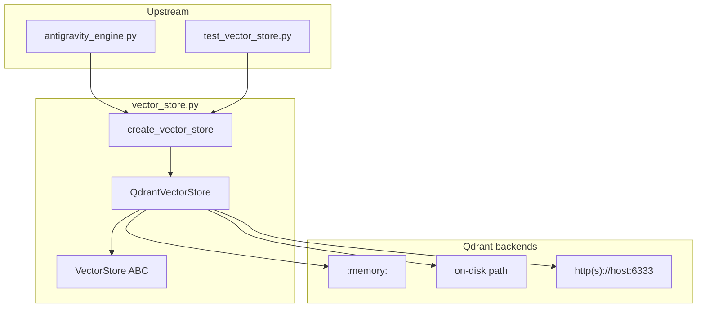
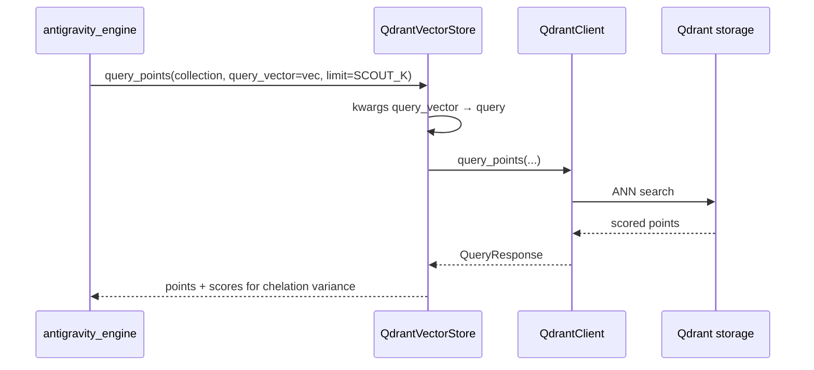

---
brain:
  schema_version: "1.0"
  dossier_type: component
  repo: "CHELATEDAI"
  file_path: "vector_store.py"
  language: python
  layer: backend
  subsystem: vector_store
  stability: stable
  trust_tier: production_critical
  last_verified: "2026-06-29"
  last_verified_sha: "a1f88c77"
  verified_by: agent
  ingest_tags: [vector_store, qdrant, F-044, dependency_inversion, foundation]
  related_docs:
    - docs/MODULE_GUIDE.md
  upstream_callers:
    - antigravity_engine.py
  downstream_dependencies:
    - qdrant_client.QdrantClient
    - qdrant_client.models
---

# vector_store — File Dossier

> **Source:** `vector_store.py`  
> **Template:** `component-dossier` v1.0 — F-044 dependency-inversion boundary over Qdrant vector database operations.

---

## §1 Executive summary

`vector_store.py` defines a `VectorStore` abstract interface and a `QdrantVectorStore` wrapper that delegates to `qdrant_client.QdrantClient`. `create_vector_store(location, backend="qdrant")` is the factory used by `AntigravityEngine` to support in-memory (`:memory:`), on-disk path, or remote HTTP Qdrant URLs. The wrapper normalizes legacy `query_vector` kwargs to `query` for `query_points` compatibility.

**Invariant:** All engine vector persistence flows through `VectorStore` methods — callers should not instantiate raw `QdrantClient` in production paths except via `get_client()` for backward compatibility.

---

## §2 Architectural role

### Subsystem context



### Layer table

| Layer | Role of this file |
|---|---|
| Frontend | N/A |
| API | N/A — Python DI boundary, not REST |
| Worker / pipeline | Vector CRUD, similarity query, scroll — backing retrieval and sedimentation |
| Data / persistence | **Primary** — Qdrant collections, points, payloads |
| Config / ops | Location string selects memory/disk/remote; quantization configured by engine using `ChelationConfig` |

### Execution context

| Context | Detail |
|---|---|
| Process | One `QdrantVectorStore` per `AntigravityEngine` instance |
| Thread safety | Delegates to `QdrantClient` thread model; no additional locking in wrapper |
| Lifecycle hook | Created in `AntigravityEngine.__init__`; `close()` on teardown |

### Feature gates

| Gate | Default | When false / unset |
|---|---|---|
| `backend="qdrant"` | only supported value | `create_vector_store(..., backend="invalid")` raises `ValueError` |
| `qdrant_location` | `":memory:"` in tests / `ChelationConfig.DEFAULT_DB_PATH` in production | Selects client constructor mode |

---

## §3 Dependency graph

### Inbound (who calls this file)

| Caller | Call pattern | Notes |
|---|---|---|
| `antigravity_engine.py` | `create_vector_store(qdrant_location, ...)` | Ingestion, scout queries, sedimentation upserts |
| `test_vector_store.py` | Direct factory and `QdrantVectorStore` tests | F-044 abstraction proof |
| `test_antigravity_engine.py` | Patches `antigravity_engine.create_vector_store` | Engine tests use mock client |
| `test_tts_engine_integration.py` | Patches `QdrantVectorStore` | Integration harness |

### Outbound (what this file calls)

| Dependency | Type | Purpose |
|---|---|---|
| `qdrant_client.QdrantClient` | pip | Underlying vector database client |
| `urllib.parse.urlparse` | stdlib | HTTP URL hostname validation |

### External systems

| System | Protocol | When |
|---|---|---|
| Qdrant (embedded) | in-process `:memory:` or local path | Default tests, local evolution DBs |
| Qdrant (server) | HTTP/HTTPS | `qdrant_location` starting with `http://` or `https://` |

### Package pins (file-relevant only)

| Package | Version pin | Why this file cares |
|---|---|---|
| `qdrant-client` | repo `requirements.txt` | Sole backend implementation |

---

## §4 Interconnection narrative

When `AntigravityEngine` constructs, it calls `create_vector_store(location=qdrant_location)` which returns `QdrantVectorStore`. The engine uses the abstraction for collection lifecycle (`collection_exists`, `create_collection`), bulk ingestion (`upsert`), scout neighborhood queries (`query_points`), point reads (`retrieve`, `scroll`), and metadata (`get_collection`). This indirection (F-044) lets tests swap in `:memory:` stores and keeps open the possibility of alternate backends — today only `"qdrant"` is implemented.

`query_points` accepts either modern `query=` or legacy `query_vector=` kwargs; the wrapper rewrites `query_vector` → `query` before forwarding (`vector_store.py:75–78`), preserving compatibility with older engine code paths.

Sibling foundation: [`../config/dossier.md`](../config/dossier.md) (`DEFAULT_DB_PATH`, quantization constants), [`../embedding_backend/dossier.md`](../embedding_backend/dossier.md) (produces vectors stored here).

### Sequence (scout query during inference)



---

## §5 Public surface reference

### `VectorStore` (ABC)

Dependency inversion interface mirroring essential `QdrantClient` operations. All methods accept `*args, **kwargs` and are implemented by delegation in `QdrantVectorStore`.

#### `VectorStore.collection_exists(*args, **kwargs)` *(abstract)*

| Field | Value |
|---|---|
| **Purpose** | Check whether a named collection exists |
| **Returns** | Provider-specific bool (Qdrant: `bool`) |

#### `VectorStore.create_collection(*args, **kwargs)` *(abstract)*

| Field | Value |
|---|---|
| **Purpose** | Create collection with vector params and optional quantization |
| **Side effects** | Allocates Qdrant collection |

#### `VectorStore.query_points(*args, **kwargs)` *(abstract)*

| Field | Value |
|---|---|
| **Purpose** | Approximate nearest neighbor search |
| **Parameters** | Qdrant-compatible; wrapper adds `query_vector` → `query` alias |
| **Returns** | Qdrant `QueryResponse` or equivalent |

#### `VectorStore.retrieve(*args, **kwargs)` *(abstract)*

| Field | Value |
|---|---|
| **Purpose** | Fetch points by id with optional vectors/payloads |

#### `VectorStore.upsert(*args, **kwargs)` *(abstract)*

| Field | Value |
|---|---|
| **Purpose** | Insert or update points (vectors + payload) |
| **Forensic note** | Primary ingestion persistence path |

#### `VectorStore.scroll(*args, **kwargs)` *(abstract)*

| Field | Value |
|---|---|
| **Purpose** | Paginated iteration over collection points |

#### `VectorStore.get_collection(*args, **kwargs)` *(abstract)*

| Field | Value |
|---|---|
| **Purpose** | Collection metadata (vector size, distance, quant config) |

#### `VectorStore.close()` *(abstract)*

| Field | Value |
|---|---|
| **Purpose** | Release client resources |
| **Side effects** | Calls underlying `QdrantClient.close()` when client non-None |

#### `VectorStore.get_client()` *(abstract)*

| Field | Value |
|---|---|
| **Purpose** | Expose raw `QdrantClient` for backward compatibility |
| **Returns** | `QdrantClient` instance |

---

### `QdrantVectorStore(VectorStore)`

#### `QdrantVectorStore.__init__(qdrant_location=":memory:", client_cls=QdrantClient)`

| Field | Value |
|---|---|
| **Purpose** | Construct wrapped Qdrant client for memory, disk, or remote URL |
| **Parameters** | `qdrant_location` — `":memory:"`, `http(s)://host:port`, or filesystem path string; `client_cls` — injectable client class (testing) |
| **Raises / errors** | `ValueError` if `qdrant_location is None`; `ValueError` if HTTP URL missing hostname |
| **Side effects** | Instantiates `client_cls(location=...)` or `client_cls(path=...)` |
| **Thread safety** | Same as underlying client |

**Location routing logic:**

| `qdrant_location` pattern | `QdrantClient` ctor |
|---|---|
| `":memory:"` | `client_cls(location=":memory:")` |
| starts with `http://` or `https://` | `client_cls(location=url)` after hostname check |
| else (filesystem path) | `client_cls(path=qdrant_location)` |

#### `QdrantVectorStore.collection_exists(*args, **kwargs)`

| Field | Value |
|---|---|
| **Purpose** | Delegate to `self._client.collection_exists` |

#### `QdrantVectorStore.create_collection(*args, **kwargs)`

| Field | Value |
|---|---|
| **Purpose** | Delegate to `self._client.create_collection` |

#### `QdrantVectorStore.query_points(*args, **kwargs)`

| Field | Value |
|---|---|
| **Purpose** | Delegate with `query_vector` kwarg aliasing to `query` |
| **Side effects** | Mutates kwargs dict (pops `query_vector`) |

#### `QdrantVectorStore.retrieve(*args, **kwargs)`

| Field | Value |
|---|---|
| **Purpose** | Delegate to `self._client.retrieve` |

#### `QdrantVectorStore.upsert(*args, **kwargs)`

| Field | Value |
|---|---|
| **Purpose** | Delegate to `self._client.upsert` |

#### `QdrantVectorStore.scroll(*args, **kwargs)`

| Field | Value |
|---|---|
| **Purpose** | Delegate to `self._client.scroll` |

#### `QdrantVectorStore.get_collection(*args, **kwargs)`

| Field | Value |
|---|---|
| **Purpose** | Delegate to `self._client.get_collection` |

#### `QdrantVectorStore.close()`

| Field | Value |
|---|---|
| **Purpose** | Close underlying client if not None |

#### `QdrantVectorStore.get_client()`

| Field | Value |
|---|---|
| **Returns** | `self._client` |

#### `QdrantVectorStore.__getattr__(name: str)`

| Field | Value |
|---|---|
| **Purpose** | Passthrough to raw `QdrantClient` for methods not explicitly wrapped |
| **Forensic note** | Escape hatch — prefer explicit `VectorStore` methods for portability |

---

### `create_vector_store(location=":memory:", backend="qdrant", client_cls=QdrantClient)`

| Field | Value |
|---|---|
| **Purpose** | Factory for vector store implementations |
| **Parameters** | `location` — passed as `qdrant_location`; `backend` — must be `"qdrant"`; `client_cls` — DI hook for tests |
| **Returns** | `QdrantVectorStore` instance |
| **Raises / errors** | `ValueError` if `backend != "qdrant"` |
| **Examples** | `create_vector_store(":memory:")`; `create_vector_store("/data/qdrant", backend="qdrant")` |

---

## §6 Internal control flow

### Factory

1. If `backend != "qdrant"` → `ValueError("Unsupported vector store backend: ...")`.
2. Return `QdrantVectorStore(qdrant_location=location, client_cls=client_cls)`.

### `QdrantVectorStore.__init__`

1. Reject `None` location.
2. If `:memory:` or HTTP(S) URL → `client_cls(location=...)`, with URL hostname validation.
3. Else → treat as filesystem path → `client_cls(path=...)`.

### `query_points` compatibility shim

1. If `query_vector` in kwargs and `query` not in kwargs → rename key to `query`.
2. Forward to `self._client.query_points`.

### `close`

1. If `self._client is not None` → `self._client.close()`.

---

## §7 Data contracts

| Contract | Shape | Notes |
|---|---|---|
| Point vector | `list[float]` length `D` | Must match collection `VectorParams.size` |
| Payload | `dict` (e.g. `{"text": str, ...}`) | Controlled by engine `STORE_FULL_TEXT_PAYLOAD` |
| `query_points` result | Qdrant response with `.points` | Each point has `id`, `score`, optional `payload` |
| `scroll` result | `(records, next_offset)` tuple | Standard Qdrant scroll semantics |
| Collection name | `str` | Engine uses `ChelationConfig.DEFAULT_COLLECTION_NAME` by default |

---

## §8 Configuration & environment

| Variable / constant | Default | Effect on this file |
|---|---|---|
| `qdrant_location` (engine arg) | `":memory:"` in tests | Selects Qdrant mode — not read from env in this module |
| `ChelationConfig.DEFAULT_DB_PATH` | `PROJECT_ROOT / "db_default"` | Typical production path passed by callers |
| `ChelationConfig.QUANTIZATION_*` | INT8 / 0.99 / RAM | Applied by engine at `create_collection`, not inside wrapper |

---

## §9 Failure modes & observability

| Symptom | Cause | Behavior |
|---|---|---|
| `ValueError: qdrant_location cannot be None` | Explicit None passed | Init fails |
| `ValueError: Invalid Qdrant URL` | `http://` without hostname | Init fails (`test_qdrant_vector_store_invalid_url_raises`) |
| `ValueError: Unsupported vector store backend` | `backend != "qdrant"` | Factory fails |
| Dimension mismatch on upsert | Vector size ≠ collection config | Qdrant client raises — propagates to engine |
| Connection refused (remote) | Qdrant server down | Qdrant client exception at operation time |

This module does not emit structured logs — observability is via Qdrant client exceptions and engine-level logging.

---

## §10 Security & trust boundary

- **Filesystem:** Disk `path=` mode reads/writes Qdrant files under caller-controlled directory — combine with `validate_safe_path` at call sites when paths are user-supplied.
- **Network:** HTTP mode connects to caller-specified host — SSRF risk if `qdrant_location` comes from untrusted input without validation.
- **Auth:** No API key handling in wrapper — Qdrant Cloud auth must be configured via client_cls/URL conventions outside this file.
- **Trust tier:** `production_critical` — stores all embedded document vectors and payloads.

---

## §11 Tests & verification

| Test file | What it proves |
|---|---|
| `test_vector_store.py` → `TestVectorStoreAbstraction` | Factory returns `QdrantVectorStore`; invalid backend rejected; memory init; None location; bad URL |
| `test_vector_store.py` → `TestQdrantVectorStoreOperations` | `collection_exists`, `create_collection`, `upsert`, `retrieve`, `query_points`, `scroll`, `get_client` |
| `test_antigravity_engine.py` | Patches `create_vector_store` — engine integration without live Qdrant in most tests |

**Smoke tier:** **floor** — `:memory:` Qdrant needs no Docker daemon; tests are self-contained.

```bash
# Primary B0 proof (F-044 abstraction + CRUD)
python -m unittest test_vector_store.py -v

# Combined B0 foundation smoke (vector store + config)
python -m unittest test_vector_store.py test_unit_core.TestChelationConfig -v
```

---

## §12 Related documentation

- [`docs/MODULE_GUIDE.md`](../../../MODULE_GUIDE.md) — "Qdrant-backed vector-store abstraction"
- [`../config/dossier.md`](../config/dossier.md) — DB paths, quantization, collection defaults
- [`../embedding_backend/dossier.md`](../embedding_backend/dossier.md) — Produces vectors stored here
- [`../antigravity_engine/dossier.md`](../antigravity_engine/dossier.md) — Primary consumer of `create_vector_store`

---

## §13 Drift watch / known gaps

- **None known for B0 vector store at `fe72fb6`** — `test_vector_store.py` covers factory, init validation, and full in-memory CRUD/query path.
- **Only Qdrant backend implemented** — `create_vector_store(..., backend="qdrant")` is the sole path; `VectorStore` ABC is portability scaffolding without alternate backends.
- **`__getattr__` passthrough** (`vector_store.py:99–101`) — engine or scripts may call undocumented `QdrantClient` methods, coupling callers to Qdrant specifics.
- **`query_vector` shim mutates kwargs** — callers reusing the same dict after `query_points` should not rely on `query_vector` key remaining.

---

## §14 Changelog (dossier)

| Date | SHA | Change |
|---|---|---|
| 2026-06-29 | fe72fb6 | B0 full enrichment — §1–§14, F-044 surface documented, sibling links |