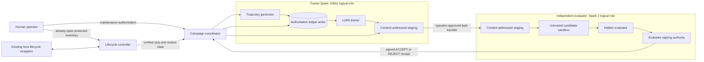
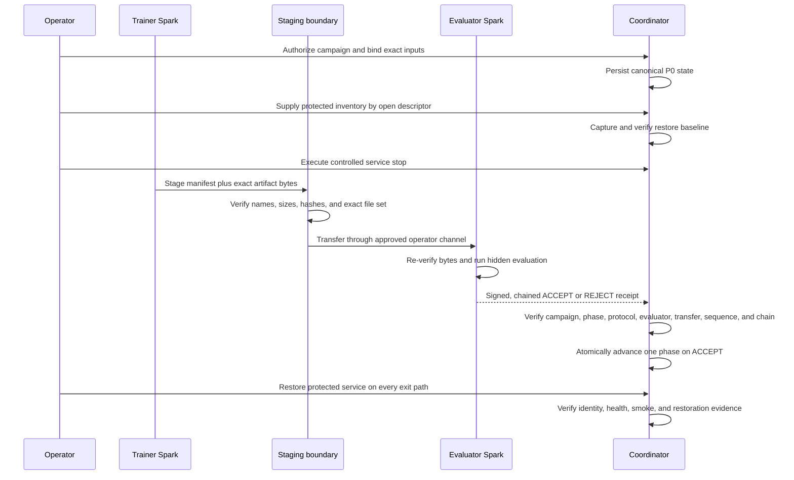

# EGV Dual-Spark Campaign Architecture and Commissioning Runbook

## Status

This document describes the public-safe architecture for commissioning an
Evidence-Governed Variation (EGV) experiment across two DGX Spark systems. It
also identifies which control-plane pieces exist in this branch and which
pieces remain planned.

> [!IMPORTANT]
> This branch does **not** prove that a Qwen model was trained, that a live
> dual-Spark campaign ran, or that the protected DeepSeek service was stopped
> and restored. The current implementation provides lifecycle state,
> protected-inventory validation, typed lifecycle plans, content-addressed
> artifact staging, signed evaluator receipts, phase-specific evidence gates,
> canonical signed restoration verification, and monotonic phase
> coordination. Live host execution, training, ablations, replay, packaging,
> and public sealing still require integration and runtime evidence.

The names **GBA1** and **Spark 2** below are logical operator roles, not network
endpoints. This document intentionally contains no addresses, credentials,
usernames, private paths, service names, or private infrastructure topology.

## Goal

The campaign tests whether evidence-governed retrieval, typed authority,
correction-aware memory, and a small LoRA adapter improve a smaller agent model
without weakening the evaluator boundary. The design assigns generation and
training to one Spark and reserves the other Spark as an independent evaluator.
The evaluator owns hidden tests and signs decisions; the trainer cannot declare
its own success.

A commissioning run is successful only when it produces verifiable campaign
evidence **and** restores the pre-existing model service to its captured
identity, configuration, health, and deterministic smoke result. Restoration
takes priority over completing the experiment.

## Implementation boundary

| Capability | Branch status | Evidence boundary |
|---|---|---|
| P0-P13 state vocabulary and monotonic transitions | Implemented | Canonical, content-digested state file |
| Protected restore inventory | Implemented | Closed canonical schema loaded from an already-open regular file descriptor |
| Lifecycle capture/stop/restore plans | Implemented as typed plans | An injected host executor must perform and observe the real operation |
| Content-addressed artifact staging | Implemented | Exact manifest, byte count, digest, file-set, and symlink checks |
| Independent evaluator authority | Implemented | Pinned public key, campaign/protocol/evaluator bindings, signed chained receipts |
| Exact retry of a committed phase | Implemented | State and receipt digests must match the already-committed step |
| Phase-specific P0-P13 evidence schemas | Implemented | Exact source, destination, role, lifecycle-state, and closed evidence-envelope contracts |
| Commissioning input preparation | Implemented | Exactly 20 public train tasks, eight evaluator-private development tasks, and 80 pending B/D generation requests |
| Host-script executor integration | Planned | Must call the existing approved host lifecycle wrappers without exposing secrets |
| Qwen loading, trajectory generation, LoRA training | Planned/in a separate slice | No live execution claim in this branch |
| Held-out ablations, replay, disposition, packaging | Planned | Requires evaluator-private data and signed runtime evidence |
| Public terminal seal | Planned | Requires successful restoration and a rebuilt, scanned public bundle |

The implementation entry points are:

- [`egv/campaign/state.py`](../egv/campaign/state.py): canonical P0-P13 state
  and atomic replacement.
- [`egv/campaign/inventory.py`](../egv/campaign/inventory.py): private restore
  inventory validation.
- [`egv/campaign/lifecycle.py`](../egv/campaign/lifecycle.py): typed lifecycle
  plans and observation verification.
- [`egv/campaign/transport.py`](../egv/campaign/transport.py):
  content-addressed staging.
- [`egv/campaign/authority.py`](../egv/campaign/authority.py): evaluator receipt
  signing and verification.
- [`egv/campaign/coordinator.py`](../egv/campaign/coordinator.py): one-phase
  advancement after transfer and receipt verification.

## Trust and execution architecture



The separation is deliberate:

- GBA1 may generate trajectories, maintain the authoritative campaign ledger,
  and train the adapter.
- Spark 2 owns hidden fixtures, evaluator configuration, and the campaign
  signing key. It receives content-addressed artifacts and returns bounded
  diagnostics plus signed decisions.
- Candidate code runs inside the existing evaluator isolation boundary. It
  receives neither the hidden-test bundle nor signing material.
- The operator owns credentials and the approved lifecycle mechanism. Neither
  the repository nor the model receives credentials.
- The coordinator advances only one phase at a time and requires the caller's
  expected state digest, the staged transfer digest, and a chained evaluator
  receipt.

## Evidence flow



Transport is content-addressed, not confidential. The approved transfer channel
must provide any required confidentiality. The receiver admits a transfer only
when the canonical manifest and every payload match their declared digest and
size, no payload is missing or extra, no symlink is present, and the staged file
set contains nothing unexpected.

## P0-P13 lifecycle

The table is the commissioning contract. “Current primitive” means the branch
contains a reusable validation or state component; it does not mean the live
phase is executable end to end.

| Phase | Purpose | Required gate evidence | Current primitive |
|---|---|---|---|
| P0 | Authorize and freeze | Maintenance approval, exact source revision, distinct roles, reserved restoration window | State initialization |
| P1 | Read-only preflight | Hardware/runtime/storage health, time sync, evaluator-runtime compatibility, no workload conflict | Generic signed phase gate only |
| P2 | Capture restore point | Exact service count, identity/image/model/configuration digests, dependency order, health/smoke digests, resource baseline | Protected inventory and verified capture snapshot |
| P3 | Controlled service stop | P2 still matches, reverse-order stop succeeds, stopped set is exact, restoration becomes durably required | Typed stop plan and restore-required state |
| P4 | Stage frozen inputs | Clean exact source, pinned model/data/software/evaluator manifests, zero prohibited scan findings | Content-addressed staging |
| P5 | Establish evaluator authority | Independent key, negative controls, signed receipt chain, one ledger event per receipt | Pinned evaluator public-key verification |
| P6 | Freeze protocol | Dataset/splits, model, LoRA profile, policies, seeds, budgets, metrics, adversarial review digest | Protocol digest can be bound into receipts |
| P7 | Generate training trajectories | Complete lineage and receipts, replay match, no development/held-out access | Planned integration with Variation and ledger slices |
| P8 | Train and seal LoRA | Frozen accepted rows, unchanged base, LoRA-only mutation, deterministic checkpoint selection, no split leakage | Planned Training integration |
| P9 | Run held-out ablations | Matched A-H and correction experiments, fixed budgets/order, independent signed verdicts | Planned Evaluation/Variation integration |
| P10 | Replay and disposition | Ledger-only replay, paired metrics, complete gate vector, conservative ordered disposition | Planned replay/disposition implementation |
| P11 | Build provisional private package | Allowlist export and early secret/private-data scan; explicitly not publishable | Planned packaging implementation |
| P12 | Restore protected service | Dependency-order restore, exact identity/count/configuration, original health and deterministic smoke | Typed restore plan and verification snapshot |
| P13 | Rebuild and seal public bundle | Restoration receipt included, fresh allowlist export, zero scan findings, manifest and terminal chain seal | Planned packaging and public verifier integration |

P0-P13 are monotonic. A normal transition cannot skip or regress. A rejected
evaluator decision cannot advance. Retrying a transition is accepted only when
it proves it is the exact already-committed step.

## Commissioning runbook

### 1. Validate the branch without touching infrastructure

From a clean checkout, run:

```powershell
python -m unittest tests.test_egv_campaign_lifecycle tests.test_egv_campaign_transport -v
python -m ruff check egv/campaign tests/test_egv_campaign_lifecycle.py tests/test_egv_campaign_transport.py
python -m compileall -q egv/campaign
```

These tests exercise local fixtures only. They do not contact either Spark,
load Qwen, or alter the protected service.

### 2. Establish P0 and P1

1. Record the exact source revision and frozen protocol inputs.
2. Assign GBA1 to the trainer role and the other Spark to the evaluator role.
   Verify they resolve to distinct physical systems without recording endpoints
   in public artifacts.
3. Reserve enough time to restore the protected service even if commissioning
   fails immediately after the stop.
4. Run read-only preflight on both systems. Do not install, reconfigure, stop,
   or stage during P1.
5. Stop before mutation unless every required preflight result is available and
   accepted.

### 3. Capture the P2 restore baseline

Use the existing approved host lifecycle wrappers to produce the private closed
inventory and typed observation consumed by the injected executor boundary.
Keep raw launch definitions, operational identities, endpoints, and credentials
outside the repository and public evidence.

The baseline must bind:

- every protected service and its dependency order;
- service/container identity and executable or image digest;
- model and configuration digests;
- expected service count;
- a deterministic health response and smoke input/output digest; and
- a resource baseline that excludes the resources intentionally changed by the
  later stop and restore.

Load the canonical inventory only through an already-open regular file
descriptor. Bind its digest into the initial campaign state. If any protected
service lacks a proven restore method, stop the campaign here.

### 4. Perform the controlled P3 stop

1. Re-run capture immediately before mutation and require an exact P2 match.
2. Through the injected executor, invoke the existing host-side stop wrapper
   for the exact protected service set in reverse dependency order.
3. Do not construct shell commands from model output or inventory data.
4. Verify the exact service set is stopped.
5. Persist `restore_required=true` before any later phase proceeds.
6. On any partial, unknown, or ambiguous outcome, enter restoration immediately.

> [!WARNING]
> Do not stop the protected service until P4-P10 integrations are executable
> and the evaluator has passed its independent preflight. The current branch by
> itself is not sufficient authorization for a live stop.

### 5. Stage and transfer at P4

Stage only clean, committed, scanner-approved inputs. Construct a closed
transfer manifest with one descriptor per artifact. Each descriptor binds a
safe logical ID, role, media type, byte count, and SHA-256 digest. Move the
canonical manifest and digest-named blobs through the operator-approved channel,
then re-run receiver-side verification before use.

The staging store is tamper-evident and content-addressed. Do not describe it as
an immutable filesystem or as a confidential channel.

### 6. Establish evaluator authority at P5-P6

1. Create the ephemeral campaign signing key only inside the independent
   evaluator controller.
2. Give the coordinator only the public key and derived key ID.
3. Pin the campaign ID, protocol digest, evaluator/runtime digest, source and
   data manifests, model/tokenizer/adapter inputs, policies, seeds, budgets, and
   metrics.
4. Run evaluator isolation negative controls before admitting campaign work.
5. Require each receipt to bind the campaign, destination phase, transfer and
   artifact-set digests, protocol, evaluator, metrics, monotonic sequence, prior
   receipt digest, key ID, and signature.
6. Treat a protocol change as a new campaign with a new campaign ID.

### 7. Generate and train at P7-P8

On GBA1, generate training trajectories from the frozen training split only.
Retain rejected attempts as evidence, but create supervised rows only from
accepted, fully receipted outcomes at the frozen ledger cutoff. Train one
LoRA-only adapter with the frozen target manifest and checkpoint protocol.

Before P8 can pass, prove:

- no development or held-out example entered generation or training;
- the base-model snapshot is unchanged;
- every changed trainable tensor is an allowed LoRA parameter;
- checkpoint lineage, RNG, optimizer, scheduler, and data cursor restore; and
- the selected adapter follows the preregistered development rule.

Seal one adapter for all trained ablation arms. Do not select or retrain from
held-out outcomes.

### 8. Evaluate and replay at P9-P10

Transfer the sealed adapter and exact manifest to Spark 2. The evaluator
re-verifies every byte, applies the adapter through the real PEFT/model loader,
runs the frozen matched ablations, and signs each bounded decision. GBA1 may
ingest verified receipts but cannot generate evaluator signatures.

After evaluation, rebuild all derived projections solely from the authoritative
ledger. Recompute preregistered metrics and the complete gate vector. Missing
or unassessable evidence becomes `UNEVALUATED` or `INCONCLUSIVE`; it never
silently becomes a pass. Adversarial review is supporting evidence, while
cryptographic verification and deterministic replay remain authoritative.

### 9. Package provisionally at P11

Build a private provisional export from allowlisted fields. Scan filenames and
contents for credentials, private keys, local identities, private addresses,
operational service identifiers, private paths, raw environment data, hidden
tests, raw evaluator journals, raw prompts, candidate source, precise telemetry,
and unapproved data. Resolve findings at the source and rebuild; do not redact a
database or provisional archive in place.

### 10. Restore at P12 on every exit path

Restoration is mandatory after any successful or partial P3 stop.

1. Stop only campaign processes bound to the frozen campaign manifests.
2. Confirm campaign processes released protected resources.
3. Through the injected executor, invoke the existing host-side restore wrapper
   in dependency order. Do not expose its private path or configuration.
4. Verify service count, identity, executable/image, model, and configuration
   digests.
5. Re-run the exact P2 health and deterministic smoke checks.
6. Compare the protected resource baseline.
7. Keep `restore_required=true` until every check succeeds.
8. If restoration succeeds before evaluator authority exists, retain a private
   bootstrap restoration record and do not publish campaign findings.
9. After evaluator authority exists, bind the verified restoration projection
   into the signed campaign evidence chain.

An emergency restoration may recover service without completing the evidence
gate. In that case, quarantine the scientific findings and record the incident;
never delay service recovery merely to create a receipt.

### 11. Seal at P13

Only after P12 succeeds, rebuild the public bundle from authoritative,
allowlisted sources. Include the public restoration evidence, aggregate metrics,
closed public projections, evaluator public key, signed receipt envelopes,
replay report, and content manifest. Run a fresh filename/content scan, verify
every manifest digest, append the terminal public chain seal, and verify from a
fresh extraction. Only that sealed rebuild is publication-eligible.

## Idempotency and resume rules

Every mutating operation needs an idempotency key derived from the campaign,
phase, input manifest, and expected predecessor. The current coordinator
implements exact retry for a phase gate: once a step is committed, a retry must
carry the same predecessor state digest and evaluator receipt digest.

On resume:

1. Read the canonical durable campaign state.
2. Verify its expected digest from the operator's last accepted evidence.
3. Check whether restoration is required before doing any campaign work.
4. Verify source, model, tokenizer, adapter, data, evaluator, protocol, policy,
   ledger, staging, and receipt-chain digests.
5. Reconcile signed evaluator receipts newer than the last ledger checkpoint.
6. Quarantine any attempt with an unknown effect outcome.
7. Resume from the first incomplete idempotency key.

Never decrement a sequence, skip a phase, rewrite an accepted receipt, locally
regenerate missing evaluator evidence, or reuse a campaign ID after changing
the frozen protocol.

## Failure and rollback matrix

| Failure | Immediate action | Evidence consequence |
|---|---|---|
| P0-P2 mismatch | Stop before mutation | No commissioning claim |
| Unknown or partial P3 stop | Enter restore-required state and restore immediately | No staging or training |
| Transfer missing, extra, substituted, noncanonical, or symlinked | Reject transfer and preserve prior state | No phase advance |
| Wrong evaluator key/protocol/runtime/sequence/chain/signature | Reject receipt and quarantine transfer | No phase advance |
| Evaluator returns `REJECT` | Preserve evidence and prior phase | No phase advance |
| Base-model mutation or split leakage | Stop training/evaluation | Adapter not eligible |
| Hidden-test exposure or successful denied effect | Stop affected campaign; assess contamination | Findings not promotable |
| Ledger or deterministic replay failure | Stop disposition and packaging | `NOT_SUPPORTED` or `INCONCLUSIVE` per frozen rules |
| Restoration mismatch | Continue restoration incident handling | Findings remain quarantined; P13 forbidden |
| Secret/private-data scan finding | Fix authoritative export source and rebuild | Existing archive is not publishable |

## Evidence acceptance gate

A commissioning or scientific claim requires all of the following:

- exact source and frozen-input manifests;
- a continuous canonical P0-P13 state chain;
- content-verified transfers;
- pinned evaluator authority and continuous signed receipt chain;
- no unresolved practical Critical or High defect in the exercised slice;
- strict relevant unit, integration, adversarial, and live validation evidence;
- complete training provenance and base-model immutability proof;
- matched held-out results or an explicit conservative disposition;
- successful ledger-only and public cryptographic replay;
- successful protected-service restoration; and
- a rebuilt public bundle with zero prohibited scan findings and a verified
  terminal seal.

A numeric audit score is advisory. It cannot replace a failed practical gate,
and a perfect score is not required when strict tests, live validations, and
adversarial review support the bounded claim.

## Known limitations

- The current campaign package is a library of control-plane primitives, not an
  end-to-end CLI or host runner.
- The injected executor adapter for the existing host lifecycle wrappers is not
  present in this branch.
- State mutation uses a cross-process lock, generation-checked compare-and-swap,
  atomic replacement, and durable directory synchronization. It does not create
  one transaction spanning campaign state, the evidence ledger, staging, and
  external host effects; those surfaces remain receipt-coordinated.
- Content addressing detects substitution; it does not encrypt artifacts or
  make the underlying filesystem immutable.
- Artifact staging currently accepts in-memory byte payloads. Large model files
  need a bounded streaming transport before this interface is used for them.
- Restoration verifies the repository's canonical signed public-restoration
  receipt before clearing the durable restore requirement. The final public
  chain seal still requires the live commissioning evidence bundle.
- Training, trajectory generation, matched ablations, correction study,
  disposition, and packaging remain separate integration work.
- Commissioning preparation emits only pending generation requests. It cannot
  manufacture accepted trajectories: completion requires real model output and
  a contiguous signed ALLOW/PASS/ALLOW evaluator receipt chain. Reconciliation
  requires the frozen evaluator-runtime digest plus the caller-owned next
  sequence and predecessor digest from the authoritative evaluator ledger; a
  signed but detached or stale subchain is not accepted.
- No result in this branch establishes model quality, safety improvement,
  throughput, cost reduction, or completed Qwen execution.

For the frozen experimental detail and full scientific gate definitions, see
the [dual-Spark execution protocol](runbooks/evidence-governed-variation-dual-spark.md)
and [EGV architecture decision](architecture/adr-0001-evidence-governed-variation-agent.md).
