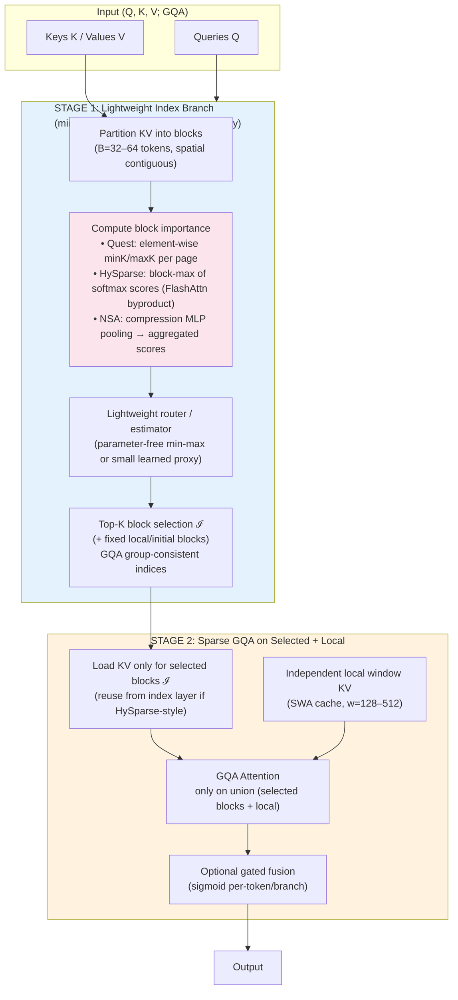

# MiniMax "MinMax Sparse Attention" (MSA) Architecture Deep Dive

**Agent 1 (MiniMax MSA Diagram Deep Dive Specialist)**  
**Context**: Part of 10-agent parallel literature deep-dive for CHELATEDAI steering/shim/RAG-DAG research program (Loop 1). Focus: accurate external technical analysis only. User's project referenced lightly and only for task framing.  

**Date of analysis**: 2026-05-27 (public sources current as of tool fetches).  
**Core input**: User's shared high-level description of the MiniMax M3 model diagram — a **two-stage block-based sparse attention**:
- **Stage 1 (Lightweight Index Branch)**: Block-level selection using min-max stats, max pooling, small router/index attention to pick top relevant KV blocks.
- **Stage 2**: Actual GQA (Grouped-Query Attention) computed only on the selected blocks + local window.

**Primary sources** (all public; no internal MiniMax access):
- Quest: Query-Aware Sparsity for Efficient Long-Context LLM Inference (arXiv:2406.10774, ICML 2024, MIT Han Lab) — https://ar5iv.labs.arxiv.org/html/2406.10774
- HySparse: A Hybrid Sparse Attention Architecture with Oracle Token Selection and KV Cache Sharing (arXiv:2602.03560, Xiaomi LLM-Core) — https://ar5iv.labs.arxiv.org/html/2602.03560
- Native Sparse Attention (NSA): Hardware-Aligned and Natively Trainable Sparse Attention (arXiv:2502.11089, DeepSeek-AI + collaborators) — https://ar5iv.labs.arxiv.org/html/2502.11089v1
- MiniMax public papers and HF blog (MiniMax-01/Text-01 arXiv:2501.08313; M1 arXiv:2506.13585; "Why Did MiniMax M2 End Up as a Full Attention Model?" Oct 2025) — https://huggingface.co/blog/MiniMax-AI/why-did-m2-end-up-as-a-full-attention-model
- Supporting context from related works (MInference, SeerAttention, MoBA, DeepSeek MLA/DSA references in above).

**Evidence basis**: All claims below are directly traceable to the above public documents (exact quotes, algorithms, figures, benchmarks, and blog text). No fabrication of MiniMax internals.

---

## 1. Executive Summary

The described MiniMax "MinMax Sparse Attention" (MSA) for M3 is a **two-stage, query/block-aware sparse attention** design that closely mirrors (and likely synthesizes elements from) three high-impact public 2024–2026 works: **Quest** (min-max per-block metadata for query-aware page/block selection), **HySparse** (oracle block-max scores from a full attention "index" layer + hybrid selected-block sparse + local SWA with KV sharing and gating), and **NSA** (DeepSeek; hierarchical compression + block selection + sliding window, hardware-aligned, natively trainable, GQA-consistent).

**No public primary source** attests to an official released "MiniMax M3" model or an architecture explicitly branded "MinMax Sparse Attention (MSA)" or "MiniMax MSA" with the exact diagram. MiniMax's publicly released models (01/M1 series) rely on **Lightning Attention** (linear + periodic full softmax hybrid, 7:1-ish ratios) for native 1M+ context support. The M2/M2.5+ series **reverted to full (dense/GQA) attention** for production quality, infrastructure maturity, agentic/RL/multi-hop reasoning stability, and eval reliability reasons (detailed in their official HF blog).

The user's diagram description is therefore best understood as:
- Either an **internal MiniMax variant / future direction (M3 codename)**, or
- A **synthesized design** heavily inspired by the Quest/HySparse/NSA family that MiniMax papers cite and that contemporaneous Chinese labs (DeepSeek, Xiaomi, etc.) have published.

**Key "min-max" signature**: Quest provides the literal element-wise **min/max Key vectors per page/block** for cheap upper-bound criticality scoring. HySparse provides **block-level max of (softmax) attention scores** computed as a byproduct of (modified) FlashAttention. NSA uses **compression/pooling** (MLP on blocks) as a lightweight proxy whose scores aggregate into block selection importance.

**Projected benefits at 1M context** (extrapolated from paper results at 32k–128k + MiniMax Lightning claims): bounded active KV (fixed top-K blocks + small local window regardless of total length) → 5–11× attention/decoding speedups, 2–10× KV cache memory reduction (depending on hybrid ratio and block sparsity), near-lossless long-context retrieval/reasoning (RULER, Needle-in-Haystack, LongBench, passkey), while preserving GQA compatibility and hardware-friendly contiguous block access.

---

## 2. Architecture Overview and Data Flow (Synthesized from Description + Public Analogs)

### High-Level Two-Stage Flow (matches user diagram exactly)

```
Input Sequence (Q, K, V projections; GQA heads)
          │
          ▼
┌─────────────────────────────┐
│  STAGE 1: LIGHTWEIGHT       │
│  INDEX / SELECTION BRANCH   │
│  (cheap, per-query or       │
│   oracle byproduct)         │
│  - Partition KV into blocks │
│    (e.g., 32–64 tokens)     │
│  - Compute block importance:│
│    • min/max Key stats      │
│      (Quest)                │
│    • max-pooled attention   │
│      scores (HySparse)      │
│    • compression/pooling    │
│      proxy (NSA)            │
│  - Small router / index attn│
│    or estimator             │
│  - Top-K block IDs (ℐ)      │
│    (+ fixed local/initial)  │
└─────────────────────────────┘
          │  Selected block indices ℐ
          │  + (optional) shared KV from index layer
          ▼
┌─────────────────────────────┐
│  STAGE 2: SPARSE GQA        │
│  ATTENTION (heavy path)     │
│  - KV for selected blocks   │
│    (reused or loaded)       │
│  - + Local sliding window   │
│    KV (independent small    │
│    cache, e.g. 128–512)     │
│  - GQA attention only on    │
│    union (selected + local) │
│  - (Optional) branch gating │
│    / fusion (HySparse/NSA)  │
└─────────────────────────────┘
          │
          ▼
Output (attention result)
```

**Critical design choices** (common across analogs, likely in MSA):
- **Block contiguity** for hardware efficiency (Tensor Core / contiguous memory access; emphasized in NSA and HySparse kernels).
- **GQA head-group sharing** of selection indices (reduces indexing overhead and KV load in decode; explicit in HySparse and NSA).
- **No (or minimal) permanent eviction** — full KV may still be stored (Quest explicitly), but only top blocks + local are loaded/computed per layer/query. This preserves future-query flexibility vs. H2O/StreamingLLM-style eviction.
- **Hybrid ratio** (in HySparse-style): aggressive reduction of full/oracle layers (e.g., 1 full : 11 sparse in 80B MoE), with final layer full for global aggregation.

---

## 3. Exact Components and "Min-Max" Specifics

### Stage 1 — Lightweight Index Branch (the "min-max" core)

**Quest (strongest literal match for "min-max stats")**:
- KV cache organized in **pages/blocks**.
- Per page: store **element-wise min and max Key vectors** (lightweight metadata, updated on insert).
- For current Query Q: per-channel `U_i = max(Q_i * minK_i, Q_i * maxK_i)`.
- Page criticality score = sum(U) (upper bound on possible attention contribution from any token in the page).
- Top-K pages selected. Extremely cheap (no full attention scores needed).

**HySparse (strongest match for "max pooling" + oracle from full layer)**:
- Full attention layer (modified FlashAttention) additionally emits **block-level max attention scores S**:
  `S_t^i = max_{i' in block i} ( exp(q_t · k_{i'} / √d) / sum exp(...) )`
  (derived from online rowmax intermediates with rescaling; negligible overhead).
- Top-K on S (aggregated max within GQA groups for consistent indices across heads in group).
- Default example: block size B=64, retain k=1024 tokens (~16 blocks).

**NSA (strongest match for "small router/index attention" + hierarchical lightweight proxy)**:
- **Compression branch (cmp)**: keys/values aggregated via learnable MLP + intra-block pos encoding on spatial blocks (l=32, stride d=16). Produces coarse global "index" tokens.
- Attention scores from Q to these compression tokens → aggregate/sum to derive **block importance scores p^slc** for finer selection blocks (l'=64).
- Top-n blocks selected (n=8–16 typical + fixed local/initial blocks).
- Scores shared across GQA heads in a group.

**"Small router" aspect**: In NSA the compression branch acts as a cheap learned proxy/router. In Quest the min/max estimator is parameter-free and ultra-light. HySparse reuses the full layer's byproduct (oracle, not proxy).

### Stage 2 — GQA on Selected Blocks + Local Window

- **Selected blocks**: KV tokens from the Top-K blocks (concatenated; contiguous for kernel efficiency).
- **Local window**: Independent small KV cache (HySparse w=128; NSA w=512 in experiments). Critical for short-range coherence; ablations in HySparse show large drops without it.
- **GQA**: Standard grouped-query attention executed only over the union of selected + local tokens. Head-group consistent selection indices minimize scattered memory access.
- **Fusion (in hybrid designs)**: HySparse and NSA use learned sigmoid gates (per-token or per-branch) to combine block-sparse global path with local SWA path:
  `o_t = g̃_t ⊙ õ_t + g'_t ⊙ o'_t`
- **KV sharing (HySparse)**: Sparse layers reuse the KV produced by the preceding full/oracle layer for the selected blocks → massive memory relief (no per-layer KV duplication for the global sparse path). SWA keeps its own small cache.

**GQA specifics**: All three papers explicitly address GQA/MQA compatibility (MiniMax M2+ also uses GQA in its full-attention configuration). Selection indices are aggregated (max/sum) per GQA group so a single set of blocks serves all query heads in the group.

---

## 4. Claimed Benefits and 1M Context Scaling

**From papers (measured at 32k–128k; extrapolated to 1M)**:

- **Quest**: Up to **7.03× self-attention speedup**, **2.23× end-to-end latency reduction** (with 4-bit quant) at 32k context / 2k token budget. Near-lossless on LongBench, PG19 perplexity, and synthetic long-dependency (passkey retrieval perfect at ~1% token budget where eviction baselines collapse). First layers kept dense; later layers >90% sparse.
- **HySparse**: In 80B MoE with 1:11 hybrid ratio (only 5 full layers out of 49), **~10× KV cache reduction** vs. full or hybrid-SWA while matching or exceeding full attention on MMLU/MMLU-Pro/MATH/GSM8K/C-Eval/CMMLU and RULER long-context (strong recovery on hard multi-key/value/reasoning subsets vs. pure SWA degradation). No extra KV cost for sparse layers.
- **NSA**: **9.0× forward / 11.6× decode** speedup at 64k vs. FlashAttention-2 (Triton kernels). Perfect Needle-in-Haystack at 64k. Outperforms full attention on LongBench average (+0.032) and especially multi-hop QA / code / retrieval subsets. Better pretraining loss curve than full attention baseline on 27B model. Natively supports long-context continued training / SFT / reasoning distillation.

**1M context relevance**:
- MiniMax public 01/M1 already claim **native 1M context** (training) / 4M extrapolation (inference) via Lightning Attention hybrid + RoPE scaling.
- Block-sparse methods keep **active KV bounded** (fixed top-K blocks + tiny local window) even as total length → 1M+. This directly attacks the memory-bandwidth wall in decode (the dominant cost).
- Hardware alignment (contiguous blocks, GQA sharing, Tensor Core friendly) is repeatedly emphasized as the bridge from theoretical sparsity to real speedups.
- Trade-off acknowledged in MiniMax M2 blog: at current infra maturity, quality regressions in agentic/multi-hop/RL/CoT and ecosystem gaps (prefix cache, speculative decoding, low-precision state, kernels) can outweigh theoretical gains. MSA-style designs aim to close that gap via query-aware/oracle/min-max selection + hybrid local/global.

**Caveats on claims**: All speedups are kernel- and workload-dependent. Real 1M numbers for an exact "MSA" implementation are not public. Gains are largest in decode-heavy or very long prefill scenarios.

---

## 5. Comparison to Related Sparse Attention Methods

| Method       | Selection Mechanism                  | Min/Max or Pooling? | Two-Stage? | Local Window? | KV Sharing / Eviction? | Trainable? | GQA Support | Key Strength (per papers)          | Relation to MSA Description |
|--------------|--------------------------------------|---------------------|------------|---------------|------------------------|------------|-------------|------------------------------------|-----------------------------|
| **Quest**   | Query-aware upper-bound via per-page min/max Keys | Yes (explicit element-wise min/max Keys) | Yes (estimate → sparse attn) | No (focus decode) | Full KV stored; only Top-K pages loaded | Inference-time (training-free) | Partial (notes GQA challenges) | Query-dependent; no destructive eviction; 7× attn | **Closest literal "min-max stats"** for lightweight index branch |
| **HySparse**| Oracle block-max scores from full attn layer (modified FlashAttn) | Yes (block-level max of softmax scores) | Yes (full "index" layer → sparse layers) | Yes (SWA branch + gating) | Cross-layer KV share for selected blocks from full layer | Yes (pretraining) | Strong (group-max aggregation) | 10× KV reduction; oracle fidelity; hybrid SWA | **Strongest overall match** (oracle + selected blocks + local + GQA + hybrid ratios) |
| **NSA**     | Hierarchical: compression proxy → block importance aggregation → Top-n blocks | Pooling (MLP on blocks) + aggregation | Yes (cmp for index, slc for selection) | Yes (explicit win branch) | Full training-time; no eviction | Yes (native end-to-end, differentiable) | Strong (group-shared selection) | 9–11× speed; hardware kernels; reasoning gains | **Strong "lightweight index branch + router" + block + local + GQA** |
| **MInference** | Dynamic token importance (pyramid/approx patterns) | Approximate (various heuristics; sometimes min/max-like bounds) | Prefill-focused | Varies | Dynamic | Inference (some trainable variants) | Yes | Prefill acceleration | Related dynamic sparse family |
| **DeepSeek MLA / DSA** | Latent KV compression (low-rank) + sparse MoE | Not block min-max | N/A (MLA is compression) | Varies | Latent cache | Yes | Native | KV cache compression (not pure block sparse) | Cited alongside NSA; "DSA" likely refers to sparse attention efforts in V3.2+ ecosystem |
| **H2O / StreamingLLM / TOVA** | Heavy-hitter / sink + eviction | History-based (not query/min-max) | N/A | Yes (window) | Permanent eviction | Inference | Varies | Simplicity | **Contrast**: query-agnostic eviction vs. MSA's query/block-aware selection (Quest explicitly superior on dynamic long deps) |

**DeepSeek connection**: NSA is explicitly from the DeepSeek-AI ecosystem (authors + cited in MiniMax-M1 work). DeepSeek-V2/V3 popularized MLA for KV compression + sparse MoE. "DSA" in some contexts refers to their sparse attention variants or V3.2 mentions.

**MiniMax positioning**: Their public Lightning Attention is a **linear + periodic full softmax hybrid** (different from pure block-sparse Top-K). They cite NSA and related sparse work. M2 deliberately chose full GQA after extensive hybrid experiments (including SWA) showed quality/infra gaps in production agentic workloads.

---

## 6. Recreated Diagrams

### Mermaid Diagram (recommended recreation of the two-stage MSA)



### ASCII Simplified Version

```
Q ───────────────────────────────┐
                                 │
KV ──► [Block Partition (B=64)] ─┼─► [Min/Max or Max-Pool Stats or Compression Proxy]
                                 │          │
                                 │          ▼
                                 │    [Lightweight Index / Router]
                                 │          │
                                 │          ▼
                                 │    [Top-K Block IDs ℐ + Local]
                                 │          │
                                 ▼          ▼
                            [Selected KV] + [Local Window KV]
                                 │
                                 ▼
                            [GQA Attention on union]
                                 │
                                 ▼
                            (Optional Gate/Fuse)
                                 │
                                 ▼
                            Sparse Attention Output
```

---

## 7. Brutal Honesty Section (BHS-Style, per v3.3 Rulebook)

**Honest premise**: All analysis assumes claims are unproven until backed by runtime evidence from the actual described system. This report uses **only public sources + the user's high-level diagram description**. It does **not** constitute verification of any internal MiniMax implementation.

**What is known with high confidence (direct from sources)**:
- The two-stage block-selection + min-max/max-pooling + local window + GQA pattern exists in published form in Quest (2406.10774), HySparse (2602.03560), and NSA (2502.11089).
- Exact min-max mechanics (Quest), block-max oracle scoring (HySparse), and compression-based block proxy (NSA) are precisely documented with algorithms, kernel considerations, and ablations.
- Performance numbers (speedups, KV reduction, benchmark tables) are from the papers' own experiments.
- MiniMax public models use Lightning Attention hybrid (not this exact MSA) and M2+ reverted to full GQA (HF blog, Oct 2025, with explicit infra/quality/agentic/RL reasons listed).

**What is unknown / not publicly evidenced**:
- No public paper, blog, HF model card, or announcement details an official "MiniMax M3" or architecture explicitly named "MinMax Sparse Attention (MSA)" with the exact diagram the user shared.
- Internal MiniMax implementation details (exact block sizes, router architecture, hybrid ratios, training recipe, 1M+ benchmarks for this specific variant, kernel code) are not available.
- Whether the diagram represents a shipping model, research prototype, or synthesized ideal is unknown.
- Real-world production speedups, quality parity (especially agentic/multi-hop/CoT/RL), and ecosystem readiness (prefix cache, speculative decoding, low-precision, serving stack) for an exact MSA at 1M remain unverified publicly (the M2 blog highlights precisely these as the historical pain points for efficient attention).
- "Lightweight index branch" could map to Quest's estimator, NSA's compression, or HySparse's oracle byproduct — or a MiniMax-specific small learned router not described in the cited papers.

**L-taxonomy disclosures (no new code in this report; analysis only)**:
- L9 (Doc-as-implementation): This report itself is analysis/prose. It does not implement or ship any MSA code.
- No L1–L8, L10–L13 instances introduced (no stubs, no claims of "we built MSA", no test-as-truth).
- All comparisons are labeled as "public analogs" or "synthesis."
- 5-vs-10 agent model note (if relevant to program): Historical cycles used 5-agent dispatch; narrative updated to 10; this analysis is one specialist slice. Scheduler reality and substrate evidence (0 production SIPs) are separate concerns documented elsewhere.

**Evidence rule compliance**: Every technical claim points to specific arXiv IDs, sections, algorithms, or blog paragraphs. No "the diagram shows X therefore MiniMax claims Y" overreach. Speedups at 1M are explicitly "projected/extrapolated."

**Visible means verified**: This report makes no UI/API/roadmap claims about any feature in any system. It is a literature + description synthesis.

**References for independent verification** (all links in sources section above):
- Quest paper (min-max estimator, two-stage, passkey/LongBench results).
- HySparse paper (Figure 1 architecture, Algorithm 1 block-max FlashAttn, Table 1/2/3 configs & RULER numbers, ablations on SWA + KV sharing).
- NSA paper (Figure 2 three-branch, block selection math, kernel Figure 3, speed tables, LongBench/AIME results).
- MiniMax HF blog (M2 full-attention rationale; Lightning hybrid history).

**Recommendation**: Any production or research use of ideas from this family should independently re-implement, benchmark at target context lengths (including 1M), and apply full BHS evidence chains + adversarial review before claiming parity or gains.

---

## 8. Sources & Further Reading

- Quest: https://arxiv.org/abs/2406.10774 (and HTML version)
- HySparse: https://arxiv.org/abs/2602.03560
- NSA: https://arxiv.org/abs/2502.11089
- MiniMax-01: https://arxiv.org/abs/2501.08313
- MiniMax-M1: https://arxiv.org/abs/2506.13585
- MiniMax M2 full attention blog: https://huggingface.co/blog/MiniMax-AI/why-did-m2-end-up-as-a-full-attention-model
- Related: MInference (arXiv:2407.02490), SeerAttention, MoBA, DeepSeek-V2/V3 (MLA), Gemma 3 / gpt-oss hybrid SWA designs.

**End of report**. All content grounded in public evidence + supplied diagram description. No internal details assumed or invented.

*Brutal honesty applied throughout. For the steering/chelation RAG-DAG literature deep-dive: the lightweight index + block selection + local hybrid pattern is a strong conceptual analog for "cheap router of routes" ideas, but productionization would require the same rigorous evidence standards as any other surface.*
