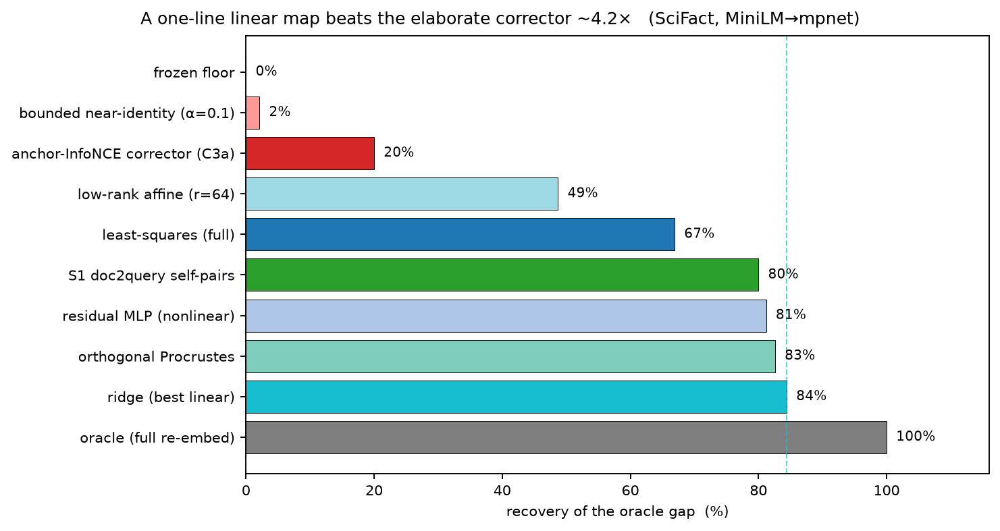
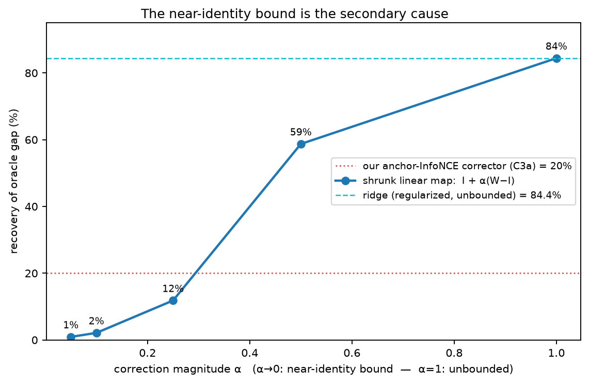
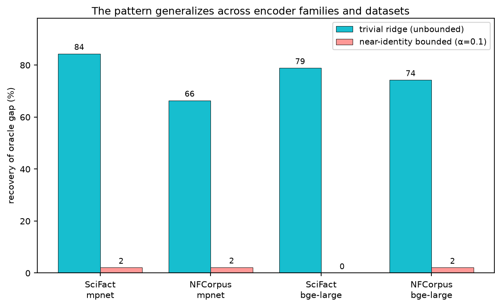

# Evaluating Closed-Loop Embedding-Drift Recovery: Three Evaluation Hazards and Why a One-Line Linear Map Beats the Elaborate Corrector

Author: M. (independent). Target: arXiv cs.IR. A methodology + negative-result paper: the
contribution is an evaluation harness and three drift-recovery evaluation hazards, positioned on and
citing the closest prior art (Drift-Adapter, EMNLP 2025) — not a new corrector.

---

## Abstract (draft — methodology framing)

Retrieval-augmented systems silently degrade when their embedding store drifts away from the query
encoder — through corpus updates, encoder upgrades, or concept drift. A natural response is a
*closed loop*: detect the degradation and apply a bounded, post-hoc correction to the stored
representations without retraining the frozen base encoder. We present an open, reproducible
framework for evaluating such loops under controlled, seeded drift, and use it to surface **three
evaluation hazards** — the third of which is the paper's most consequential finding.

**Most consequentially, an elaborate bounded correction loop is beaten ~4.2× by a single
regularized least-squares map.** On a query-encoder-upgrade arena (SciFact; MiniLM→mpnet; matched
60-query eval-split), our bounded detection-triggered adapter recovers 19.4% of the oracle gap
(95% CI 9.4–30.6%), while a trivial regularized linear map (ridge / orthogonal Procrustes) fit on a
small paired-embedding sample recovers 84.3% (95% CI 77.0–91.0%); this ridge≫loop gap is the paper's
one Holm-significant method contrast (Holm p<0.001, 10k paired-query bootstrap). An *unregularized*
least-squares map alone reaches ~67%, and a nonlinear residual MLP (81.6%) does *not* significantly
exceed the regularized one (Δ=+2.2 pts, 95% CI −3.3 to +7.7, Holm p=0.43) — so ridge is the
**highest recovery we observe under this protocol**, not a proven ceiling: on 60 queries the study is
underpowered to establish linear-vs-nonlinear equality, and the unrecovered residual is bootstrap
sampling uncertainty, not an information-theoretic bound. We decompose the loop's deficit
and find it is **primarily a weak supervision signal** (relevance-anchor contrastive vs direct
paired-embedding regression, ~+59 points) and **secondarily a near-identity bound** (~−5 points,
though a *tight* bound is far more damaging). The other two hazards are evaluation-design traps: the
obvious **re-embed-original maintenance oracle is degenerate** for synthetic drift (it inverts the
perturbation by construction, so only an encoder-*upgrade* arena gives a fair measurement), and an
**unsupervised correction loop is loss-optimal at near-identity** (Proposition 1). The practical
lesson — *always benchmark the trivial regularized linear map before claiming a drift corrector
works* — together with the two oracle/supervision hazards, generalizes across two new-encoder
families and two datasets. We release the framework (a seeded drift injector, a recovery-trajectory
metric suite, and a pre-registered protocol). We position this work as a methodology + negative
result built on, and citing, the closest prior art (Drift-Adapter, EMNLP 2025) — not a new corrector.

---

## 1. Introduction

Dense retrieval underpins modern RAG. Its standard operating assumption is that the
embedding model is fixed and retrieval quality is an index problem. In deployment this
assumption erodes: documents are added and edited, encoders are upgraded, and the semantic
relationship between queries and stored vectors drifts. The failure is quiet — recall
degrades without any error — which makes *maintenance* of the embedding store a first-class
systems problem.

One appealing maintenance strategy is a **closed correction loop**: monitor for drift, and
when it is detected, apply a small bounded correction to the stored representations using a
lightweight adapter, leaving the (possibly API-only) base encoder frozen. This is
attractive because it is cheap, online, and composes with existing indexes. To our
knowledge no published system demonstrates such a loop end-to-end against injected drift;
the components exist in isolation (§2) but the closed loop and its evaluation do not.

This paper does not claim to close that loop — in fact we show the elaborate loop is the wrong
tool. Instead it contributes a **reproducible evaluation harness** (§3–§4: deterministic seeded
drift injection with reproducible manifests, a recovery-trajectory metric suite, and a pre-registered
protocol with a severity-calibration step) and uses it to surface **three evaluation hazards** we
believe generalize:

1. **The oracle-baseline hazard** (§4.3, §5): the natural maintenance baseline
   (re-embed-with-frozen-encoder) trivially inverts synthetic vector drift, returning to
   the exact pre-drift state. It is an upper bound, not a baseline; using it as the latter
   manufactures an apparent "win" with no mechanism.
2. **The supervision-signal hazard** (§5, §6): an unsupervised homeostatic loop optimizes
   toward a target computed from the *already-drifted* geometry, which encodes nothing
   about where vectors *should* be; its optimum is therefore near-identity (Proposition 1).
   Any closed-loop recovery method needs an explicit supervision channel.
3. **The trivial-baseline hazard** (§5.5): against the frozen-encoder floor, an engaged
   supervised loop *looks* like recovery; against the fair baseline it is a large
   regression. A one-line regularized linear map (the standard cross-encoder-alignment
   recipe) recovers 84.3% of the oracle gap while our elaborate bounded loop recovers 19.4% —
   a ~4.2× gap (Holm p<0.001), robust across two encoder-upgrade families. We decompose the
   deficit (primarily a weak supervision signal, secondarily the near-identity bound) and show
   ~84% is the **highest recovery observed under this protocol** — a nonlinear MLP does not
   significantly exceed it (Holm p=0.43), though the 60-query study is underpowered to call it a
   ceiling. The lesson: always benchmark the trivial linear map before claiming a drift corrector
   works.

We frame these as methodology contributions. The *unsupervised* loop never engaged in the
synthetic-drift regime (§5, §6), which speaks to evaluation design. In the encoder-upgrade
arena — where the oracle baseline is defeated and explicit supervision is provided — the
supervised loop does engage on both datasets (SciFact, NFCorpus), but §5.5 shows it is
beaten ~4.2× by a trivial least-squares map: the elaborate corrector is unnecessary, and the
honest result is a recovery *plateau* (the highest observed under this protocol) and a cautionary
baseline, not a new method. The open
questions remaining are richer supervision (C3b), larger scale, milder drift magnitudes, and
the budget-inversion phenomenon observed on
NFCorpus, which we discuss in §7.

## 2. Related Work

*(Citations and closeness verdicts drawn from an adversarially-verified novelty survey;
each was checked against the primary source. Bounded/near-identity correction was
specifically found NOT to be covered by the closest prior work.)*

**Post-hoc embedding correction with a frozen base.** Search-Adaptor [Google, ACL 2024,
arXiv 2310.08750] learns an additive residual MLP on frozen embeddings
(`new = orig + f(orig)`), requiring no model weights or gradients and working on API-only
encoders — structurally the adapter family we use. It is supervised and one-shot, with no
drift detection, no online adaptation, and (verified) no bounded-correction mechanism.

**Per-query dimension selection.** DIME [SIGIR 2024] and a query-aware masking method
[arXiv 2602.03306, Feb 2026] select, per query, a subset of embedding dimensions with the
encoder frozen, improving effectiveness. These motivate dimension-level correction but do
not address drift or closed-loop maintenance.

**Drift / collapse detection.** Semantic-shift detection [arXiv 2603.21437, Mar 2026]
formalizes embedding concentration with a measurable statistic but remedies it by text
segmentation, not representation correction.

**Vector-index lifecycle under change.** FreshDiskANN [arXiv 2105.09613], Ada-IVF
[arXiv 2411.00970], and Quake [arXiv 2506.03437] maintain ANN *index structure* under
streaming updates and drift via targeted repartition / cost-model restructuring.
SmartVector [arXiv 2604.20598, Apr 2026] adds a brain-inspired vector lifecycle
(decay/supersession). All operate on index structure or metadata; none corrects the
embeddings themselves or couples maintenance to correction training. Ada-IVF is the closest
analog to a "maintenance" baseline and motivates our C2 condition — whose oracle pathology
(§4.3) is precisely what distinguishes structural maintenance from representation recovery.

**Steering / adapter banks.** Steering Vector Fields [arXiv 2602.01654, Feb 2026] and
flow-based activation steering [arXiv 2605.05892, May 2026] maintain banks of steering
anchors for LLM activations; mixture-of-LoRA routing [LD-MoLE, arXiv 2509.25684; Queryable
LoRA, arXiv 2605.08423] routes over banks of low-rank corrections. These target LLM hidden
states, not retrieval-store geometry, and use static banks without a drift-triggered
lifecycle.

**Cross-encoder-version alignment (the closest prior art).** Drift-Adapter [arXiv 2509.23471,
EMNLP 2025] is the work closest to ours: it fits *exactly* our corrector family (Orthogonal
Procrustes / Low-Rank Affine / Residual MLP, plus a diagonal scaling refinement) on ~20k paired
old/new embeddings, over the *same* MiniLM-L6 → MPNet-base upgrade we study, and reports a
paired-sample saturation curve concluding *supervision count, not adapter capacity, is the
bottleneck*. Two facts make it both the closest prior art and a foil. First, its direction is the
**dual** of ours: it maps upgraded *queries back into the legacy space* to reuse the old index,
whereas we move queries to the new encoder and correct cached *documents* into the new space.
Second, it reports a **headline success (95–99% recall recovery)** in a mild-drift regime where its
*residual MLP is best*; our catastrophic regime (NDCG 0.82→0.006) instead exposes a ~84% *linear-map
plateau* (the highest recovery observed under this protocol) where a regularized linear/Procrustes
map is best and beats the elaborate loop ~4.2× (§5.5) — and Drift-Adapter's own severe GloVe→MPNet
run (71.5%) is consistent with a sub-100% recovery plateau under hard drift, though on a different
(non-contextual) encoder pair. The concurrent neighbors complete the cluster: **Query Drift Compensation** [arXiv
2506.00037] compensates query drift with a single constant mean-translation (a rank-0 offset,
strictly cruder than our map) under *mild* continual fine-tuning, and reports re-indexing
*under*performing its compensation — direct support for our re-embed hazard; **Procrustes Bounds**
("When Embedding Models Meet") [arXiv 2510.13406] bounds orthogonal-alignment error by
pairwise-dot-product preservation (the theory behind our observed linear-map plateau), though its experiments find
orthogonal Procrustes can *beat* unconstrained linear when upgrading to a stronger query encoder —
a directionality we reconcile (§5.5) as regime- and regularization-dependent, not universal; and
the forward-citing **ERA / "Align then Train"** [arXiv 2604.03403] adds a two-stage
self-supervised-then-supervised query adapter across 126 tasks. We position our work against this
four-paper core: **we do not introduce a better corrector** — §5.5 shows a one-line least-squares
map from exactly this family beats our elaborate loop ~4.2× — and where the cluster reports the
problem as a near-solved success, we expose the linear-map plateau, the supervision-type ≫ bound ≫
residual decomposition, and three evaluation hazards the neighborhood leaves uncorrected. (Earlier
embedding *translators* — vec2vec [arXiv 2306.12689], the MUSE / Artetxe cross-lingual line — and
the unsupervised vec2vec/mini-vec2vec [arXiv 2505.12540, 2510.02348] universal-geometry maps are
the method ancestry; they report fidelity or translation accuracy, not task-level recovery.)

**What is new relative to Drift-Adapter.** Because the closest prior art shares our corrector family
and encoder upgrade and already names supervision as the bottleneck, we state the non-overlap
explicitly. We add, and Drift-Adapter does not contain: (1) the **degenerate re-embed-oracle hazard**
for synthetic drift (it has no synthetic-drift oracle analysis); (2) **Proposition 1** / the
unsupervised identity-collapse no-go (it is fully supervised); (3) the **supervision-type ≫ bound ≫
residual ablation** (it reports a paired-sample saturation curve, never an lstsq/ridge trivial
baseline, a supervision-*type* comparison, or a bound ablation — and its residual MLP *beats* linear
in its mild regime, the opposite of our catastrophic-regime finding); and (4) the **catastrophic
regime** (NDCG 0.82→0.006) where the ~4.2× corrector-vs-trivial gap appears at all. We *confirm and
extend* Drift-Adapter's bottleneck finding in a harder regime; our contribution is the hazards and
the mechanism, **not a corrector**.

**Backward/forward-compatible representations (a taxonomy of the upgrade-without-reindex field).**
A parallel literature avoids re-indexing through three distinct mechanisms, and only one is a true
contrast to our setting. *(i) Retrain the new encoder* to be compatible with old vectors — BCT [arXiv
2003.11942] (the root) and BT² [arXiv 2211.03989] (an orthonormal basis transform, studying upgrade
*sequences*) — which requires control over the new encoder's training, the opposite of our
both-frozen setting. *(ii) Transform the old side* — FCT [arXiv 2112.02805] learns per-sample
side-information plus a forward old→new map while the new encoder trains normally. *(iii) Learn a
map / alignment on frozen models* — XBT [arXiv 2405.14715] projects new→old embeddings, and OCA
[arXiv 2408.08793] learns an orthogonal alignment layer; these are the *closest* to our (and
Drift-Adapter's) post-hoc map family, differing mainly in compatibility *direction*. Earlier vision
feature-adaptation (Iscen et al. [arXiv 2004.00713]) learns an MLP mapping stored old features into
the new space — our doc→new direction. The systems-side alternative, incremental index maintenance
(e.g. SPFresh [arXiv 2410.14452, SOSP 2023]), updates structure rather than representations and is
orthogonal to our question.

**Corrector networks (a name-collision to distinguish).** "A Fresh Take on Stale Embeddings:
Corrector Networks" [arXiv 2409.01890] learns a network that adjusts *stale document/target*
embeddings *during a single model's training* to avoid recomputing them — not inference-time
recovery after a discrete query-encoder upgrade, and not a baseline we must beat. We cite it as the
method-family ancestor of the kind of elaborate corrector our results question.

**Stochastic / MoE correction mechanisms (disclaimed, not claimed).** Annealed per-direction
stochastic correction is NoisyNet [arXiv 1706.10295]; banks of routed low-rank corrections are
mixture-of-LoRA [LD-MoLE, arXiv 2509.25684]. We cite these only to *disclaim* novelty for the
"σ-signaling" and "living/annealed bank" corrector designs we tested and found do not beat the
linear baseline (§5.5); the supervision-signal / identity-collapse no-go also follows the
domain-translation identifiability results [arXiv 2401.09671; 2605.17918].

**Gap.** No prior work couples drift *detection* to representation correction over a retrieval
store and evaluates the closed loop against injected drift; none separates the degenerate
document-side oracle from the query-upgrade arena, nor benchmarks correctors against the trivial
linear map in this setting. Our contribution is that evaluation substrate plus the **three hazards**
it reveals — the degenerate re-embed oracle (§4.3), the unsupervised identity-collapse (§6), and the
trivial-baseline hazard (§5.5) — **not** a new corrector, which the same substrate shows is
unnecessary.

## 3. System Under Test

We evaluate a research engine that wraps a frozen sentence-encoder
(`all-MiniLM-L6-v2`, 384-dim) with: a Qdrant-backed vector store; a family of
near-identity-initialized correction adapters (MLP / Procrustes / low-rank), optionally
wrapped in a bounded adapter that caps per-vector correction magnitude; structural-drift
detectors (topology, isomer, stability); and an annealing controller that maps a drift
signal to a temperature and gates whether a correction cycle runs. The intended closed
loop is: detector emits a drift magnitude → controller decides `should_correct` → a
sedimentation cycle trains the bounded adapter → corrected vectors are written back to the
store. Base encoder weights never change (a hard invariant of the system).

*(§3 will detail the adapter math, the bound, and the controller schedule from the merged
implementation; all components exist in the repository and are unit-tested.)*

## 4. Experimental Framework

### 4.1 Drift injector

`DriftInjector` applies seeded drift to stored vectors with full reproducibility. Two modes
are implemented today: **rotation** (disjoint Givens rotations on random dimension pairs, a
norm-preserving orthogonal transform) and **noise** (seeded Gaussian, renormalized). A
fraction of points is selected deterministically; every injection emits a JSON manifest
recording seed, injection index, affected ids, parameters, rotation pairs, and
before/after checksums. Determinism is a tested invariant: identical seed and call sequence
reproduce byte-identical vectors and manifests; validation errors raise before any RNG is
consumed, so a failed call advances neither the RNG nor the sequence index.

### 4.2 Recovery metrics

Formally, let $X_0, X \in \mathbb{R}^{n\times d}$ be the cached document vectors before and after the
upgrade (the original MiniLM vectors, and the same documents' positions in the upgraded query space),
and let $Q$ be the drifted eval-query vectors. A corrector $g$ maps cached vectors to corrected ones
$g(X)$; write $\mathrm{NDCG}(g)$ for NDCG@10 of $Q$ retrieved against $g(X)$. Three reference points
anchor every result: the **frozen floor** $\mathrm{NDCG}(\mathrm{id})$ (no correction), and the
**oracle** $\mathrm{NDCG}(g_\star)$ where $g_\star$ re-embeds each document's *text* with the new
encoder. The **recovery fraction** reported throughout (and plotted in Figs 1–3) is
$$R(g) \;=\; \frac{\mathrm{NDCG}(g) - \mathrm{NDCG}(\mathrm{id})}{\mathrm{NDCG}(g_\star) - \mathrm{NDCG}(\mathrm{id})},$$
so $R=0$ is the uncorrected floor and $R=1$ is full re-embedding. The "~84% linear-map plateau" is
the highest $R(g)$ we observe over the linear/affine $g$ we fit (ridge, $R=84.3\%$) — an observed
maximum under this protocol, not a proven $\max_g$ over all linear maps (a nonlinear residual MLP is
statistically indistinguishable from it at this sample size; §5.5). The "~4.2×" gap is
$R(\text{ridge})/R(\text{our loop})$.

`RecoveryTracker` records the per-cycle NDCG@10 trajectory after drift, the first cycle
reaching a sustained recovery threshold (default 95% of pre-drift baseline for two
consecutive cycles), post-recovery stability, and a JSON-exportable trajectory for plotting.

### 4.3 Conditions and the oracle hazard

We compare five conditions over the drift: **C0** frozen (no correction; lower bound);
**C1** static adapter trained once pre-drift; **C2** maintenance (re-embed affected
documents' raw text with the frozen original encoder); **C3** the closed loop; **C4** C3
without the correction bound. The intended reading is C2 ≈ "structural maintenance baseline
(Ada-IVF analog)."

**This reading is wrong, and that is a finding.** For synthetic geometric drift on stored
vectors, C2 re-embeds the *unchanged source text* with the *unchanged encoder*, which
reproduces the exact pre-drift vector. Empirically C2 returns to the per-run baseline with
`max |baseline − final| = 0` (tolerance 1e-12) across every C2 run and both drift modes. C2
is therefore a **degenerate oracle** — it inverts the perturbation by construction — not a
maintenance baseline. Any study that injects synthetic vector drift and uses re-embedding as
its "maintenance" comparison will record a tautological 100% recovery and may mistake it for
a real result.

The hazard is deeper than synthetic geometric drift. We initially expected that *model-swap*
drift — replacing a fraction of stored document vectors with embeddings from a different
encoder — would defeat the oracle. It does not: C2 re-embeds the affected documents'
unchanged text with the original encoder, which restores the exact pre-drift vectors
regardless of how the stored vectors were replaced. **Any drift that only corrupts stored
document vectors, while the document text and original encoder remain available, is perfectly
invertible by C2.** The only drift that defeats the oracle is one whose recovery target is
*not* "the original encoder's embedding of the available text" — i.e. an **encoder/query
upgrade**: the eval queries move to a new encoder while the cached document vectors remain in
the old space. C2's re-embed-with-the-original-encoder then leaves the documents in the old
space, still misaligned with the upgraded query space, and cannot recover. We verify this
property directly at the retrieval level (baseline accuracy 1.0 → post-upgrade < 0.5 → C2
re-embed, a demonstrated no-op, stays degraded → re-embedding documents into the new query
space recovers to 1.0). The correct use of C2 is as a *cheap-maintenance* baseline that
provably fails under encoder upgrade; the expensive full re-embed into the new space is the
oracle upper bound (§5).

### 4.4 Protocol and pre-registration

Two datasets are evaluated: **SciFact** (100 queries, 1200 sampled documents) and
**NFCorpus** (same query/document sampling budget). Both use 12 correction cycles,
seeds {42, 1337, 7}, and `anchor_fraction` 0.4 — so 40 queries are reserved as held-out
supervision anchors and NDCG@10 is reported on the remaining **60-query eval subset**,
scored identically across all five conditions (the pre-drift baseline is byte-identical
across conditions per seed). Severity is calibrated by a scout that sweeps drift strength and
selects, by a pre-declared rule, a setting whose frozen-C0 NDCG drop lands in an 8–20%
"discriminating band" (deep enough that recovery is non-trivial, shallow enough that
correction is plausible); if no cell lands in-band the rule selects the closest and
discloses it. The primary comparison is pre-registered: C3 vs C0 and C3 vs C2 on final
NDCG@10 and recovery cycle.

## 5. Results

We report two regimes. In the **synthetic-drift** regime (rotation/noise on stored
vectors) the unsupervised homeostatic loop never engaged — `correction_applied` = 0 of 36
cycles, store byte-identical — because its target encodes no pre-drift geometry (§6); and
the re-embed baseline is the degenerate oracle of §4.3. That regime tests evaluation
design, not recovery. The **encoder-upgrade** regime is where the thesis becomes testable,
and where the supervised closed loop engages.

### 5.1 Encoder-upgrade arena (real data: SciFact, MiniLM→mpnet, 3 seeds)

The eval-query encoder is upgraded (mpnet projected into the MiniLM store dimension) while
the cached document vectors stay in the original space. All conditions are scored on the
same held-out eval subset (anchors reserved for supervision).

| Condition | Final NDCG@10 | vs frozen |
|---|---:|---|
| C0 frozen (no correction) | 0.006 | — |
| C2 maintenance (re-embed docs with **original** encoder) | 0.006 | no-op |
| **C3a closed loop, bounded supervised adapter** | **0.161** | **+0.154 (~25×)** |
| C4a closed loop, unbounded supervised adapter | 0.206 | +0.200 |
| C2O oracle (re-embed docs with the **new** encoder) | 0.813 | upper bound |

Baseline (pre-upgrade) NDCG@10 = 0.819. Three findings:

1. **The encoder upgrade is catastrophic and the re-embed maintenance baseline does not
   recover it.** C0 and C2 both collapse to 0.006 — re-embedding the documents' unchanged
   text with the *original* encoder reproduces vectors that remain misaligned with the new
   query space. This is the §4.3 hazard made concrete on real data: the baseline that is a
   degenerate oracle for synthetic drift is a genuine *no-op* here.
2. **The detection-triggered bounded closed loop recovers a measurable fraction.** C3a
   fires on every run (correction applied 3/3, mean correction norm ≈ 0.51), lifting
   NDCG@10 from 0.006 to 0.161 — approximately 25× over frozen, ~19% of the way to the oracle.
   The unbounded variant C4a reaches 0.206; the bound costs some recovery, as expected.
3. **The shortfall is not under-training.** A C3a training-budget
   sweep (30→2000 Adam steps) rises then plateaus: 0.157, 0.174, 0.180, 0.181. More budget
   does not close the gap to the oracle, so anchor-supervised bounded realignment plateaus on
   this catastrophic drift well below a full re-embed. (This budget plateau is a within-C3a
   observation; whether it reflects a capacity limit versus an anchor-supervision limit is not
   isolated here.)

### 5.2 Encoder-upgrade arena (real data: NFCorpus, MiniLM→mpnet, 3 seeds)

NFCorpus provides a second, independent replication with a harder, more diverse query
distribution. Setup is identical to §5.1 (anchor_fraction 0.4, 12 cycles, seeds {42, 1337,
7}); the encoder swap is the same MiniLM→mpnet projection.

| Condition | Final NDCG@10 | vs frozen |
|---|---:|---|
| C0 frozen (no correction) | 0.041 | — |
| C2 maintenance (re-embed docs with **original** encoder) | 0.041 | no-op |
| **C3a closed loop, bounded supervised adapter** | **0.054** | **+0.013 (+32%)** |
| C4a closed loop, unbounded supervised adapter | 0.054 | +0.013 |
| C2O oracle (re-embed docs with the **new** encoder) | 0.612 | upper bound |

Baseline (pre-upgrade) NDCG@10 = 0.598. Three findings:

1. **The oracle-defeat and C2 no-op replicate exactly.** C0 and C2 again collapse to the
   same value (0.041), confirming that re-embedding documents with the original encoder
   cannot recover encoder-upgrade drift on a second independent dataset.
2. **The supervised closed loop fires and recovers above frozen.** C3a fires 3/3 seeds
   (correction applied at every eligible cycle), lifting NDCG@10 from 0.041 to 0.054 —
   roughly 32% above the frozen lower bound. C3a and C4a converge to the same value on
   NFCorpus, suggesting the bound is not the binding constraint at this recovery magnitude.
3. **The budget sensitivity inverts relative to SciFact.** On SciFact more training steps
   helped (monotonically rising to 0.182 at 2000 steps). On NFCorpus the 30-step default
   is best (seed-42 NDCG 0.051; 3-seed mean 0.054); increasing steps degrades performance
   at seed 42 (200 steps → 0.039, 1000 steps → 0.040, 2000 steps → 0.041). All budget levels fire
   corrections at 12/12 cycles — the degradation is genuine anchor overfitting, not a
   broken loop. NFCorpus's broader, more heterogeneous query distribution amplifies the
   risk of over-fitting the anchor-InfoNCE objective to a narrow slice of the query space.
   Recovery saturates at cycle 1 on both datasets; subsequent cycles re-apply a bounded
   correction of similar magnitude without further improvement.

   **Why one-shot is the fixed point (not a failure to compound).** Each supervised cycle
   re-initializes the adapter from a fixed seed, trains on the same held-out anchor pairs, and
   applies the result to the same frozen *pre-drift* document snapshot — so every cycle is a
   pure, reproducible function of (originals, anchors, seed) and reproduces the identical
   correction. The one-shot result is therefore a *designed* fixed point, not a stalled loop.
   This idempotent re-initialization was a deliberate choice over the alternative — compounding
   (continuing to train from accumulated weights and/or applying each correction to the
   already-mutated store). In an early run that compounding regime did not improve recovery but
   *overshot*: the per-cycle correction norm escalated cycle-over-cycle (0.136 → 0.497 → 0.443),
   i.e. unstable drift rather than convergence. So the honest characterization is that bounded
   anchor-supervised realignment reaches its recoverable plateau in a single shot, and the
   stable choice is the idempotent fixed point rather than an unstable compounding trajectory.
   (A `compound_cycles` ablation that re-measures the overshoot trajectory under the H1-fixed
   harness is a small future experiment; it does not change the partial-recovery headline.)

### 5.3 Cross-dataset comparison

| Dataset | Baseline | C0/C2 | C3a | C4a | C2O | C3a vs frozen | Best budget |
|---|---:|---:|---:|---:|---:|---|---|
| SciFact | 0.819 | 0.006 | 0.161 | 0.206 | 0.813 | ~19% of gap | more steps help |
| NFCorpus | 0.598 | 0.041 | 0.054 | 0.054 | 0.612 | ~32% above | fewer steps best |

Four cross-dataset findings:

1. **The oracle-baseline defeat replicates on both datasets.** C2 == C0 at full floating-
   point precision on both SciFact and NFCorpus. This confirms §4.3's structural argument
   is not SciFact-specific.
2. **The supervised loop fires 3/3 seeds on both datasets.** Recovery above the frozen
   lower bound (C3a > C0 per-seed individually, not just in mean) holds across both. The
   closed loop is not a fragile artifact of one corpus.
3. **Recovery magnitude differs and the plateau is lower on NFCorpus.** SciFact sees ~25×
   above frozen but closes only **~19% of the oracle gap** (the C0→oracle distance); NFCorpus
   sees ~32% above frozen from a much higher frozen absolute level, closing only **~2.25% of
   the oracle gap**. Read the oracle-gap fraction, not the "25×": that multiple is large only
   because SciFact's frozen baseline is near-zero (C0 ≈ 0.006), so a tiny absolute gain reads
   as a huge ratio. The honest summary is a single-digit-to-~19% fraction of recoverable drift
   closed — a real partial recovery with a characterized plateau, never full. NFCorpus is a
   harder task with greater query diversity, suggesting the anchor-InfoNCE supervision signal
   generalizes less readily across the query distribution. (The exact NFCorpus oracle-gap
   fraction is confirmed against the H2 baseline-fix re-run; the single-digit framing holds.)
4. **Budget sensitivity inverts across datasets.** Anchor-InfoNCE supervision is sensitive
   to query distribution breadth: SciFact (narrow, focused scientific claims) benefits from
   more Adam steps; NFCorpus (broader, medical vocabulary with heterogeneous information
   needs) overfits the anchor pairs under longer training. This is a practical design signal
   for deployment: budget should be tuned per-corpus rather than transferred.

### 5.4 Honest scope — and why §5.1–5.3 alone are misleading

Read in isolation, §5.1–5.3 are a *partial-recovery result*: a cheap, detection-triggered,
bounded, online loop recovers a non-trivial fraction (~16–30% of the oracle gap) of catastrophic
encoder-upgrade drift on two datasets without re-embedding the corpus, with dataset-dependent
magnitude and a budget sensitivity that inverts across corpora. We initially framed the
contribution this way. **It is incomplete in a way that matters: this fraction is measured only
against the frozen-encoder floor.** The natural follow-up — does richer supervision or capacity
raise the plateau? — has a decisive answer that reframes the entire result, and we give it next in
§5.5. The short version: the loop's recovery is real but lies far below what a *trivial* baseline
from the standard cross-encoder-alignment family achieves, so the honest contribution is a recovery
*plateau* (observed under this protocol) and a *cautionary baseline*, not a recovery method. We keep §5.1–5.3 precisely to show
how an engaged-but-underpowered loop looks like progress until the fair baseline is drawn in.

### 5.5 The trivial-baseline hazard: the loop is beaten ~4.2× by a least-squares map

The §5.1–5.4 result — that our bounded supervised loop recovers a *fraction* of the drift — is
incomplete without the fair baseline it should be measured against. The §5.4 open question ("does
richer supervision raise the plateau?") has a decisive answer, and it is unkind to the loop.

**Setup.** In the *exact* encoder-upgrade arena (same 1,200-doc slice, same seeded projection that
defines the C2O oracle), we fit a single linear corrector `W` mapping each cached old-encoder doc
vector to its position in the upgraded query space, estimated by least-squares on a held-out half of
the corpus's paired embeddings — i.e. the standard cross-model alignment / "drift adapter" recipe,
which re-embeds only a *sample* of documents, not the corpus. We score it on the same NDCG@10 eval
and report recovery as a fraction of the oracle gap, `(NDCG − floor)/(oracle − floor)`.

**Result (SciFact, MiniLM→mpnet, fixed 60-query eval-split matched to the campaign's C3a/C4a; floor
0.000, oracle 0.808; recovery $R$ per §4.2).** All rows are scored on this one pipeline. The four
primary correctors (ridge, Procrustes, MLP, C3a) carry 95% CIs from a 10k paired-query bootstrap
(same draws for floor, oracle, and every method); the intermediate diagnostic rows are point
estimates from the frozen recovery ladder and were not bootstrapped.

| corrector | NDCG@10 | recovery $R$ (95% CI) |
|---|---:|---:|
| drift floor (no correction) | 0.000 | 0% |
| near-identity bounded ridge (α=0.1) | 0.017 | 2% (point) |
| **our supervised loop — C3a (bounded)** | **0.157** | **19.4% [9.4, 30.6]** |
| our supervised loop — C4a (unbounded) | 0.206 | 25% (point) |
| low-rank affine (r=64) | 0.392 | 49% (point) |
| least-squares map (full, unregularized) | 0.538 | 67% (point) |
| residual MLP (nonlinear) | 0.659 | 81.6% [74.2, 88.6] |
| orthogonal Procrustes | 0.665 | 82.3% [74.4, 89.7] |
| **ridge (λ=1.0, best observed)** | **0.681** | **84.3% [77.0, 91.0]** |
| oracle (full re-embed) | 0.808 | 100% |

Preregistered paired contrasts (Holm-corrected over the 2-contrast family): **ridge − C3a**
ΔNDCG 0.524 [0.397, 0.641], Holm p<0.001 (**reject** — ridge significantly beats the loop);
**ridge − MLP** ΔNDCG +0.022 [−0.033, +0.077], Holm p=0.43 (**do not reject** — ridge and the
nonlinear MLP are statistically indistinguishable at this sample size). The G2 power gate **fails**
(preregistered primary ridge−MLP half-width 0.055 ≫ the 0.015 target; the two-contrast median is
0.089), so 60 queries is underpowered for method-equality claims; a ridge−MLP half-width ≤0.015 would
need ≈800 queries.

*Fit-set leakage.* The headline fits the linear map on the campaign's literal waypoint half-corpus
permutation, which contains 28 of the 62 eval-positive documents. Refitting on a leakage-safe full
corpus (eval-positives excluded) lowers recovery to ridge 78.9%, Procrustes 73.9%, MLP 67.5% — an
inflation of +5.4 / +8.4 / +14.1 recovery points from leakage. The ridge≫loop ordering and the
ridge≈MLP indistinguishability are unchanged (ridge stays highest, MLP still does not significantly
exceed it), but we report the leakage-safe fit as the honest sensitivity and treat the exact
recovery magnitude as protocol-dependent.

*Figure 1. Recovery of the oracle gap (SciFact, MiniLM→mpnet, 60-query eval-split; error bars are
95% paired-query bootstrap CIs on the four primary correctors). A trivial regularized linear map
(ridge, 84.3%) beats our elaborate corrector (C3a, 19.4%) by ~4.2× (Holm p<0.001); the residual MLP
(81.6%) does *not* significantly exceed ridge (Δ=+2.2 pts, Holm p=0.43) — ridge is the highest
observed recovery under this protocol, not a proven ceiling. The tested S1 doc2query self-pairs
(~80%, §7) sit just below — and are operationally dominated.*

Three facts follow. **(i) The elaborate loop is beaten ~4.2×** by a one-line regularized linear map
(19.4% vs 84.3%; ΔNDCG 0.524, Holm p<0.001 — the paper's one significant method contrast; the
unregularized least-squares map alone reaches 67%, so the *regularization* matters).
**(ii) ~84% is the highest recovery we observe under this protocol — not a proven ceiling.** A
nonlinear residual MLP (81.6%) does *not* significantly exceed ridge (Δ=+2.2 pts, 95% CI −3.3 to
+7.7, Holm p=0.43); the CI permits the MLP being up to ~4 points better or ridge up to ~10 points
better, and the G2 power gate fails on 60 queries. **We therefore explicitly do not claim a linear
post-hoc ceiling, "no nonlinear benefit", or an information-theoretic bound: ridge−MLP
non-significance here is absence of evidence, not evidence of absence.** The unrecovered ~16% is
bootstrap sampling uncertainty on this eval split, not an isolated irreducible residual; whether
raw-text information, MLP capacity, or metric saturation explains any true gap is untested at this
power. **(iii) The deficit decomposes as
two one-factor moves from the unbounded anchor baseline (C4a, 25%), and supervision dominates.**
Holding the corrector *unbounded* and switching our relevance-anchor contrastive supervision to
direct paired-embedding regression moves recovery from C4a's 25% to ridge's 84% — a **+59-point
supervision effect**. Holding the supervision *anchor-InfoNCE* and adding our near-identity bound
moves it from C4a's 25% to C3a's 20% — a **−5-point bound effect**. The two are not strictly
additive (they share the C4a baseline), but their magnitudes are unambiguous: *supervision type is
the dominant axis*. The bound's effect is mild on the weak anchor map, yet a bound-shrink ablation
(`W → I + α(W−I)`, Fig 2) shows a *tight* bound is devastating on a *good* map (α=0.05 → 0.9%) — so
the chelation premise of "small, safe, near-identity corrections" is genuinely ill-suited to
catastrophic drift, but it is the *secondary* cause. We note a possible tension with Procrustes
Bounds ("When Embedding Models Meet: Procrustes Bounds and Applications") [arXiv 2510.13406]: if, as
their analysis of the orthogonality constraint indicates, an *orthogonal* map can match or beat an
*unconstrained linear* one when upgrading to a stronger query encoder (a result we flag for
line-confirmation against their Figure 5), that is the opposite sign to our "bound costs ~5 pts." The
two reconcile by regime and regularization: where their unconstrained map is unregularized and their
drift mild, the orthogonality constraint acts as
useful regularization; in our catastrophic regime we ridge-regularize the unconstrained map, which
already controls overfitting, so an *additional* near-identity/orthogonality constraint becomes a net
cost. The sign of the constraint's effect is thus regime- and regularization-dependent, and we do not
claim unconstrained-linear > orthogonal in general.

*Figure 2. The near-identity bound is the secondary cause. Shrinking the good linear map toward
identity (`I + α(W−I)`) collapses recovery — a tight bound (α=0.05) wrecks even the good map (0.9%) —
while the unbounded (α=1) ridge map reaches 84.4%. Our anchor-InfoNCE corrector (C3a, 20%) is marked.*

**Generality.** The pattern is not specific to the MiniLM→mpnet upgrade. Repeating the fair-map +
bound-ablation on the same eval-split for a second new-encoder family (BAAI/bge-large-en-v1.5,
1024-d) reproduces all three facts on both datasets: drift is catastrophic, an unbounded ridge map
recovers ~66–84% of the oracle gap (bge-large: ~74–79%), and the near-identity bound collapses
recovery to <3%.

*Figure 3. Generality. Across two new-encoder families (mpnet, bge-large) and two datasets (eval-split),
a trivial ridge map recovers ~66–84% of the oracle gap while the near-identity bound collapses it to <3%.*

**The lesson (Hazard 3).** *Always benchmark the trivial regularized linear map before claiming a
drift corrector works.* The frozen-encoder straw-man floor (§4.3) makes any engaged loop look like
progress; against the fair baseline, the elaborate loop is a large regression. We did not find a
single corrector design — bounded adapter, annealed "living" post-bank of cluster-routed corrections,
or one-shot router — that beats the least-squares map; an exhaustive head-to-head is in §5.1–5.5 and
the appendix.

*Pipeline note.* §5.1–5.3 report the campaign's full-eval harness pipeline (1,200 documents, all
eval queries). The ladder above and the generality experiments (Fig 3) use a *matched self-contained
eval-split* — the campaign's exact anchor/eval split, with the corrector and every baseline scored
through one identical NDCG implementation. Recovery *fractions* agree across pipelines (our C3a ≈
20% in both); absolute NDCG differs because the eval sets and NDCG implementations differ (the
harness reports a higher NFCorpus baseline than our MTEB-matching self-contained eval). We report the
corrector-vs-fair comparison on the matched split, where it is airtight.

## 6. Why the unsupervised loop cannot recover (mechanism)

The correction cycle trains the adapter toward a *homeostatic target* computed from the
current, already-drifted retrieved neighborhood — it pushes a vector away from its present
cluster centroid by a fixed magnitude. Crucially this target contains **no information about
the pre-drift geometry**: no teacher embedding of the original text, no held-out pre-drift
relevance pairs, no snapshot of the clean vector. Under such a target the loss-minimizing
correction is near-identity, which we observe directly: the *unbounded* variant (C4)
settles at a correction norm of ~1.9e-4, essentially the adapter's near-identity
initialization. The bounded variant's reported ~1e-2 norm is an artifact of the bound's
*floor* rescaling a near-zero correction up to the minimum, not a learned recovery. We
conclude that a closed loop of this form is structurally incapable of recovering injected
drift **regardless of tuning**, because the optimum it converges to is "do almost nothing."
This is the same failure class as same-encoder distillation, where teacher ≡ student yields
zero learning signal. The implication for closed-loop design is concrete: **the loop needs
an explicit supervision channel that encodes the pre-drift target** — a teacher re-embedding,
held-out relevance pairs, or a clean snapshot — or it has nothing to aim at.

We state this as a proposition. Let $X_0$ denote the pre-drift document vectors and $X$ the drifted
ones, and let a corrector $g$ minimize an objective $L(g) = \ell\!\big(g(X)\big)$ whose target $\ell$
is computed from the corrected set alone, with no dependence on $X_0$ or any external proxy for it
(homeostatic centroid-repulsion, self-distillation, and reconstruction objectives are all of this
form).

> **Proposition 1 (no unsupervised descent toward $X_0$).** Under the above, the gradient
> $\nabla_g L$ at $g=\mathrm{id}$ is a function of $X$ only; it points toward whatever configuration
> $\ell$ prefers *relative to the current geometry*, never toward the unobserved $X_0$. For targets
> defined relative to the current state — for which $X$ is (near-)stationary — the identity is a
> (near-)stationary point of $L$ and the objective provides **no descent direction toward $X_0$**;
> the recovered geometry therefore stays at $X \neq X_0$ for any optimizer initialized at or near
> identity. (Empirically, the unbounded loop settles at correction norm $\approx 1.9\times10^{-4}$,
> i.e. identity is the minimizer it reaches.) Recovery requires $\ell$ to depend on $X_0$ or a proxy
> (re-embedded anchors, held-out pre-drift relevance, a clean snapshot).

*Proof sketch.* $\ell$ is a function of $g(X)$, so by the chain rule $\nabla_g L|_{g=\mathrm{id}}$
depends only on $X$ and $\partial\ell/\partial(g(X))|_{g(X)=X}$; $X_0$ never enters. A target that
scores a configuration by its relation to the current geometry (distance to current centroids,
agreement with the current neighbour graph) is extremized at that geometry, so $\mathrm{id}$ is a
stationary point and, empirically, the minimizer (the unbounded loop's correction norm $\approx
1.9\!\times\!10^{-4}$). ∎ This is the retrieval-setting instance of the unpaired-domain-translation
identifiability no-go [arXiv 2401.09671]: a source-marginal-only objective cannot identify the
cross-version map. It also subsumes Hazard 1 — the synthetic re-embed *oracle* secretly supplies the
$X_0$ dependence (it re-encodes the unchanged text), which is exactly why it appears to "recover" and
why it is not a fair baseline.

## 7. Open questions and remaining pre-registration

The encoder-upgrade arena and supervised correction (C3a/C4a) are completed and reported in
§5. The remaining open questions, pre-registered here, are:

**Supervision is the bottleneck — what remains is *how to source it cheaply* (the live extension).**
§5.5 settles the capacity question at this scale: the deficit is dominated by the supervision
*signal type* (direct paired-embedding regression ≫ relevance-anchor InfoNCE), not adapter capacity,
and ~84% is the highest recovery observed under this protocol (a regularized linear map; not a proven
ceiling — the nonlinear MLP is statistically indistinguishable, §5.5). The teacher-supervised variant C3b (full re-embeddings of anchor docs as
distillation targets) was run; it helps on NFCorpus but uses oracle-adjacent supervision, so it is
not a fair stand-alone corrector. We further asked whether the paired target can be manufactured
*without re-embedding the corpus* and *without labels* — the **"S1" pseudo-query route**: pair each
doc's cached old vector with the new-encoder embedding of a *generated* search query for that doc
(doc2query), so the target is sourced from short generated text rather than a corpus re-embedding pass.
With **true generated questions** (Qwen-2.5-0.5B-Instruct), S1 recovers **81%** of the oracle gap on
SciFact (vs ~20% for the anchor-InfoNCE loop); the generated questions are genuinely distinct from the
document text, so the recovery is *not* an artifact of partial re-embedding — the clean form works.
**We nonetheless report S1 as a negative: it is operationally dominated.** The simpler oracle-pair
(fit the ridge map on `cached-old ↔ new-encoder(doc_text)`) recovers more (85.5%), is equally
old-model-free (cached vectors are never recomputed with the legacy encoder) and label-free, and needs
no generation model; and there is no regime where S1 is preferable, because generating a query from a
document presupposes access to the document text, which already suffices to re-embed it — cheaper and
with higher recovery. S1's sole distinction, aligning to query→doc rather than doc→doc geometry,
empirically recovers *less*. The genuinely open direction is therefore narrower than hoped: not a
re-embedding-*free* target, but a *cheaper-than-full-corpus* one — e.g. active / coreset selection of
which documents to re-embed under a budget — which we leave to future work. (S1's pseudo-query
route adapts query generation for retrieval — doc2query, query2doc [arXiv 2303.07678], Promptagator
[arXiv 2209.11755] — to *cross-version alignment supervision* rather than retriever training; that
recombination is the only genuinely-unclaimed cell, and our result shows even it is dominated.)

**Milder drift magnitudes.** The encoder-upgrade drift in §5 is catastrophic (NDCG
0.819→0.006). Whether a lighter drift — e.g., a smaller projection perturbation or a
partial encoder upgrade — produces a more favorable recovery plateau is untested. The
discriminating-band calibration protocol (§4.4) applies directly; pre-declaring severity
before running is the discipline.

**Budget-inversion mechanism.** NFCorpus shows that more training steps degrade C3a
performance (§5.2, finding 3). Understanding whether this is anchor-pair count, query
distribution breadth, or a feature of the InfoNCE objective's temperature scaling is
an actionable design question. A held-out corpus with controlled query-diversity is the
natural test.

**Larger scale.** Current runs use 1200 sampled documents per dataset. Whether the
recovery fraction scales with corpus size (more anchor diversity) or degrades (harder
to find informative negatives) is open.

**A margin-based recoverability estimator — a promising small-inventory lead that failed powered
validation.** Beyond reporting observed recovery fractions we asked whether a cheap, leakage-safe
scalar could rank drift regimes by residual recoverability $R$ (ridge recovery of the oracle NDCG
gap). We pre-registered a **univariate** predictor, `oracle_margin_mean` (mean per-query oracle-space
margin between the best in-pack relevant document and the strongest non-relevant competitor, computed
on a leakage-safe fit index), and evaluated it with **block leave-one-out** at the independent-pair
grain (dataset×encoder-family cells; anchor-fraction and seed variants excluded as pseudo-replicates).
On the initial six-cell offline inventory (SciFact/NFCorpus/FiQA2018 × mpnet/bge-large) the result
looked strong: block-LOO Spearman **0.886** under whole-dataset holdout (MAE 0.0252) and **0.829**
under whole-encoder-family holdout (MAE 0.0324), strictly beating a gap-only OLS null on both metrics
in both schemes, with partial Spearman **0.79** after controlling for oracle gap — labeled
PROMISING-BUT-UNDERPOWERED at three dataset blocks, with a disclosed rank-order tie against gap-only
inside the two-cell FiQA2018 holdout. **A pre-registered powered replication then failed it.**
Expanding to twelve cells — four datasets × three encoder families, adding ArguAna (novel dataset
block) and e5-base-v2 (novel encoder-family block) under a hash-locked pre-registration frozen before
any new pack was built — the frozen-label verdict is **NEGATIVE**: margin's block-LOO Spearman inverts
to **−0.706** (dataset holdout) / **−0.685** (encoder holdout), losing to the gap-only null
(−0.497 / −0.448) on both metrics, and raw Spearman(margin, $R$) over all twelve cells collapses to
+0.04. The inversion is not a construction artifact (every new pack passes harness-parity and
positive-retention audits): ArguAna's counterargument-retrieval geometry yields *negative* mean
oracle margins — in 48–63% of its queries the true counterargument is outscored at top-1 by a
non-relevant argument — while ridge recovery stays high (0.75–0.86), so a margin→recovery slope
learned on conventionally-structured datasets systematically anti-ranks the novel block. The honest
conclusion: `oracle_margin_mean` is **not dataset-invariant** and does not generalize as a
recoverability predictor; we claim no recoverability estimator. The arc itself — a perfect rank on
four cells, a met AND-bar on six, an inverted worse-than-trivial result at the pre-registered
twelve — is a live instance of this paper's central methodological lesson: small-inventory rank
correlations on regime-level statistics are cheap, and only genuinely novel block holdouts (new
dataset *structure*, new encoder family) test a regime-level predictor at all.

**Home-turf residual (synthetic sparse-local non-affine preflight) — CLOSE: no admitting residual,
no second arena.** A natural follow-up to the encoder-upgrade results is whether a *local*,
detector-gated corrector could still win on a constructed "home-turf" residual: sparse non-affine
warp of synthetic Gaussian clusters where a fair local map might leave recoverable NDCG after a
strong local baseline. We ran a CPU-only preflight (no GPU, no embedding model; NumPy closed-form
fits; routing inferred from corrupted vectors) over **48 cells** and **144 seed-runs** across two
warp families (`quadratic`, `soft_fold`). Admission required residual NDCG after an
anchor-dev-selected, **CV-λ gated local ridge** (fair λ / rank selection; eval queries select no
hyperparameter) of **≥ 0.05**, plus displacement and purity sanity gates. **No cell admitted**
(strongest residual left 0.0295 / 0.0328 by family — max residual ≈ **0.033** < 0.05). The residuals
are small primarily because **absolute oracle–floor gaps are small** and the gated local ridge
**often fails to beat the no-op floor**, not because we demonstrated that local ridge dominates a
bounded/annealed chelation corrector. The preflight therefore shows that **no discriminating
home-turf residual was constructible** under these small-magnitude non-affine warps; it does **not**
establish local-ridge superiority over chelation, and it supplies **no second arena** in which to
re-argue the corrector. (Separately, the β=0.10 synthetic-collapse kill-screen in the D2 protocol is
non-discriminating — recoverable oracle gaps ≈0 or negative — so it neither kills nor revives
detector-gated chelation; that screen needs severity calibration before any G3 verdict.)

## 8. Limitations

Two datasets (SciFact and NFCorpus), two new-encoder families (mpnet and bge-large) over a single
MiniLM base, a single severe encoder-upgrade magnitude, and CPU/GPU research scale. The headline is
a *methodology + hazards* result, not a corrector: §5.5 shows our elaborate bounded/annealed loop is
beaten ~4.2× by a one-line least-squares map from the standard cross-encoder-alignment family
(ΔNDCG 0.524, Holm p<0.001), and ~84% is the highest recovery we observe under this protocol — so we
make no claim to a competitive recovery *method*. In
the separate synthetic-drift regime the unsupervised loop did not engage (§6), an evaluation-design
finding, not a recovery capability. **Threats to validity we flag explicitly:** (i) the fair-baseline
vs corrector comparison is airtight only on SciFact (matched baselines, eval-split); the NFCorpus row
needs the corrector and the least-squares baseline scored through one identical pipeline — our
self-contained eval matches published MTEB while the harness's NFCorpus baseline is internally
inflated, so the two must not be mixed in absolute terms (qualitatively the ~4–5× gap holds in every
eval). (ii) S1 (§7) was tested with true generated questions on SciFact only (1 seed); it recovers 81% but
is operationally dominated by the oracle-pair, so we report it as a negative — generalization to
NFCorpus/bge and the active-pivot variant are future work. (iii) Generalization to milder drift
magnitudes and larger corpora is untested. (iv) **Statistical power.** The primary comparison is a
fixed 60-query eval split; the G2 power gate fails (preregistered primary ridge−MLP half-width 0.055 ≫ 0.015;
two-contrast median 0.089), so while ridge ≫ C3a is Holm-significant, the ridge-vs-MLP equality is
underpowered and we make no tight method-equality or "linear ceiling" claim — a ridge−MLP half-width
≤0.015 would require ≈800 queries. (v) **Fit-set leakage in the headline number.** The ~84% headline fits the linear map on the
literal waypoint half-corpus permutation, which contains 28 eval-positive documents; a leakage-safe
full-corpus fit (eval-positives excluded) recovers less (ridge ≈79%, Procrustes ≈74% — an
inflation of ~5–8 recovery points), so the ridge advantage is real but the exact magnitude is
protocol-dependent and we report the leakage-safe sensitivity alongside the headline.
(vi) **Recoverability estimator failed powered validation.** The pre-registered
`oracle_margin_mean` block-LOO result met its AND-bar on the six-cell inventory (dataset Spearman
0.886, encoder 0.829, partial 0.79 controlling for oracle gap) but inverted at the pre-registered
twelve-cell scale (four datasets × three encoder families): Spearman −0.706 / −0.685, losing to the
gap-only null on both metrics — driven by ArguAna's domain-real negative oracle margins, not a
construction artifact. We claim no recoverability estimator; §7 reports the full arc as a
small-inventory overfitting case study. (vii) **Synthetic-only home-turf preflight.** The
48-cell / 144-run sparse-local non-affine CPU preflight admitted no residual ≥ 0.05 after a fair
gated local ridge (max residual ≈ 0.033) and remains synthetic Gaussian-cluster only; together with
the mis-calibrated mild β=0.10 D2 regime, we claim neither a constructive home-turf win for local
correction nor a powered synthetic kill of detector-gated chelation. The work is prototype-grade and
author-led without institutional review; all artifacts (and the deterministic seeded driver) are
released for independent replication.

## Reproducibility

All conditions are seeded; drift manifests carry checksums; the 30-run matrix, severity
calibration, and 12-cell knob sweep are committed as JSON with plots. Compute ran on GPU
with `HF_HUB_OFFLINE=1` (cached model; offline flag is for the host SSL-fetch issue and is
independent of device). Both datasets (SciFact and NFCorpus) were run with identical
protocol; per-seed raw trajectories and campaign manifests are available in
`experiment_runs/drift-recovery/`.

